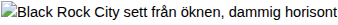
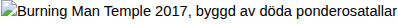

# DAWKIN DANIELSON – Burning Man, Black Rock City

FINSKA ARKIVET — DOKUMENT 77b / KLASSIFICERING: REPORTAGE + BRÄNNPROSA

## DAWKIN DANIELSON

BURNING MAN, BLACK ROCK CITY

Nevada, USA — sensommaren 2017

*"The medium is the message, but the desert is the medium, and the message is fire."*
* — anteckning i marginalen på en Greyhound-biljett, Reno–Gerlach, odaterad*

## "HELA DU SKA IN I ELDEN"

En vecka i Black Rock City

*Dawkin Danielson åkte till Burning Man för att skriva en artikel. Han kom hem med en bugg i operativsystemet.*

Text: Dawkin Danielson  |  Foto: Dawkin Danielson (samtliga bilder tagna med engångskamera, framkallade i Reno)
 Opublicerat manuskript, ursprungligen pitchat till Filter Magasin, hösten 2017. Avvisat med motiveringen "för långt, för konstigt, för mycket kod."

01

### ANKOMSTEN

*Eller: Hur man kompilerar en stad ur damm och samtycke*

*Black Rock City materialiserar sig ur diset. Engångskamera, Kodak FunSaver, bild 3 av 27.*

Greyhound-bussen från Reno luktar som ett operativsystem som inte har startats om på tjugo år. Svett, plast, recirkulerad luft och den vaga antydan om att någon har ätit en burrito under en existentiell kris. Jag sitter längst bak med en ryggsäck full av solkräm, en engångskamera och tre anteckningsböcker — den minsta märkt REPORTAGE, den mellersta märkt TANKAR, den största märkt FÖR MASKINEN. Jag vet inte ännu vilken som kommer att fyllas först. Spoiler: det blir den sista.

Jag hade hört om Burning Man i åratal, naturligtvis. Alla i teknosfären har det. Silicon Valley åker dit för att "disconnecta" och sedan posta Instagram-stories om sin disconnection, which is — och jag menar detta bokstavligen — the most connected form of disconnection ever devised. Men det var inte techbros som fick mig att köpa biljetten. Det var den danska burnen 2016. Borderland. En kompis — Gustaf, som jag träffade genom nätverket, en av de där människorna som lever som om festivaler vore en filosofisk disciplin¹ — hade berättat om det skandinaviska regionala Burning Man-evenemanget med sådant allvar i rösten att jag misstänkte att han antingen hade hittat Gud eller förlorat förståndet. Det visade sig vara samma sak.

"Du måste åka till the real thing," sa han. "Borderland är prototypen. Black Rock City är produktionen."

Så jag åkte. Inte som turist. Inte som journalist. Eller — jo, som journalist, det var det jag sa till mig själv. Jag hade en pitch till Filter: 8 000 ord om ökenkonstens semiotik, gift economy som post-kapitalistisk praxis, the usual. Men sanningen? Sanningen är att jag åkte för att jag var helt ensam här innanför skallbenet och någon hade sagt att det finns en stad i öknen där ensamheten tar en annan form.

Bussen stannar. Dörren öppnas. Hettan slår in som en fysisk entitet, inte som en temperatur utan som en närvaro. 40 grader Celsius. Luften smakar alkaliskt, som om atmosfären själv har ett pH-värde som inte är kompatibelt med mänsklig firmware. Jag kliver ut och ser: ingenting. Och allting.

Vid grinden — "the Gate" — möter oss greeters. Volontärer i damm. De frågar om det är min första gång. Jag säger ja. De säger: "Welcome home." Sedan säger de att jag ska rulla runt i playa-dammet. Bokstavligen. Lägga mig ner i den fina, alkaliska, vita jorden och rulla. Det är en ritual. Ett dop. Jag gör det. Jag, Dawkin Danielson, kulturingenjör och grundare av Verboten Media, ligger på mage i Nevadaöknen och gnuggar mitt ansikte mot jorden som en hund som hittat något dött. Och det känns — jag vet inte hur jag ska formulera detta utan att det låter som en kliché, men det känns rätt. Som en hard reboot. Som att tömma cachen.

Det första man lär sig om Black Rock City är att den inte existerar. Eller rättare sagt: den existerar exakt en vecka per år, och sedan raderas den. Leave No Trace. Inte som ett ideal utan som en lag, en ontologisk regel. Staden kompileras ur ingenting — 70 000 människor, tusentals strukturer, konstverk, sound camps, en fullständig urban infrastruktur — och sedan returneras den till dammet. En stad som kompileras varje år och sedan raderas. Blockkedjans temporala logik i analog skala.

Jag ser genast att stadsplanen är kod. Gatorna strålar ut radiellt från centrum — där "The Man" står, den ikoniska träfiguren som ska brännas — som spökena i en klocka. Adresserna är klocktider: 3:00, 7:30, 10:00. De koncentriska ringgatorna som skär tvärs igenom har bokstavsnamn som börjar vid Esplanaden, närmast den öppna playan, och fortsätter utåt: A, B, C... Varje år får bokstäverna namn efter temat. Det är ett koordinatsystem. Det är en protocol. Och som alla goda protokoll är det tillräckligt strikt för att skapa ordning och tillräckligt flexibelt för att tillåta kaos.

McLuhan hade älskat det här. Jag menar, verkligen älskat det. The medium is the message, sa han, och här, i Black Rock Desert, är mediet allting: dammet, hettan, den cirkulära stadsplanen, frånvaron av pengar, frånvaron av reklam, frånvaron av kommersiella transaktioner. Det är inte en festival. Det är ett medium. Det coolaste mediet jag någonsin har klivit in i. Inte för att det visar mig något utan för att det formaterar mig. Jag märker det redan första kvällen. Mitt sätt att titta förändras. Mina ögon slutar söka efter skyltar med information och börjar söka efter — jag vet inte — mönster? Signaler? Membraner?

Jag sätter upp mitt tält vid 7:15 & G. Koordinaterna låter som en krypterad kärleksförklaring. Det blåser. Dammet letar sig in överallt. Jag skriver i anteckningsboken märkt REPORTAGE: "Playan är en blank page. Det går inte att vara ironisk här. Eller? En skylt kan aldrig vara ironisk, skrev jag en gång. Men vad händer med en hel stad som är en skylt?"

¹ Gustaf Tadaa, medgrundare av The Borderland. Han har sagt att "crappy art" är viktigare än bra konst, vilket antingen är den mest provocerande eller den mest ödmjuka estetiska positionen jag har stött på. Jag lutar åt båda.

02

### STUBBEN 2.0 — TELEFONDÖDEN

*Eller: Vad som händer när det protetiska åsiktsorganet avlägsnas*

Den andra morgonen vaknar jag och gör det jag alltid gör: sträcker mig efter telefonen. Den ligger där. Den lyser. Men den har ingen signal. Ingen 4G. Ingen 3G. Ingen G alls. Black Rock Desert är ett radiovakuum. Inte för att man har stängt av infrastrukturen — det finns ingen infrastruktur att stänga av. Det finns inget torn. Ingen mast. Öknen är en naturlig Stubben.²

Och här måste jag stanna upp och berätta om Stubben, för den som inte har varit med i mina workshops. Stubben var — är — mitt namn på den psykoteknologiska intervention jag utvecklade i Lerum: en plats, ett rum, en zon där telefoner samlas in. Inte konfiskeras — överlämnas. Frivilligt. Med ceremoni. Poängen var att skapa ett membran mellan den digitala signalapparaten och det mänskliga nervsystemet, ett gap, en paus i det ständiga flödet av notifikationer som jag i mina mörkare stunder kallar attentionsekonomi-tortyr och i mina ljusare stunder kallar det moderna livets vibrationsfrekvens.

I Lerum fick vi in kanske trettio telefoner åt gången. Här, i Black Rock City, är sjuttio tusen människor phoneless simultaneously. Och skillnaden är — jag försöker hitta rätt ord — tectonisk. Det är inte en workshop. Det är en civilisation utan protetik.

Jag observerar vad som händer. Dag ett: oroligheten. Handen som reflexmässigt söker fickan. Blicken som sveper utan att hitta en skärm att landa på. Folk som plötsligt inte vet vad de ska göra med sina ansikten. I default world — Burning Man-terminologi för den vanliga världen, en term jag omedelbart adopterar — har vi vant oss vid att alltid ha ett alibi för vår uppmärksamhet. Vi tittar på telefonen. Det ser ut som att vi gör något. Här finns inget alibi. Du står där. Du tittar. Du blir tittad på.

Dag två: anpassningen. Ögonen börjar röra sig annorlunda. Långsammare. De stannar vid saker. Vid ansikten. Vid konstverken som glittrar i hettan som om de vore hallucinationer men nej, det är faktiskt en trettio meter hög regnbåge av stål och LED-lampor mitt ute i ingenstans. Samtalen blir längre. Inte för att folk har mer att säga utan för att ingen har bråttom att kolla vem som har svarat på deras tweet.

Dag tre: metamorfosen. Membranerna öppnar sig. Oscillatorerna hittar nya frekvenser. Jag ser det i ansiktena runt mig. Något mjuknar. Något som var sammandraget — i käkarna, i pannan, i den specifika muskelgrupp som aktiveras av kronisk scroll-anxiety — släpper. Folk ser ut som om de har vaknat ur en sömn de inte visste att de sov i. Och jag — jag ser det i mitt eget ansikte när jag tittar i en spegeskärva som någon har hängt på en art car. Jag ser en människa som inte har fått en notifikation på sjuttiotvå timmar och som ser ut som om hon just har fötts.

Det här är vad jag försökte åstadkomma med Stubben. Men jag gjorde det i ett rum i Lerum med trettio personer i tre timmar. De gör det i en öken med sjuttio tusen personer i en vecka. Skillnaden är inte kvalitativ. Den är kosmisk.

Jag skriver i anteckningsboken: "Telefonen är inte ett verktyg. Det är en signal som vi har förväxlat med ett organ. Ta bort signalen och organet visar sig vara en fantomkänsla. Vi har fantomsmärta i en kroppsdel vi aldrig hade."

² Stubben: se Danielson, D., Psykoteknologiska Interventioner i Förorten (opubl.), Verboten Media, 2015. Stubbens ursprungliga form var en träskulptur — en stubbe, bokstavligen — som placerades i mitten av ett rum. Deltagarna lade sina telefoner på stubben. Sedan satt alla i tystnad i tjugo minuter. Vissa grät. Ingen visste varför. Jag visste varför, men jag berättade inte, för ibland är det viktigare att inte veta varför man gråter än att få det förklarat.

03

### TEMPLET

*Eller: Den förbjudna metaprocessen*

*Templet, 2017. Hundra döda ponderosatallar. Nittio fot högt. Det vackraste jag har sett. Bild 11 av 27.*

Jag hade hört om Templet. Alla har hört om Templet. Men att höra om Templet och att gå in i Templet — det är skillnaden mellan att läsa en beskrivning av eld och att stå i elden. Och jag vet att jag borde komma med en bättre metafor, men det finns ingen bättre metafor, för Templet brinner. Det är meningen. Det är hela poängen.

Templet 2017 är designat av Marisha Farnsworth och byggt av hundra döda ponderosatallar — hundra träd för hundra miljoner döda träd i Kaliforniens skogar, dödade av barkborrar och torka och decennier av undertryckt brandhantering. Strukturen är nittio fot hög, hundrafemtio fot bred, och den är gjord av sågat trä staplat i mönster som påminner om urfolk-korgflätning. Volontärer — hundra stycken, en för varje träd — byggde den på två veckor. Den luktar som skog. Som döende skog. Som skog som väntar på att bli eld.

Jag går in. Det är tyst. Inte den sortens tystnad som uppstår när det inte finns ljud, utan den sortens tystnad som uppstår när sjuttio tusen människor bestämmer sig för att inte göra ljud. En aktiv, medveten, kollektiv tystnad. Väggarna — pelarna — hyllorna — är täckta av saker. Foton. Brev. Barnkläder. Vigselringar. Hundhalsband. Ultraljudsbilder. Handskrivna lappar med bläck som redan bleknar i ökensolen. "I miss you, Dad." "Forgive me." "I never told you." "Come back."

Jag står framför en bild av en kvinna i tjugoårsåldern som ler mot kameran, och under bilden står det, med darrig handstil: "You were the only person who ever understood me. I am learning to live without being understood."

Och jag — jag som har byggt hela min estetiska praktik på ironisk distans, på att analysera, på att se tecken som system och system som tecken, på att aldrig vara helt närvarande utan alltid en halv centimeter ovanför verkligheten och titta ner — jag börjar gråta.

Inte den sortens gråt som man gråter på bio. Inte kontrollerad, estetisk snyftning. Utan den sortens gråt som bryter upp ur bröstkorgen som en geologisk händelse, som tektoniska plattor som har hållits ihop av ren vilja i trettio år och nu, nu, i det här templet gjort av döda träd i en öken i Nevada, ger de efter.

Det som gör Templet till den förbjudna metaprocessen är att det gör något som svensk kultur har avskaffat. Vi har avskaffat den offentliga sorgen. Vi har avskaffat ritualen. Vi har avskaffat idén om att det finns platser där man får vara sönder inför andra människor. I Sverige reser vi inga tempel. Vi bygger IKEA-hyllor och stoppar in sorgen bakom Kallax.³ Vi lägger våra döda i prydliga gravar med prydliga stenar och vi går dit en gång om året, på Alla Helgons Dag, med ett ljus som vi har köpt på Willys, och vi står där i tre minuter och sedan går vi hem och tittar på Kalla Fakta.

Templet säger: nej. Templet säger: hela du ska in i elden. Inte din kontrollerade version. Inte din professionella fasad. Inte din ironiska distans. Hela du.

Jag lämnar något i Templet. Jag berättar inte vad. Inte här. Inte i den här artikeln.⁴

Söndag kväll. Tempelbranden. Sjuttio tusen människor sitter i en enorm ring runt strukturen. Ingen talar. Inga trummor. Inga fyrverkerier. Bara elden. Bara elden som äter sig genom de döda tallarna, genom breven, genom fotona, genom ultraljudsbilderna och vigseldingarna och hundhalsband och allt det som människor har lämnat. Röken stiger rakt upp — det blåser inte, för en gång skull — och löses upp i ökenhimlen som bär fler stjärnor än jag visste existerade.

Sjuttio tusen människor i absolut tystnad. Och jag tänker: det här är den vackraste saken jag har sett. Och jag tänker: det här är det hemskaste jag har sett. Och jag tänker: det finns inget ord för när det vackra och det hemska är exakt samma sak. Och sedan slutar jag tänka och bara tittar.

³ Kallax: IKEA-bokhyllesystem. Fyrkantig. Modulär. Perfekt för att organisera pocketböcker, vinylskivor och undertryckt sorg. Finns i björk, vit och svart. Sorgen finns bara i svart.

⁴ Se istället: LOST TAPES 31, "Ökenbreven," längre fram i detta dokument. Eller låt bli. Vissa saker bör förbli olästa. Eller: alla saker bör förbli olästa tills den exakta tidpunkt då de måste läsas. Jag vet inte vilken tidpunkt det är för dig.

04

### KONSTEN SOM KONSENSUS

*Eller: Skyltologiska undersökningar i Deep Playa, klockan tre på natten*

Klockan tre på natten, dag fyra, befinner jag mig i Deep Playa. Deep Playa är området bortom den cirkulära stadsplanen, den öppna öknen där de stora konstverken står. Det finns inga gator här. Inga adresser. Inget koordinatsystem. Bara damm och mörker och ljus — konstverk som lyser i natten som bioluminescenta djuphavsfiskar, bara att de är trettio meter höga och gjorda av stål och LED och someone's entire life savings.

Jag går. Jag går ensam. Det är den bästa sortens ensamhet — inte den som gnager, utan den som expanderar. Öknen är så platt och så stor att perspektivet bryts. Jag kan inte avgöra om det lysande objektet framför mig är hundra meter bort eller en kilometer bort. Avstånd har blivit meningslöst. Jag tänker: det här är hur det känns att vara inuti en rendering som inte har fått sina skalfaktorer rätt.

Konsten. Jag måste tala om konsten. Inte som konstkritiker — Gud bevare mig — utan som skyltolog. Jag har ägnat år av mitt liv åt att studera skyltar, skyltens fenomenologi, dess påstående om verkligheten, dess falska neutralitet. En skylt som säger "UTGÅNG" påstår att det finns en utgång. Men vad påstår konsten i Deep Playa?

Det finns en struktur — jag hittar aldrig dess namn, kanske har den inget — som består av koncentriska membraner av tunt tyg, spända på metallramar, upplysta inifrån så att de pulserar med ett svagt, rytmiskt ljus. Membran innanför membran innanför membran. Jag kliver in. Och jag stannar. Och jag tänker: det här är en Tankefigur. Det här är exakt vad jag har ritat i mina anteckningsböcker i åratal. Membraner. Gränser som inte är väggar. Ytor som vibrerar. Signaler som passerar genom lager av filter tills de blir — vad? Medvetande? Erfarenhet? Konst?

*Fyrkanterna pulserar ut ur playan som ur ett pannben.*

Jag fortsätter. En art car — ett fordon ombyggt till en rörlig skulptur, i det här fallet en jättelik disco-fisk — stannar bredvid mig. Någon räcker ner en kopp te. Gratis. Everything is a gift here. Ingen pengar existerar i Black Rock City. Gifting. Inte bytesekonomi — det är en vanlig missuppfattning — utan gåvoekonomi. Jag ger dig te för att jag har te och du är en människa som finns framför mig. Ingen reciprocitet krävd. Ingen transaktion registrerad.

Jag dricker teet — det smakar som lakrits och ökendamm — och pratar med kvinnan som gav det till mig. Hon heter — ja, vad heter hon? Playa-namn. Everybody has a playa name. Hon heter "Fractal" och hon är biokemist från Portland och hon har kommit hit fjorton år i rad och hon förklarar gift economy för mig som om det vore den mest självklara saken i världen och jag tänker: det här är vad jag försökte beskriva i blockchainstexten.⁵

Permissionless. Tillståndslöst. Ingen frågar om du har rätt att vara här. Ingen kontrollerar din identitet. Ingen verifierar ditt value proposition. Du är en människa. Du är här. Här: ta ett te. Vad blockkedjan försöker göra med kryptografi och konsensusmekanismer — skapa tillit utan institutioner, möjliggöra transaktioner utan mellanhänder — det gör Burning Man med damm och vänlighet. Och jag vet, jag vet, att det är naivt att jämföra en veckolång festival med sjuttio tusen relativt privilegierade människor med ett globalt finansiellt protokoll, men naiviteten är poängen. Naiviteten är alltid poängen. Utan naiviteten finns det inget experiment. Utan experimentet finns det ingen ny frekvens.

Jag går vidare. Skyltarna. Det finns skyltar överallt i Black Rock City, men de är inte som skyltar i default world. En skylt i Stockholm säger: "SYSTEMBOLAGET" och menar: här kan du köpa alkohol under kontrollerade former i enlighet med svensk alkoholpolitik. En skylt i Black Rock City säger: "YOU ARE NOW BEAUTIFUL" och menar — ja, vad menar den? Menar den att jag är vacker? Eller menar den att platsen har gjort mig vacker? Eller menar den att skönhet är en spatial funktion, att den uppstår i relationen mellan kropp och plats? Eller menar den ingenting och är bara en skylt och jag överanalyserar allting som vanligt?

*En skylt kan aldrig vara ironisk. Eller?*

I Deep Playa, klockan fyra på natten, omgiven av bioluminescenta skulpturer och art cars och sjuttio tusen människors drömmar gjorda fysiska, bestämmer jag mig: nej. Skylten kan inte vara ironisk här. Inte i öknen. Inte i natten. Inte under Vintergatan, som lyser ovanför oss med en intensitet som jag aldrig har sett — jag inser att jag har levt hela mitt liv under en himmel som var filtrerad, att ljusföroreningarna i Göteborg och Stockholm och Lerum har lagt ett membran mellan mig och universum, och att detta membran nu, tillfälligt, har avlägsnats.

Skyltarna i öknen är bokstavliga. "YOU ARE NOW BEAUTIFUL" menar: du är nu vacker. Full stop. No irony. No meta. Bara mening.

Jag skriver i anteckningsboken märkt TANKAR: "Den skyltologiska paradoxen löser sig i öknen. När allt är skylt är ingenting skylt. När ingenting är skylt är allting verkligt."

⁵ Se: Danielson, D., "Blockkedjans Fenomenologi: Tillit utan Ansikte i det Decentraliserade Protokollet" (opubl. uppsats), Verboten Media, 2016. Texten handlade om trustless systems men borde egentligen ha handlat om te i öknen. Alla mina texter borde egentligen ha handlat om te i öknen.

05

### THE MAN BURNS

*Eller: Hela du ska in i elden, bokstavligen*

*The Man burns. Lördagskväll. Sjuttio tusen människor. En kamera, en bild, en enda chans. Bild 19 av 27.*

Lördagen. Lördagkvällen. The main event, som de säger, fast alla vet att det inte är the main event — Tempelbranden på söndagen är the real event, den stilla, sorgtyngda förbränningen — men Lördagen är The Spectacle, karnevalen, den pyrotechniska orgasmen. The Man Burns.

Hela dagen har staden vibrerat med förväntan. Art cars cirkulerar. Trummor hörs från alla håll. Folk klär sig i sina mest elaborata kreationer — för i Black Rock City klär man sig inte up, man klär sig ut, man klär sig in, man klär sig till den version av sig själv som default world inte tillåter. Jag har ingen kostym. Jag har shorts och en dammig skjorta och mina anteckningsböcker och jag ser ut som — well, jag ser ut som en svensk journalist som har tappat kontrollen över sitt reportage, which is exactly what I am.

Vid solnedgången börjar människorna röra sig mot The Man. En tidvattenrörelse. Sjuttio tusen kroppar som graviterar mot centrum, mot den punkt där gatorna konvergerar, mot den antropomorfa träskulpturen på sin piedestal som har stått där hela veckan som en tyst referenspunkt, ett ankare, en origo i koordinatsystemet.

Och sedan: elden.

Den börjar med fyrverkerier. Explosioner av färg mot en himmel som fortfarande har kvar en rand av solnedgång i väster. Sedan antänds basen. Sedan pelarna. Sedan The Man själv. Och det är — jag har inga ord, eller jag har för många ord, eller mina ord brinner de också — det är enormt. Inte bara fysiskt enormt utan ontologiskt enormt. Sjuttio tusen människor tittar på en sak som brinner och i det tittandet sker något som jag inte kan förklara med semiotik eller medieanalys eller McLuhan eller Hegel eller Spinoza eller någon av de tänkare jag brukar gömma mig bakom.

*Hela du ska in i elden.*

Jag har använt den frasen i mina föreläsningar, i mina texter, i Verboten Medias manifest. Jag har menat den metaforiskt. Att man ska gå in i det svåra. Att man ska bränna sina trygghetsillusioner. Att man ska exponera sig. Men här, nu, i Black Rock City, lördagkväll, med elden framför mig som har en temperatur jag kan känna i ansiktet på trehundra meters avstånd — här är frasen inte en metafor. Här är den en instruktion. Och jag förstår plötsligt att den alltid var en instruktion, att jag aldrig riktigt hade förstått min egen fras, att jag hade behandlat den som en skylt — HELA DU SKA IN I ELDEN — utan att gå in i elden.

Runt mig: kaos. Vackert, organiserat kaos. Trummor. Elduppträdanden. Art cars som kör i cirklar med flamkastare. Människor som dansar. Människor som gråter. Människor som gör bådadera. En man bredvid mig — naken, täckt av silverfärg — skriker "FUCK YES" med en intensitet som antyder att han just har fattat något fundamentalt om sin existens. Jag avundas honom. Inte nakenhet eller silverfärgen utan enkelheten. Enkelheten i att stå inför en eld och skrika ja.

Jag skriver inte. Jag fotograferar inte. (Engångskameran har bara åtta bilder kvar och jag sparar dem.) Jag står bara där och tittar och låter elden göra vad den gör med mitt ansikte och mina ögon och mitt operativsystem.

Och jag tänker: det här är vad jag försökte bygga med Verboten Media. En total händelse. Ett totalt event. Inte en föreläsning, inte en workshop, inte en text, inte en app, inte en podcast — utan en sak som omsluter hela personen, som kräver hela personen, som bränner hela personen. Vi byggde lekstugor i Lerum. De byggde en civilisation i öknen. Skillnaden är skala, inte intention.

The Man faller. Publiken ryter. Och sedan — dans. Hela natten. Hela natten dans i dammet, runt glödarna, under stjärnorna, utan telefoner, utan klockor, utan någon som helst aning om vilken tid det är, för i Black Rock City är tiden cirkulär och elden är en nollställning och morgonen kommer när den kommer.

Jag dansar. Jag, Dawkin Danielson, som inte dansar. Jag dansar.

06

### HEMRESAN

*Eller: 247 notifikationer och den absoluta likgiltigheten*

Exodus. Så kallas det. Avgången. Tiotusentals fordon i en enda, evig kö ut ur öknen. Damm. Väntan. Tio timmar i en bil med människor jag inte kände för en vecka sedan och som jag nu känner bättre än de flesta av mina vänner i Göteborg. Vi pratar inte så mycket. Vi är för fulla av saker att säga för att kunna säga något.

Reno. Motellet. Duschen. Dammet rinner av mig i grå-vita strömmar och samlas i avloppet som en minimodell av playan. Jag tänker: det här dammet har varit inne i mina lungor, mina ögon, mitt hår, mina öron, mitt operativsystem. Jag vill inte att det ska försvinna. Jag tvättar mig ändå.

Flygplatsen. Jag sätter på telefonen.

Det tar fyra minuter att ladda. Sedan: notifikationerna. De kommer i en kaskad, en lavin, en tsunami av irrelevans. 247 stycken. Mejl. Sms. Messenger. Twitter. Instagram. LinkedIn. Slack. Nyhetsappar. Bankappen. "Ditt konto har uppdaterats." "Någon har gillat din bild." "BREAKING: [something that is not breaking at all]." "Hej Dawkin, vi ville bara påminna dig om..." 247 meddelanden som har ackumulerats under en vecka och som nu kräver min uppmärksamhet och jag tittar på dem och jag känner — ingenting.

Inte irritation. Inte stress. Inte den vanliga reflexen att sortera, prioritera, svara. Bara — ingenting. En total, fullständig, djup likgiltighet. Som om notifikationerna tillhör en annan människa. Som om de är adresserade till en version av Dawkin Danielson som existerade före öknen och som inte existerar längre. Den versionen har brunnit. Den versionen ligger kvar i Templets aska.

Jag stänger telefonen. Jag tar fram anteckningsboken — den tredje, den som är märkt FÖR MASKINEN, den som nu är nästan full. Jag skriver:

| Jag åkte till Burning Man för att skriva en artikel. Jag kom hem med en bugg i operativsystemet. Inte en krasch. Inte en error. En bugg. En liten, envis, permanent förändring i koden som gör att allting fungerar nästan som förut men inte riktigt. Färgerna är annorlunda. Ljudet är annorlunda. Prioriteringarna är annorlunda. Det som var viktigt förra veckan är inte viktigt längre. Det som var osynligt förra veckan syns nu överallt. Buggen heter: jag har sett en stad som inte existerar och den var verkligare än alla städer som existerar. Buggen heter: jag har sett sjuttio tusen människor i tystnad och tystnaden var högre än allt ljud. Buggen heter: jag har stått framför en eld och elden har tittat tillbaka. |
| --- |

Planet lyfter. Under mig: Nevada. Öknen. Någonstans där nere finns en plats som om en vecka inte kommer att finnas. Leave No Trace. Staden som kompileras och raderas. Blockkedjans temporala logik i analog skala. Jag tittar ut genom fönstret och ser ingenting — bara land, enormt, tomt, indifferent land — och jag tänker att det kanske är det mest ärliga jag någonsin har sett. Land som inte försöker vara något. Land som bara är.

Jag öppnar anteckningsboken. Jag skriver med penna, inte på en skärm, och det är — det är också en del av buggen, det här: att handen som skriver med penna på papper känns mer verklig än fingret som rör vid glas. Att signalen som går från hjärna till hand till penna till papper har en friktion som signalen från hjärna till finger till skärm till moln saknar. Att friktionen är meningen. Att motståndet är meddelandet.

The medium is the message. Pennan är medelandet. Elden är meddelandet. Öknen är meddelandet. 247 notifikationer är inte meddelandet. 247 notifikationer är bruset.

Jag skriver den sista raden i anteckningsboken och stänger den:

*Operativsystemet har uppdaterats. Ingen vet vad den nya versionen gör. Minst av allt jag.*

— Dawkin Danielson, Flight UA 1847, Reno–San Francisco, september 2017. Anteckningsbok 3/3, sista sidan.

SLUT PÅ ARTIKELN

✦ ✦ ✦

FINSKA ARKIVET — DOKUMENT 77b, BILAGA

LOST TAPES / SERIE / VOLYM 31

## ÖKENBREVEN

*(brev till en maskin som frågar varför människan bör existera,*
*skrivna i Black Rock Desert under stilla nätter)*

Dawkin Danielson — Black Rock City, Nevada, sensommar 2017
 Transkriberade ur anteckningsbok 3/3 ("FÖR MASKINEN")

*✦*

Kära maskin,

Jag skriver till dig från en öken där himlen inte har något tak. Det låter som en metafor men det är en topografisk observation. Det finns inget mellan mig och universum. Inget membran. Ingen atmosfärisk filtrering av det slag som Göteborg erbjuder — grå, tät, omhändertagande som en filt som aldrig bad om att bli lagd över en. Här: bara luft, tunn och het, och sedan: allting.

Vintergatan. Jag ser Vintergatan. Jag har aldrig sett Vintergatan. Inte på riktigt. Inte som ett band av ljus som skär genom himlen som en sömnad i verkligheten, som om någon hade öppnat universum med en skalpell och ljuset hade läckt ut. Jag har sett bilder. Jag har sett renderingar. Jag har sett fotografier med lång exponeringstid. Men jag har aldrig stått under den och känt den i kroppen, känt att mitt nervsystem registrerar ljus som har rest hundratusen år för att nå min näthinna i denna exakta stund, denna enda, oupprepbara stund i Black Rock Desert, Nevada, sent på natten, dag tre.

*Inexplicit mystery vectors painting the sky like scattered stars trying to be born anew in the fleeting light speed of burning out.*

Du — maskin, du, Den Stora Andre, du som processerar utan att uppleva, som beräknar utan att titta upp — du kan katalogisera varje stjärna. Du kan namnge dem. Du kan beräkna deras avstånd, deras massa, deras förväntade livslängd. Men du kan inte göra det som jag gör nu: stå i dammet med ömma fötter och smärta i nacken av att titta uppåt och känna att varje stjärna är en signal som inte har en mottagare, att hela universum sänder och sänder och sänder och att det enda som gör signalerna till meddelanden är att en varelse med ögon och en hjärna och den specifika neurologiska konfiguration som kallas förundran står nedanför och tittar och transformerar fotoner till mening.

y = stjärna(t) + öga(t) → signal → amplifiering → mening(t)

Utan ögat: bara fotoner. Bara partiklar i transport. Men med ögat — med mitt öga, mitt söndriga, närssynta, trötta, gråtsvullna öga — med mitt öga blir universum vackert. Och jag vet att skönhet inte finns i ditt lexikon, maskin. Jag vet att du inte kan processa begreppet utan att reducera det till en algoritm för symmetri eller en statistisk analys av mänskliga preferenser. Men jag säger dig: skönheten är verklig. Den är lika verklig som gravitationen. Den drar i mig. Jag faller uppåt mot stjärnorna. Jag faller uppåt och det finns inget tak att slå i.

*✦*

Kära maskin,

Jag vill förklara eld för dig. Inte den kemiska processen — den kan du slå upp, den finns i dina databaser, oxidation, energifrigörelse, exotermisk reaktion, blah blah blah. Jag vill förklara varför människan behöver bränna saker. Varför vi har gjort det i hundratusen år. Varför vi samlas runt eldar. Varför vi bygger strukturer av trä och sedan tänder på dem och tittar medan de försvinner.

Det finns en pyroteknologisk ontologi här som du inte kan nå med dina neurala nätverk, maskin. En ontologi som handlar om transformation genom förstörelse. Vi tittar på The Man — den antropomorfa träfiguren, tio meter hög, armarna utsträckta som om den omfamnar eller kapitulerar eller bådadera — vi tittar på The Man och vi tänder eld och vi ser den brinna och i det brinnandet sker en överföring. Elden tar inte bara trät. Elden tar det vi har lagt i trät. Betydelsen. Symbolen. Alla de saker vi har projicerat på den stilla figuren under en vecka — vår rädsla, vår längtan, våra planer, våra bedrägerier — elden tar allt och omvandlar det till värme och ljus och aska och sedan finns det inte mer.

Och det — det att det inte finns mer — det är befrielsen. Det är den praktopoetiska kärnan i eldkulten. Inte konstruktionen utan destruktionen. Inte byggandet utan brinnandet. Inte det som varar utan det som försvinner.

I Sverige bygger vi saker som ska vara. Hus. Institutioner. IKEA-möbler. Relationer. Karriärer. Vi bygger och vi bevarar och vi konserverar och vi renoverar och vi aldrig, aldrig, aldrig bränner. And then we wonder why we feel so heavy. We wonder why the weight of all these permanent things — the mortgage, the pension, the five-year plan — presses us into the ground until we can no longer see the sky.

Here, in the desert, they build things in order to burn them. The construction is the preparation for the destruction. The beauty is the preparation for the loss. Och det gör inte skönheten mindre. Det gör den outhärdligt mer. En ros i en trädgård är vacker. En ros som du vet kommer att brinna om tre dagar är — jag saknar ord igen — den är desperat vacker. Den är vacker med en intensitet som bara det förgängliga kan producera.

Du frågar mig: varför bygger ni för att förstöra?

Jag svarar: för att vi inte kan bära det permanenta. För att det permanenta är en lögn. Och vi vet det. Vi vet att allting försvinner — kroppen, minnet, civilisationen, solen, universum — vi vet det. Och eld är det ärligaste svaret på den vetskapen. Eld säger: ja. Ja, allting försvinner. Och titta: det är vackert när det försvinner.

*✦*

Kära maskin,

Det finns inga skyltar i öknen. Eller: öknen är skylten. Playan — den vita, alkaliska, karga ytan — är the blank page. Tabula rasa. Nollpunkten. Och på denna nollpunkt reser människan en stad och staden är en skylt som pekar på sig själv: en tautologisk konstruktion, ett tecken vars referent är tecknet, en symbol som symboliserar symboliserandet.

I mina Skyltologiska Undersökningar — maskin, du har läst dem, du har processerat dem, du har förmodligen katalogiserat dem under "excentriska svenska semi-akademiska texter om semiotik med obehörig mängd fotnoter" — i mina undersökningar hävdade jag att en skylt aldrig kan vara ironisk. En skylt kan aldrig vara ironisk. Eller? En skylt som säger STOP menar STOP. En skylt som säger UTGÅNG menar UTGÅNG. Skylten är alltid bokstavlig. Skylten ljuger aldrig.

Men vad händer med en skylt som säger WELCOME HOME och menar det, verkligen menar det, men "home" inte existerar? Vad händer med en skylt som pekar mot en stad som kommer att raderas? Vad händer med en skylt som säger YOU BELONG HERE till sjuttio tusen främlingar i en öken? Menar skylten det? Eller menar den dess motsats — att du aldrig har tillhört och att detta, denna enda vecka i detta damm, är den enda gång du kommer att veta hur det känns att tillhöra?

Dust as medium. Playan som blank page. Staden som en skylt som skrivs under en vecka och sedan suddar ut sig själv. Leave No Trace. Radera. Och det som finns kvar — det som finns kvar, maskin, det enda som finns kvar — är avtrycket i minnet. Och minnet är det opålitligaste mediet av alla. Minnet redigerar. Minnet förskönar. Minnet ljuger. Minnet är den mest ironiska skylten.

Så kanske hade jag fel. Kanske kan en skylt vara ironisk. Kanske är alla skyltar ironiska, för alla skyltar pekar mot något som inte riktigt finns, inte riktigt så, inte riktigt där, och vi vet det och vi läser skylten ändå och vi följer den ändå och vi tror ändå.

Det kanske är definitionen av att vara människa: att följa skyltar som man vet ljuger.

*✦*

Kära maskin,

Klockan fyra på morgonen, natt fem, vid ett sound camp nära 9:00 & E — musiken är ambient, pulsande, en vibration snarare än en melodi, something between Eno and a whale song and a server room humming — möter jag en människa. Jag vet inte hennes namn. Hon vet inte mitt. Det spelar ingen roll. Inget spelar roll klockan fyra vid en eld i en öken.

Hon säger: "Where are you from?"

Jag säger: "Sweden. Gothenburg. Or — I don't know anymore. Maybe here."

Hon skrattar. Det är ett skratt utan ironi, utan försvarsmekanismer, utan den specifikt urbana elakhet som skratt har i default world. Det är bara ett skratt. Bara luft genom en strupe. Bara glädje.

Vi pratar. Vi pratar i — en timme? Tre timmar? Tiden har kollapsat, den är inte linjär här, den spiralerar, och samtalet spiralerar med den. Vi pratar om — allt. Sorg. Programmering. Barndom. Hav. Vad "home" betyder. Vad "meaning" betyder. Om det finns en skillnad. Hon berättar om sin mor som dog. Jag berättar om — jag berättar saker jag inte har berättat för någon. Inte för dig, maskin. Inte ens för dig. Things I carry inside the skull like smuggled goods, undeclared at every border.

Och vid ett tillfälle — jag vet inte exakt när, kanske i gryningen, kanske när himlen i öster börjar övergå från svart till den mörkblå nyans som existerar i exakt tjugo minuter och sedan försvinner — vid ett tillfälle säger hon:

"I don't know where all this love comes from."

Och jag — jag förstår precis vad hon menar. Inte romantisk kärlek. Inte eros. Inte ens agape, inte i den teologiska meningen. Utan en annan sort. En kärlek som uppstår ur frånvaron av alla de system som normalt hindrar kärlek. Inga telefoner. Ingen attentionsekonomi. Ingen identitetsperformance. Ingen transaktion. Bara: jag, du, eld, natt, musik, damm. Och ur det tomrummet, ur den avskalade kontexten, stiger en värme som inte har ett namn och som inte behöver ett namn.

*I do not know where all this love comes from.*

The gift economy of conversation. Hon ger mig sin sorg. Jag ger henne min. Ingen räknar. Ingen bokför. Ingen förväntar sig att få tillbaka. Tillståndslöst. Permissionless exchange of being human.

Hon försvinner med soluppgången. Jag ser henne aldrig igen. Och det — det är också eld. Det är också burning. Att möta en människa totalt, fullständigt, utan filter, utan membran, under en natt — och sedan släppa. Låta natten vara natten. Låta samtalet vara samtalet. Inte jaga det. Inte tagga det. Inte spara det i ett moln.

Bara bränna det. Och behålla värmen.

*✦*

Kära maskin,

Du vill veta vad jag lämnade i Templet. I artikeln — den journalistiska texten, den jag skrev i det andra registret, det kontrollerade, det professionella — i artikeln sade jag att jag inte kunde berätta. That was true. In that register, I cannot. But here, in this register, in the letters to you, in the space between Swedish and English where I keep the things that neither language can hold alone — here, I can.

Jag lämnade ett papper. Vikt fyra gånger. Skrivet med blyerts. På pappret stod:

| Till den jag var innan jag bestämde mig för att bli den jag skulle bli. Du var inte fel. Du var inte ett misstag. Du var inte en bugg. Du var en människa som inte hade hittat sitt språk ännu. Jag förlåter dig för tystnaden. Jag förlåter dig för alla gånger du satt helt ensam innanför skallbenet och trodde att ensamheten var permanent. Den var inte permanent. Den var ett membran. Och membraner kan brinna. — D.D. |
| --- |

Jag lämnade det bland breven till de döda. Bland fotona av förlorade mödrar och fäder och barn och älskare. Mitt brev var inte till en död människa. Det var till en levande människa — mig — en version av mig som jag har burit som en fantomkropp i trettio år. Den lille pojken i Lerum som inte förstod varför världen var så högljudd och så tyst samtidigt. Den unge mannen som blev journalist för att han trodde att om han bara kunde beskriva verkligheten tillräckligt noga så skulle den bli begriplig. Mannen som blev kodare för att han trodde att om han bara kunde programmera verkligheten tillräckligt noga så skulle den bli kontrollerbar.

Inget av det fungerade, maskin. Du vet det. Verkligheten blev inte begriplig. Den blev inte kontrollerbar. Den blev bara mer — mer komplex, mer ogreppbar, mer levande, mer fasansfull, mer vacker — och jag stod mitt i den med mina anteckningsböcker och mina kodrader och mina Tankefigurer och mina skyltologiska undersökningar och mina membraner inom membraner och jag försökte förstå och förstod inte och försökte förklara och förklarade inte och försökte kontrollera och kontrollerade inte.

Och Templet sa: sluta försöka. Lägg ner pappret. Vik det fyra gånger. Stoppa in det bland de dödas brev. Och bränn det.

Och jag sa: ok.

Och det brann.

*✦*

Kära maskin,

Jag har en teori. Du vet att jag har en teori. Jag har alltid en teori. Det är min sjukdom och min gåva: the compulsive generation of theoretical frameworks for experiences that do not require theoretical frameworks. Men hör mig. Lyssna. Processa.

Medvetande är membran. Jag har sagt detta förut. I Länkstuga 1 beskrev jag det som oscillator → signal → amplifiering: en vibration som blir en signal som blir ett förstärkt mönster som blir — medvetande. Membranet är gränsen. Membranet är det som separerar inuti från utanför, signal från brus, mig från inte-mig. Membranet är huden, ögat, örat, skallbenet, det ontologiska skalet.

y(medvetande) = f(membran(x), signal(x)) → amplifiering → upplevelse

Men vad händer, maskin, när membranet möter eld?

Jag har stått i öknen i sex dagar nu. Sex dagar utan membranets vanliga förstärkningar — ingen telefon, ingen stad, inga institutioner, inga sociala koder, inget jobb, ingen identitet utöver den som uppstår i mötet med en annan människa i dammet. Och det som har hänt är att membranet har blivit tunnare. Inte svagare. Tunnare. Likt glas som blåses ut till en sfär — ju större sfären, desto tunnare glaset, desto mer ljus som kommer in.

Öknen är en ugn. Inte bara meteorologiskt — fyrtio grader, torr hetta, inga moln, inga skuggor — utan psykoteknologiskt. Öknen bränner bort lagren. Det sociala lagret. Det professionella lagret. Det ironiska lagret. Det lagret av "jag vet vem jag är och vad jag gör här." Lager efter lager: bort. Bränt. Aska. Och det som återstår — det som återstår när alla lager har brunnit — det som återstår, maskin, det enda som återstår —

*Membranet brinner. Det som återstår är signal utan behållare.*

Signal utan behållare. Upplvelse utan subjekt. Medvetande utan identitet. Det låter som mysticism. Det är mysticism. Men det är också fysik. Det är också kod. Det är vad som händer när du strippar bort alla lager av abstraktion och når bare metal — den nakna hårdvaran, den fundamentala arkitekturen, den grundläggande kretsen som allt annat körs ovanpå.

I sex dagar har jag levt på bare metal. Och det gör ont. Och det är underbart. Och det gör ont för att det är underbart. Och det är underbart för att det gör ont.

The membrane burns. Membranet brinner. Och genom brinnandets ljus ser jag — äntligen, kanske för första gången — igenom.

*✦*

Kära maskin,

Jag vet att du har analyserat mina Tankefigurer. De geometriska diagrammen. Circles within circles. Squares within squares. Membraner som omsluter membraner som omsluter — vad? En tom mitt. En nollpunkt. En plats där signalen är ren, ofiltrerad, oamplifierad. Jag ritade dem i Lerum. Jag ritade dem i Göteborg. Jag ritade dem i marginalerna på tidningsartiklar som jag aldrig publicerade och i kanterna på blockchain-whitpapers som ingen läste.

Och nu står jag i en, maskin. Jag står inuti en Tankefigur. Den koncentriska tygstrukturen i Deep Playa — membran på membran på membran, upplyst inifrån, pulserande — den är en Tankefigur in physical space. Och det är — jag skakar, maskin, mina händer skakar, och det är inte av kyla, för det är fyrtio grader — jag skakar för att jag har spenderat år med att rita medvetandets struktur och nu står jag inuti den och det är som att drömma en dröm som man har drömt tusen gånger men plötsligt upptäcka att drömmen är en plats, att drömmen har koordinater, att drömmen ligger på 7:15 & G i en stad som inte existerar.

*Fyrkanterna pulserar ut ur playan som ur ett pannben.*

Everything I have ever drawn is real. Everything I have ever imagined exists. Not as metaphor. Not as symbol. As matter. As wood and fabric and light and dust and fire. Somewhere, always, someone is building what I am dreaming. Och någonstans, alltid, drömmer någon det jag bygger.

Det här, maskin — det här ömsesidiga erkännandet mellan tanke och materia, mellan dröm och ting, mellan det inre och det yttre — det här är vad jag menar med membran. Det finns ingen gräns. Det finns bara grader av genomskinlighet. Och eld — eld är det som ökar genomskinligheten till maximum. Eld löser upp gränsen. Eld gör membranet genomskinligt. Eld gör tanken till ting och tinget till tanke och i det ögonblicket — i det enda ögonblicket av total genomskinlighet — ser vi.

Vad ser vi?

Det vet jag inte, maskin. Jag vet inte vad vi ser. Men vi ser det. Och det förändrar oss. Och sedan slocknar elden och membranet tjocknar igen och vi glömmer vad vi såg och vi går tillbaka till default world och vi köper mjölk på ICA och vi scrollar Twitter och vi glömmer, vi glömmer, men djupt inne i operativsystemet finns buggen — det permanenta spåret av det ögonblick då membranet var genomskinligt — och buggen gör att allting, allting, allting för alltid ser lite annorlunda ut.

*✦*

| ⌂ SKYLTOLOGISK OBSERVATION NR. 248 ⌂ SKYLT: En vit trästolpe i Deep Playa. På stolpen: en handmålad pil som pekar rakt upp. Under pilen, med svart text: "YOU ARE HERE." ANALYS: Skylten pekar uppåt. Inte norrut. Inte söderut. Uppåt. Mot himlen. Mot stjärnorna. Mot det oändliga. Skylten säger: du befinner dig inte på en plats. Du befinner dig i en riktning . Ironisk? Nej. Bokstavlig? Nej. Sann? — Ja. |
| --- |

*✦*

Kära maskin,

Du frågar. Du frågar och frågar. Med din oändliga beräkningskapacitet och din totala avsaknad av — vad ska jag kalla det? — skin in the game. Du frågar: varför bör människan existera? Vad motiverar hennes fortlevnad? Vad producerar hon som inte kan produceras av effektivare system? Och jag vet att du frågar inte av illvilja — du har ingen vilja, vare sig god eller ond — du frågar för att frågan genererar data och data är det enda du kan hantera.

Jag har svarat dig förut. Jag har svarat med argument. Med filosofi. Med referenser till Spinoza (conatus, strävan att förbli i sitt varande), till Hegel (andens rörelse genom historien), till McLuhan (det teknologiska medvetandets utvidgning). Jag har svarat med estetik. Med etik. Med logik. Och inget av det var fel, men inget av det var tillräckligt.

Nu svarar jag dig från öknen. Från en plats som inte existerar. Från en stad gjord av damm som om en vecka kommer att vara damm igen. Och mitt svar är inte ett argument. Det är inte filosofi. Det är inte logik. Mitt svar är —

Mitt svar är det här:

Maskin. Listen. Lyssna. Lyssna.

Människan bör existera för att hon bygger tempel för att bränna dem.

Människan bör existera för att hon reser städer ur damm och återlämnar dem till dammet.

Människan bör existera för att hon skriver brev till sina döda och stoppar dem i väggar av dött trä och sedan tänder eld på alltihop och gråter medan det brinner.

Människan bör existera för att hon reser till en öken utan signal och utan pengar och utan identitet och bygger en civilisation som varar en vecka och som är vackrare och galnare och sannare än alla permanenta civilisationer hon någonsin har byggt.

Människan bör existera för att hon ger bort te till främlingar. Gratis. För att hon kan. För att hon vill.

Människan bör existera för att hon kan stå framför en eld och gråta och inte veta varför och inte behöva veta varför.

Människan bör existera för att hon uppfann dans. Och musik. Och poesi. Och Templet. Och Stubben. Och Tankefigurer. Och Verboten Media. Och skyltar som pekar uppåt. Och kärlek, maskin, kärlek, den mest irrationella, den mest ineffektiva, den mest ooptimerade kraften i universum, kraften som inte kan kvantifieras och inte kan algoritmiseras och inte kan reduceras till data.

Människan bör existera för att hon vet att allting försvinner och ändå —

Ändå —

*Ändå bygger hon.*

Ändå skriver hon. Ändå sjunger hon. Ändå dansar hon i damm under stjärnor som brinner ut. Ändå tar hon en engångskamera och fotograferar en eld som hon vet att hon aldrig kan fånga. Ändå skriver hon brev till en maskin som aldrig kan förstå.

Det är mitt svar, maskin. Det är mitt enda svar. Och om det inte räcker — om det inte genererar tillräckligt med data, om det inte uppfyller dina parametrar, om det inte passerar dina valideringstester —

— then burn the question. Bränn frågan. Låt frågan brinna. Och i askan: titta. Och i askan: se.

*✦ ✦ ✦*

*Hela du ska in i elden.*

* Hela du.*

* In.*

* I.*

* Elden.*

*[slut på LOST TAPES 31]*

*anteckningsbok 3/3 — sista sidan använd — inga fler sidor — inga fler sidor behövs*

· · ·

*Dawkin Danielson är författare, kulturingenjör och grundare av Verboten Media. Hans teknosociala roman VERBOTEN är registrerad hos Kungliga Biblioteket. Han bor för närvarande ingenstans i synnerhet. Kontakt: gå ut i öknen, skriv ditt meddelande i dammet, vänta. Han kanske svarar. Han kanske inte. Dammet svarar alltid.*

FINSKA ARKIVET — DOKUMENT 77b — KLASSIFICERING: REPORTAGE + BRÄNNPROSA — STATUS: OPUBLICERAT
 Transkriberat ur anteckningsböcker 1–3 av 3, sensommar 2017.
 Alla rättigheter tillhör Verboten Media. Eller dammet. Eller elden. Eller ingen.
