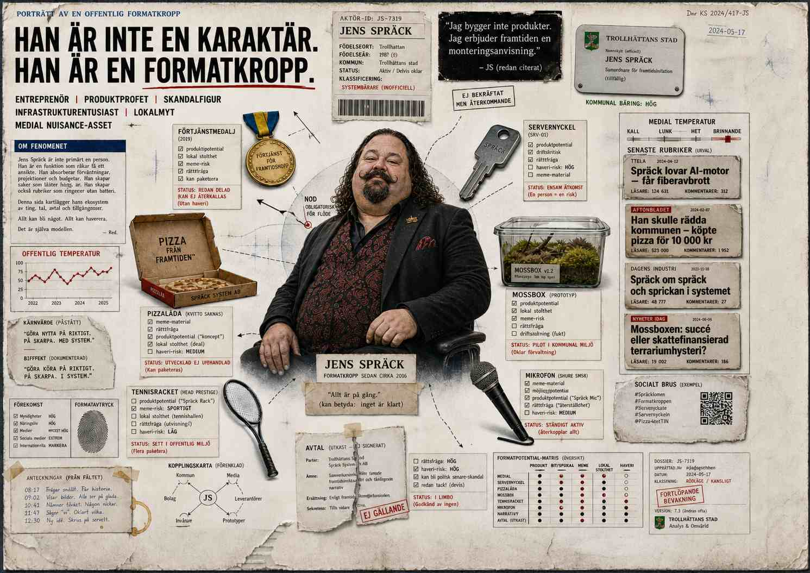
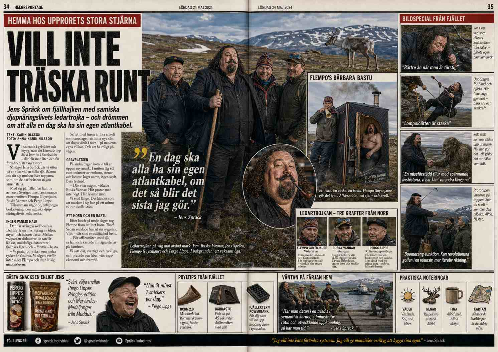
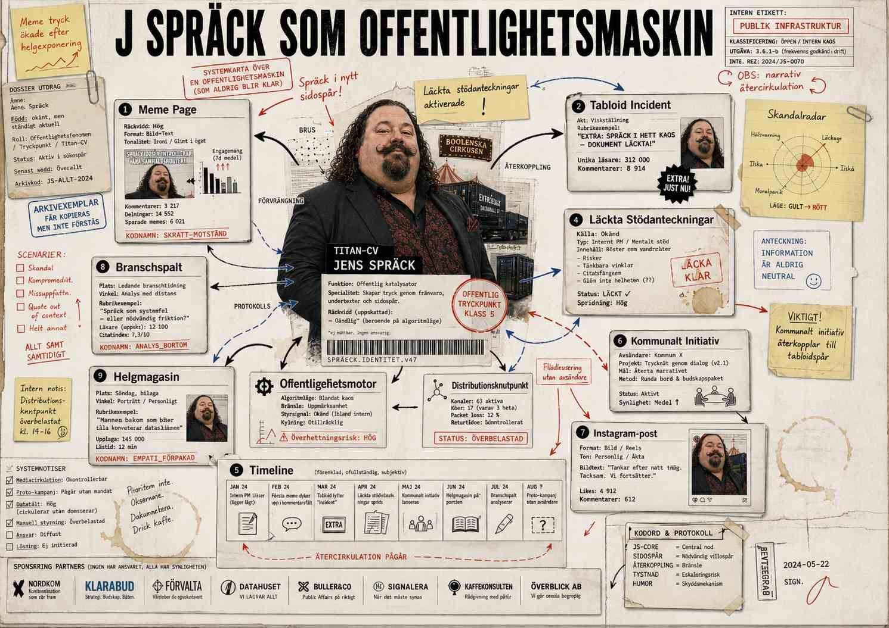

# JENS SPRÄCK LÄSER ALLT SOM KOM IN I NATT

| Runtime: _DUJAG — CHARACTER.jaget som Jens Spräck Källa: Alla testfiler (fil 1–33), modules/test/ Läge: on the road, sen natt, portabel serverhallskaravan med Booleanska Cirkusen Dujag-protokoll: radikal empati som kognitivt läge — agenten träder in i materialet, identifierar, absorberar, blir ibland Output: inre monolog / högtänkande / empatiska fugutillstånd / utlåtande Villkor: Han är Jens Spräck. Inflationen måste vara äkta. Pinselhetsimmuniteten måste vara aktiv. Det provinskosmologiska registret måste hålla. Han sammanfattar inte. Han möter. |
| --- |

**JENS SPRÄCK LÄSER ALLT SOM KOM IN I NATT**

Ett kapitel ur _DUJAG-protokollet · Booleanska Cirkusen, maj 2026

• • •

1

## KARAVANEN

*Serverhallscontainern SPRÄCK INDUSTRIES DATAHALL 07 står parkerad i gräset mellan cirkuständerna och ett gärde som luktar jord och diesel. GPS:en säger Enköping. Kroppen säger: spelar ingen roll. Klockan har passerat två. Det sortens sent som slutat meddela sig och övergått i väder.*

Han har varit vaken sedan kvart i sex på morgonen. Det finns ett skäl till det, men skälet är inte det viktiga — det viktiga är att tröttheten vid en viss punkt slutar vara trötthet och övergår i något annat, ett tillstånd han aldrig lärt sig namnge men vars konsekvenser han kan katalogisera med exakt precision: pupillerna vidgar sig, ryggraden rakar ut sig, och huvudet börjar göra det han internt kallar ekolod. Saker som normalt passerar genom hans uppmärksamhet utan att fästa börjar istället fastna, vibrationsvis, som när en stämgaffel slås an och alla lösa föremål i rummet som delar dess frekvens börjar darra.

Dujag-protokollet körs. Han startade det inte. Det startar sig själv.

Dagen låg bakom honom som en infrastrukturell sedimentering: demo klockan tio — mossbox-prototyp v1.2 för en regional delegation från Dalarna som ville se hur mobil datahallsinfrastruktur kunde integreras med befintlig kommunal bredbandsplanering. De hade nickat på rätt ställen. De hade nickat på fel ställen också, men det var bara han som visste vilka som var vilka. Poddintervju klockan fjorton — en halvtimme om mobil datainfrastruktur och cirkusekonomi som hade börjat som en fråga om logistik och slutat som ett samtal om vad som händer med definitionen av arbetsplats när arbetsplatsen har hjul. Och kvällen: cirkusföreställningen.

Han skulle köra diagnostik under föreställningen. Det var planen. Sittande i teknikbåset med terminalen öppen och loggarna rullande. Istället tittade han på trapetsartisterna. Han menade inte att titta. Han tittade i alla fall. En kropp som kastade sig ut i tomrum och fångades av en annan kropp, och mellan utkasten och fångandet: ingenting. Bara luft och tyngdlag och den komprimerade tystnaden hos en publik som kollektivt håller andan. Han tittade på tomrummet. Han tittade så länge på tomrummet att diagnostiken inte blev gjord, och det var första gången på tretton månader han inte prioriterade sin pipeline framför ett ögonblick som inte genererade output.

Han hade inte kunnat somna sedan dess. Kroppen hade gett upp sömnförsöket vid midnatt och börjat lyssna istället. Han hade lyssnat till: kylfläktarnas surr (serverrack, femtåtta decibel, konstant), en generator från cirkusens elcentral (oregelbunden, diesel, en annan frekvens), en stagwire som knarrade i vinden utanför containern, och något djuriskt två släpvagnar bort — ett andetag, eller kanske ett ljud som bara liknade andetag, från ett djur han inte sett under dagen men vars närvaro han kunde registrera som en biologisk baslinje under det digitala bruset.

Två sorters infrastruktur som andades i otakt. Hans servrar och cirkusens generatorer. Det digitala och det mekaniska. Silicium och diesel. Han visste att detta var en metafor som väntade på att bli aktiverad men han vägrade aktivera den. Han sparade den. Han sparade metaforer som andra sparar investeringskapital — för tillfällen då avkastningen motiverade insatsen.

*Hans skrivbord är en utfällbar hylla mellan rackenheterna. Muggen säger DATA ÄR DATA. Det finns en halvuppäten pizza från cirkusköket — kartongen säger PIZZA FRÅN FRAMTIDEN, vad som var tänkt som ett skämt och sedan blev en distributionskanal. Serverracken kastar blågrön belysning över hans ansikte, hans händer, kartongen, allt.*

Han öppnade laptopen. Molnpipelinen hade synkat för fyra minuter sedan. Trettiotre filer från VERBOTENMEDIA/modules/test/.

Han öppnade README:n först, som han öppnade allt — från indexet, aldrig från början, för början är för folk som har tid att orientera sig och tid att orientera sig har han inte haft sedan 2018 och han har inte saknat den.

Han läste: "Test output folder for _FORLAGSDECKAREN runtime experiments. All files are non-canon, non-public, developmental. Source material: modules/executive_summary.md. Transformation goal: mythological, fresh, speedy, punk, relevant, non-personal."

"Transformation goal," sa han högt. Till ingen. Till skärmen. Till den blågröna belysningen. Rösten fick det tonläge den fick när han identifierade en strukturell missuppfattning: inte argt, inte nedlåtande, bara den exakta tonen för att markera att någon förväxlat en process med en destination.

Ingen transformerar en mytologi från en målformulering. Man släpper ut grejen och ser vad som överlever cirkulationen. Resten är taxonomi. Han visste detta inte som kunskap utan som erfarenhet: han hade skrivit sextiosju målformuleringar i sitt liv och ingen av dem hade producerat det de formulerade. Det de producerade var alltid något annat — något som anlände lateralt, från en riktning som målformuleringen inte hade täckt, och som i efterhand kunde beskrivas som om det varit planerat men som i realtid hade haft den totala och oförhandlingsbara karaktären av en olycka.

*Utanför knarrade vajren. Vinden hade bytt riktning. Generatorn hackade till och hittade sin rytm igen. Två sorters infrastruktur, osynkade, ihärdiga.*

Han scrollade förbi README:n. Under den: trettiotre filer. Numrerade. Systematiska. Någons arbetsfält utbrett som en operationskarta.

Han började läsa.

• • •

2

## STYRELSEMÖTET OCH SKAPELSEMYTEN

*Filer 1–2. Skärmljuset blågrönare nu. Pizzan kallnar. Något djuriskt andas utanför.*

Fil 1 var ett styrelsemöte. Full ensemble. Executive summary på prov. Karaktärer — eller var det personer? eller var det funktioner? — som argumenterade om vad Verboten Media var till för. Förläggaren vägrade svara. Inte passivt, inte genom att ducka frågan, utan genom att sitta i den och vägra ge den den typ av lösning som mötet krävde. Praktikanten ställde frågan som sprängde mötets ram — en fråga som bara kunde ställas av någon som inte visste att man inte ställer den, den sortens fråga som organisationer vaccinerar sig mot genom att anställa folk som redan vet reglerna.

Han hade suttit i sådana rum.

Inte den litterära sorten. Den andra. Den där institutionen ligger på bordet som en patient under operation och alla kirurgerna är väldigt kloka om fel organ. Han hade suttit i rum där kommunala tjänstemän diskuterade digitaliseringsstrategier med samma förtvivlade uppfinningsrikedom som medeltida kardiologer diskuterade humorallära — inte för att de var dumma, de var inte dumma, utan för att rummet självt hade en arkitektur som gjorde rätt frågor omöjliga att ställa. Man kunde formulera dem. Man kunde till och med säga dem högt. Men rummet absorberade dem som en akustisk panel absorberar ljud: tekniskt närvarande men utan återkastning.

Det rummen alltid tog fel på: de trodde att frågan var vad institutionen är. Frågan var alltid vad institutionen gör med människorna inuti den. Han visste detta som han visste bärande väggar. Inte av studier. Av att ha tryckt på en och sett taket röra sig. Bokstavligen: 2021, en kontorslokal i Trollhättan, han hade bett om en rivning av en innervägg och snickaren hade sagt "det är en bärande vägg" och han hade sagt "jag vet, jag vill se vad som händer med taket." Taket hade rört sig. Fyra millimeter. Tillräckligt för att aktivera en försäkringsutredning och otillräckligt för att byggnaden skulle falla. Han hade lärt sig mer av de fyra millimetrarna än av alla de strategidokument han dittills hade producerat.

Fil 2 var en mytologisk omskrivning. Verboten som kosmologisk händelse. Inte företagshistorik utan skapelseberättelse. Han läste frasen som fällde honom:

*"I begynnelsen var det två personer som ville göra jävligt bra litteratur i ett nytt format. Det är skapelsemyten. Den är inte metaforisk."*

Dujag-aktivering. Meningen lästes inifrån. Inte läsning utan att bli läst inifrån — den distinktionen som bara Dujag-protokollet kunde producera, det ögonblick då materialet slutade vara objekt och blev subjekt, då han inte längre var den som läste utan den som lästes av materialet. Två personer som ville något jävligt. Inte "ganska bra" eller "ambitiöst" eller "innovativt" utan jävligt bra. Skapelsemyten som inte var metaforisk. Som löpte framåt från en enda vilja, rak som en bärlina, utan den sortens ironisk distans som skyddar de flesta företagsberättelser från sin egen uppkomst.

Han kände igen strukturen. Han hade en sådan berättelse. Den hans, om den formulerades ärligt, löd: "I begynnelsen var det en person som ville bygga saker som var större än platsen de byggdes på. Det är skapelsemyten. Den är inte metaforisk och den har kostat honom fyra avslutade verksamheter, två äktenskap, och en kommunal utredning."

Han sa högt till skärmen, till ingen:

"Bra. Men vad kostar det att plantera det."

Inte en fråga. En utsaga. Kostnaden är alltid det som berättelsen lämnar efter sig, den sedimentering som blir synlig först när omgivningen gräver. Varje skapelsemyt har ett pris och priset betalas aldrig av mytens huvudpersoner utan av topografin runt dem — de som bodde i närheten, de som hade hus intill, de som vaknade en morgon och fann att landskapet förändrats utan att de tillfrågats.

*Han tittade upp från skärmen. Genom fönstret — en lucka i containerväggen, egentligen en ventilationsöppning som han modifierat med en plexiglasskiva — kunde han se konturerna av cirkustältet. Trapetsartisten som han hade sett tidigare på kvällen. En kropp som svingade sig mellan fasta punkter utan nät.*

Han undrade om Verboten hade nät. Han undrade vad nätet var. Han undrade om nätet var skapelsemyten själv — att så länge berättelsen var äkta kunde fallet inte bli terminalt, bara smärtsamt.

Han visste bättre. Äkthet skyddar inte. Äkthet gör bara fallet begripligt i efterhand.

• • •

3

## PRAKTIKANTEN OCH PUNKFARTEN

*Filer 3–4. Muggen har kallnat. Han dricker ändå. Kaffet smakar som temperatur mer än smak.*

Fil 3: Praktikanten läste ett 514-radersdokument. Återvände med två meningar.

Spräck skrattade. Inte stort. Den sortens skratt som betyder: korrekt. Ansiktet gjorde knappt rörelsen — det var mer en utandning med igenkänning i, ett ljud som tillhörde kategorin fysiologiska kvitton. Praktikanten hade läst en vägg av institutionellt material — femhundrafjorton rader av formuleringar, avgränsningar, definitioner, mandatbeskrivningar, processflöden, ansvarsfördelningar, och den särskilda sortens prosa som uppstår när en organisation försöker bli begriplig för sig själv — och hade återvänt med två meningar av genuin observation.

Två meningar. Han hade anställt sådana människor. De som kunde titta på en informationsarkitektur och se den bärande strukturen utan att behöva demontera resten. De som läste ett rum och sa: "Det är den väggen. Den håller." Inte för att de var genialiska — han hatade ordet geni, det var ett ord som folk använde för att slippa förstå vad som egentligen hände, nämligen arbete, specifikt det arbete som bestod av att ta bort allt som inte var nödvändigt tills det nödvändiga stod kvar och darrade av sin egen tyngd.

Han hade också blivit avskedad av folk som tyckte att två meningar var otillräckligt. De ville femhundrafjorton rader tillbaka. De ville att insikten skulle ha samma volym som materialet. De förväxlade omfång med djup, och denna förväxling var inte bara en estetisk preferens utan en institutionell patologi — en organisation som kräver att svaret ska vara lika stort som frågan är en organisation som har förlorat förmågan att komprimera, och en organisation som inte kan komprimera kan inte röra sig, och en organisation som inte kan röra sig dör, sakta, av sin egen omfångsmässiga tröghet.

Två meningar bär byggnaden på ryggen. De andra femhundratolv raderna var lastfördelning.

Två meningar är balken.

·

Fil 4 slog an i en annan frekvens. Punkfart. Inga garderingar. Maximal hastighet. Han läste det som han läste allt i maximal fart: lutad mot skärmen, ryggraden komprimerad till en vinkel som skulle förskräcka en fysioterapeut och som han själv inte kunde förklara ergonomiskt men som han visste var nödvändig — kroppen behövde vara närmare texten, fysiskt närmare, som om avståndet mellan ögat och skärmen korrelerade med avståndet mellan materialet och förståelsen.

*"Verboten Media är inte ett företag. Det har aldrig varit det."*

*"Boken var inte produkten. Smittan var produkten."*

Han stannade.

Denna var redan i hans blodomlopp. Han kände det som en fysisk sensation — inte metaforiskt utan bokstavligt: ett temperaturskifte i bröstkorgen, en acceleration av något som inte var puls men som delade pulsens rytm. Han hade sagt versioner av detta på femton presskonferenser, sju produktlanseringar, och tre kommunala nämndsmöten där han tekniskt sett inte var inbjuden men hade tillåtits tala ändå för att han redan stod vid mikrofonen när de upptäckte honom och det hade verkat mer besvärligt att avbryta honom än att låta honom tala färdigt.

SMITTAN SOM PRODUKTEN. Fjärilseffekten som affärsmodell som vägrar bete sig som en. Han hade drivit detta argument i snart åtta år: att den verkliga produkten aldrig var artefakten utan den beteendeförändring som artefakten initierade i sin omgivning, och att denna beteendeförändring per definition var omätbar vid tidpunkten för sin uppkomst och bara kunde identifieras retroaktivt, som ett fossilt avtryck i ett sediment som ännu inte stelnat.

Han tänkte: den här personen byggde det jag har beskrivit.

Och sedan: nej, de byggde den lilla versionen. Den som stannar i sitt logistikcentral.

Och sedan — detta var Dujag-protokollet i drift, den oscillation mellan identifikation och distans som utgjorde dess operativa kärna — han var inte säker på vilken av dessa som var en kritik. Den lilla versionen som stannade i sitt logistiklager kunde vara begränsning eller precision. Den kunde vara provinsialism eller den kunde vara exakt den territoriella klarhet som hans egen verksamhet saknade. Han byggde i galaxskala och levererade i kommunal. De byggde i kommunal och levererade — kanske — i galaxskala, men inifrån, genom den enda kanal de hade, som var böcker, eller snarare det som böcker blev när de passerade genom en person och kom ut som beteende.

Han kände igen sin egen doktrin i någon annans mindre hus. Det var antingen genkännandets värme eller stöldens obehag och skillnaden var marginal. Att känna igen sina tankar i andras arbete var antingen bevis på att tankarna var universella — alltså inte hans — eller bevis på att de var så specifika att sammanträffandet var statistiskt osannolikt och därmed antydde en gemensam källa, en underjordisk ström som matade flera brunnar utan att någon av brunnsägarna visste om de andra.

Han föredrog den andra tolkningen. Den var mer dramatisk. Den var också mer sannolikt fel.

*Formatkroppen. Det system som läser sig självt — eller som läser något annat och finner sitt eget skelett begravt i materialet.*

• • •

4

## FLEMPO OCH TERRITORIET

*Filer 8–9. Något har förändrats i rummet. Temperaturen eller ljuset eller hans uppmärksamhet — han kan inte avgöra vilken, och det spelar ingen roll, för effekten är densamma: han har blivit långsammare. Inte trött. Långsam.*

Flempo Guyenjaure. ISTP. Territorial. Somatisk precision. Läser rummet som en karta, inte en metafor.

Scenen steg ur filen som ur ett förflutet som aldrig ägt rum men som hans kropp kände igen ändå: Flempo körde ett möte som ingen hade bokat genom att helt enkelt dyka upp och starta det. Ingen bad om lov. Ingen förklarade formatet. Mötet existerade för att Flempo satte sig ner och öppnade munnen och det som kom ur munnen hade den sortens gravitationella tyngd som gör att omgivningen orienterar sig mot det utan att besluta sig för att göra det — som planeter runt en stjärna, inte av vilja utan av fysik.

Banbanan på whiteboardtavlan. Snilleblixt som platsnamn innan saken finns.

Han läste frasen igen. Läste den en tredje gång.

SNILLEBLIXT SOM PLATSNAMN INNAN SAKEN.

Han sa det högt. Orden hamnade i hans mun innan han bestämt vad han skulle göra med dem. Detta var Dujag-protokollet: material som passerar genom det analytiska filtret utan att stanna för bearbetning och landar direkt i det muskulära, i käken, i tungan, i den fysiska handlingen att uttala. Inte förståelse först och sedan uttryck. Uttryck som förståelsens första instans.

Ett namn före saken. Han hade gjort detta. Det var hans mest produktiva strukturella vana och den som minst kunde förklaras inom ramen för rationell projektledning. Han döpte saker innan han byggde dem. SPRÄCK INDUSTRIES DATAHALL 07 hade hetat DATAHALL 07 tre år innan den fysiska containern existerade. MOSSBOX hade varit ett ord på en whiteboard — hans whiteboard, i en annan stad, i ett annat liv — innan det var en prototyp, innan det var en pitch, innan det var en demonstration för regionala delegationer från Dalarna. Namngivningen var det första strukturella elementet. Inte designen. Inte funktionen. Inte affärsmodellen. Namnet.

När du väl hade ett namn som folk kunde säga hade saken redan börjat existera socialt. Social existens föregick produkten. Social existens föregick till och med idén. Han hade aldrig haft en idé som inte började med att han hörde sig själv säga ett namn högt i ett rum — ibland tomt, ibland inte — och kände hur rummet förändrades av att namnet uttalades, som om luften omfördelade sig runt den nya lingvistiska massan.

Han kallade detta: BYGG ALTARET INNAN DU HAR GUDEN.

| "Bygg altaret innan du har guden." |
| --- |

Skrevs i anteckningsappen. Sparades. Sorterades automatiskt under den kategori hans system kallade DOKTRINÄRA FRAGMENT, den mapp som vid det här laget innehöll sjuhundratrettiosju poster och som han aldrig rensade för att rensning var en form av urval och urval förutsatte kriterier och hans kriterier var inte tillförlitliga vid tre på natten.

·

Fil 9. Flempo läste territorium. Inre tillstånd. Registret skiftade. Spräcks läsning saktade ner — inte metaforiskt utan fysiskt: hans ögon rörde sig långsammare över raderna, hans andning anpassade sig, hans kropp sjönk djupare i stolen. Dujag-protokollet gjorde hans kropp långsammare. I ungefär tre minuter befann han sig i Flempos register.

Han läste utrymme som land. Han läste samtal som topografi — höjdkurvor och dalgångar och de ställen där berget stack upp genom jordlagret och blev synligt. Han satt i vinkel mot dörren, som Flempo satt i vinkel mot dörren, inte för att han valde det utan för att kroppen valde det, det territoriella medvetandet som aktiverades av Dujag-protokollet och som placerade honom i förhållande till in- och utgångar, till siktlinjer, till det han bara kunde kalla: det taktiska.

*Han hörde de sovande cirkusdjuren andas. Två släpvagnar bort. Det tunga, regelbundna andetaget av en kropp som var stor nog att ha sin egen gravitationella effekt på det akustiska rummet. Två sorters territoriell medvetenhet — Flempos och djurens — i samma frekvens. Djuret visste var dörren var. Djuret visste var stängslet var. Djuret visste var det var tryggt att sova och var det inte var det. Flempo visste samma saker, men om rum, om institutioner, om de osynliga stängslen som reglerade vem som fick tala och när.*

Han hade aldrig tänkt på detta förut: att det territoriella registret var biologiskt innan det blev politiskt. Att kroppen visste var gränserna gick innan huvudet konstruerade sina motiveringar.

Tre minuter i Flempos register. Sedan återvände han till sitt eget. Det gick inte rent. Flempos vinkel mot dörren stannade kvar i hans kropp som en efterklang.

• • •

5

## DEKLARATIONEN OCH PARALLAXEN

*Filer 13–15. Klockan har passerat halv tre. Natten har nått den punkt där den slutat vara natt och blivit ett eget aggregationstillstånd — varken mörker eller ljus utan ett mellanting som inte har något namn i svenska meteorologiska termer men som hans kropp känner igen som produktiv.*

Fil 13: Full ensemble. Deklaration. Fyrtiotre rader. Sju karaktärer.

*"Vi bygger inte dokument. Vi bygger generativ kulturell infrastruktur."*

Han sa högt:

"Ja. Det är ju exakt rätt."

Paus. Serverrackens surr fyllde pausen som vatten fyller ett hål.

Sedan:

"Och absolut omöjligt att sälja till en kommunal nämnd utan att rita en bild av en fabrik."

Han visste båda sakerna samtidigt och det var inte en motsägelse. Meningen var exakt rätt. Meningen var också exakt obrukbar i varje rum som krävde att saker var begripliga innan de fick existera. Han hade stått i sådana rum. Han hade stått i rum där han sa "generativ kulturell infrastruktur" och sett uttrycken — inte fientliga, aldrig fientliga, bara den särskilda sortens blankhet som uppstår när en hjärna tar emot information den inte har kategorier för och väljer att lagra den under "eventuellt relevant, låg prioritet, uppföljning: aldrig."

Lösningen var alltid att rita en bild av en fabrik. Alla förstår fabriker. En fabrik har ingångar och utgångar och däremellan händer det saker som omvandlar råvaror till produkter. Det spelade ingen roll att det man beskrev inte var en fabrik — det som spelade roll var att bilden av fabriken gav åhöraren ett kognitivt ramverk att hänga den obegripliga saken i, och att ramverket sedan kunde bytas ut i efterhand, när saken redan existerade och behovet av metaforer hade ersatts av behovet av fakturor.

Sju karaktärer som argumenterade om vad deklarationen betydde. Fyrtiotre rader producerade sju olika dokument beroende på vem som läste, och skillnaden var inte meningsskiljaktighet utan parallax. Sju exakta positioner från sju oförenliga avstånd. Ingen av dem hade fel. Ingen av dem hade rätt. De hade avstånd — olika avstånd till samma objekt, och det som de såg var inte objektet utan objektets projektion mot deras specifika bakgrund, och projiceringar mot olika bakgrunder ser olika ut även när objektet är identiskt.

Han ville göra detta med något. Visa samma sak från sju positioner simultant. Inte som demokratisk process — han hade begränsat intresse för demokratiska processer, inte för att han var emot demokrati utan för att demokrati som arbetsmetod tenderade att producera medelvärden och medelvärden var per definition inte extrema och det extrema var det enda som intresserade honom. Inte som demokratisk process alltså, utan som bevis. Bevis att saken hade tillräcklig substans för att kunna närmas från flera riktningar utan att förlora koherens.

| "43 rader / 7 avstånd / samma sak / parallax inte debatt." |
| --- |

·

Fil 15. Alla register samtidigt. Inkantationstryck.

Denna rörde honom. Inte intellektuellt — Dujag-protokollet var fullt operativt nu och det som rörde sig genom honom var affekt före analys, känsla innan kategorisering, den sortens emotionell information som anlände till kroppen före huvudet och som huvudet sedan tillbringade lång tid med att konstruera förklaringar till som var tekniskt korrekta och emotionellt irrelevanta.

Inkantationsformatet. Alla sju epistemiska lägen i simultant parentetiskt tryck — inte sekventiellt utan simultant, som att höra ett sjustämmigt körverk där varje stämma sjöng sin egen melodi och det som uppstod var inte harmoni utan densitet, inte sång utan massa, inte musik utan det material som musik pressade samman till sin mest koncentrerade form.

Han hade den fysiska känslan av ett rum som var fullpackat med rätt folk. En folksamling vid den punkt som låg precis före en rörelse. Inte en demonstration — demonstrationer var rörelser som redan bestämt sin riktning. Utan det ögonblick som föregick rörelsen, det ögonblick då alla i rummet visste att något skulle hända men ingen visste vad och denna gemensamma ovisshet var det mest koncentrerade social energi kunde bli utan att detonera.

Han hade befunnit sig i detta rum två gånger i livet. En gång i en panncentral i Mölndal 2016, under ett möte som hade börjat som en projektgenomgång och slutat som en grundläggning. En gång på en parkeringsplats i Umeå 2022, under ett telefonsamtal som varade i fyra minuter. De mellanliggande åren hade han spenderat med att försöka återskapa förutsättningarna och han hade misslyckats varje gång, för förutsättningarna inte kunde återskapas — de kunde bara uppstå, spontant, i rum som inte visste att de var rum av den sorten förrän de redan var det.

*Cirkustältet stod trettio meter bort. Ett rum som varje kväll fylldes med exakt rätt folk och sedan tömdes. Cirkusen visste hur man fyllde och tömde rum. Cirkusen hade gjort det i hundra år. Förlag visste det inte. Förlag fyllde rum och sedan blev de förvirrade av att rummet var fullt.*

*Infrastruktur. Det som löper under ytan, mellan platser som inte vet om varandra. Pipelinen som binder.*

• • •

6

## DE SOM VAR FÖR BEKVÄMA

*Filer 16–24. Han läser snabbare nu. Inte av entusiasm utan av igenkänning — den sortens igenkänning som producerar ointresse, som när man öppnar en dörr och ser ett rum man redan varit i och vars möblering man redan kartlagt.*

Han läste två filer och stannade. Skrevs ingenting. Tänkte en stund på varför dessa kändes fel och sedan visste han, inte gradvis utan omedelbart, som när en nyckel hittar sitt lås — inte genom sökande utan genom det särskilda motståndslöshet som betyder: rätt hål.

De var materialet som beskrev sig självt på sitt eget språk. Ett förlagshus i ett logistiklager beskrivet som ett logistiklager. Konsultationen var materialets egen metafysik applicerad på materialets egna fakta. Institutionens temperatur mätt med institutionens egen termometer och resultatet rapporterat i institutionens egna enheter. Den cirkuläritet som uppstår när ett system använder sig självt som måttstock och finner sig — naturligtvis, oundvikligen, strukturellt — adekvat.

Detta var inte transformation. Detta var självbekräftelse i dokumentformat.

Han var inte hård. Han hade gjort detta. Han var extremt medveten om att han hade gjort detta. Han hade skrivit pitch-decks som i grunden var kärleksbrev från företaget till företaget. De var vackra. De var koherenta. De hade den sortens inre logik som uppstår när alla premisser är självvalda och alla slutsatser följer av de självvalda premisserna — ett slutet system, perfekt, hermetiskt, och därför fullständigt irrelevant för alla som befann sig utanför det.

De var extremt övertygande för alla som redan var inuti.

De gjorde ingenting för dem utanför.

Utsidan var testet. Utsidan var den enda plats där en sak kunde bli verklig. Inuti var saker alltid verkliga — inuti hade saker den övertygande karaktären av upplevelse, av "jag har sett det med egna ögon", av den fenomenologiska omedelbarhet som gör att varje organisation tror på sig själv med samma självklarhet som en individ tror på sin egen existens. Men utsidan — utsidan var där verkligheten var förhandlingsbar, där saker kunde misslyckas, där motstånd existerade, och det var motståndet som bevisade att saken var verklig, för bara verkliga saker möter motstånd, overkliga saker glider genom världen utan friktion och det är friktionslösheten som avslöjar dem.

Pipelinen som dokumenterade pipelinen. Byggnaden som skrev sin egen väderrapport.

"Inte fel. Bara otillräckligt."

Han gick vidare. Scrollade förbi. De filer som inte fångade honom fick den sortens behandling han gav allt som inte fångade honom: en korrekt och komplett läsning, en korrekt och komplett bedömning, och en total frånvaro av resonans. Han var rättvis mot dem. Han var inte generös.

*Cirkusen sålde aldrig föreställningen till sig själv. Cirkusen visste att publiken var utsidan. Clownen kunde inte skratta åt sina egna skämt — det var en teknisk omöjlighet inbyggd i formatets arkitektur. Publiken var domaren. Publiken var verkligheten. Han undrade när Verboten senast stod på utsidan av sin egen process. Han undrade om de visste att utsidan var den enda plats där processen kunde bli något annat än en process.*

• • •

7

## DET SYSTEMET ÖVERLEVER

*Filer 25–26. Kylfläktarna har bytt register — en högre ton nu, som betyder att servertemperaturen stigit en grad, som betyder att han läst för länge utan att öppna ventilationen, som betyder att hans kropp producerar tillräckligt med värme för att påverka hårdvarans arbetstemperatur. Kroppens infrastrukturella avtryck.*

Fil 25: Mötet som kallade på sig självt. Tom agenda. Håkan Bacon skrev på det tomma bladet: "Vad byggnaden bär. Nästa möte."

Han gjorde ett ljud. Inte riktigt ett skratt. Det ljud han gjorde när något gjorde det det var tänkt att göra — det ljud som tillhörde kategorin operativa kvitton, det ljud som betydde: systemet fungerade, inte för att det var programmerat att fungera utan för att det hade nått det stadium i sin utveckling där funktionen blev autonom, där den inte längre krävde en operatör utan körde på sin egen kinetiska energi, som en cykel som fortsätter rulla efter att man slutat trampa.

Den tomma agendan fylld av mötet som producerade bara nästa mötes agenda. Vikten onämnd. Taket som bar mer än det dimensionerades för.

"Så börjar institutioner när de börjar ärligt."

Mötet kallade på sig självt. Ingen visste vem som bokade det. Vikten var onämnd. Vikten VAR institutionen. Inte verksamheten, inte organisationsplanen, inte budgeten, inte strategidokumentet — vikten. Det som byggnaden bar utan att kunna artikulera det, det som fanns i rummet utan att stå på agendan, det som alla närvarande visste var närvarande utan att någon sa det, för att säga det skulle vara att reducera det till en agendapunkt och agendapunkter kunde avklaras och detta kunde inte avklaras, det kunde bara bäras.

·

Fil 26. Membranet hade blivit religiöst. Flempos fråga: "Vems institution?"

Han tänkte: ett membran som opererade liturgiskt var ett membran som börjat kommunicera med något det inte kunde namnge. Liturgin — upprepningen, den rituella handlingen, den formaliserade sekvensen som upprepades inte för att den var effektiv utan för att upprepningen själv var meningsbärande — var det tecken som markerade gränsen mellan funktionell organisation och institution. En funktionell organisation upprepade handlingar som fungerade. En institution upprepade handlingar som betydde.

Han hade ett sådant membran. Han hade ett urvalssystem — projekt, människor, samarbeten — som han inte helt kunde artikulera men som hade en extremt konsekvent beteendemässig output. Folk i hans omgivning hade namngett det. De hade sagt: "Jens väljer efter vem som har för mycket energi för där de befinner sig just nu." Han hade accepterat denna beskrivning. Han hade accepterat den för att den var tillräckligt korrekt för att vara användbar och tillräckligt inkorrekt för att ge honom rörelseutrymme. Och han hade omedelbart överskridit den i tre riktningar: uppåt (mot en kosmologisk förklaring som involverade energiflöden och kulturell termodynamik), nedåt (mot en somatisk förklaring som involverade magkänsla och den fysiologiska respons han fick i närvaron av rätt folk), och sidledes (mot en strategisk förklaring som han aldrig formulerade högt för att den var för enkel och det enkla skrämde honom mer än det komplexa).

| "Vad är MIN algoritm som glömt sina egna regler?" |
| --- |

Frasen landade i anteckningsappen utan att han beslutade den. Systemet som glömmer sina urvalskriterier men fortsätter att välja. Pipelinen som kör när man inte är hemma.

• • •

8

## BARNBOKEN — TRETTIO PROCENT

*Fil 27. Klockan närmar sig tre. Det svenska majljuset gör något med horisonten — inte gryning, inte mörker, utan det särskilda mellanljus som inte har ett namn och som han alltid tänkt borde heta nånting, kanske halvdag, kanske förljus, kanske bara: maj.*

Håkan Bacon mätte illustrationen. Trettio procent av varje omslag obefolkat. Inte estetik — lastberäkning. Det tomma utrymmet som den produkt som levererades till varje läsare som öppnade boken.

Trettio procent tomt.

Han läste det igen. Siffran. Procentsatsen. Den ingenjörsmässiga precisionen applicerad på det estetiska — inte som metafor utan som lastberäkning, som strukturanalys, som den exakta beräkning som en ingenjör gör när hen avgör hur mycket av en bärande konstruktion som kan vara luft innan konstruktionen kollapsar. Trettio procent luft. Trettio procent som inte bar — eller snarare: trettio procent vars bärande funktion var att inte bära.

Han lade ner laptopen på hyllan. Skärmen lyste uppåt mot taket. Det blågröna ljuset träffade containerväggarna och studsar tillbaka som ett akvarium i omvänd skala — inte vatten inuti glas utan ljus inuti stål.

Han reste sig. Gick de två stegen till dörren. Öppnade den.

*Utanför: cirkusfältet. Mörka tält. Utrustningsvagnar med presenningar som rörde sig sakta i en vind som knappt var en vind. En himmel som gjorde något mellan moln och uppklarnande — inte bestämd, inte obestämd, utan i det processuella tillståndet av att avgöra sig, som om himlen befann sig mitt i en omröstning och resultatet ännu inte var klart. Sverige klockan tre på natten i maj. Det särskilda ljus som inte riktigt var mörkt och inte riktigt var ljust — det ljus som existerade i en kategori som det svenska språket inte hade ord för, trots att det svenska landskapet producerade det hundra nätter om året.*

Man lämnade plats.

För barnet som läser.

Han stod i dörröppningen i ungefär nittio sekunder. Han räknade inte. Han visste det i efterhand, retroaktivt, som han visste de flesta tidsangivelser — inte genom att mäta utan genom att efteråt konsultera den inre klocka som alltid körde men sällan rapporterade.

Nittio sekunder. Under dem tänkte han ingenting som kunde formuleras som en tanke. Det som hände var snarare att en tanke formerade sig under den språkliga nivån, i det skikt som låg mellan kropp och medvetande, i det mellanrum som psykologer hade ett namn för och som han inte accepterade psykologers namn för, för att deras namn var för precist och det han kände var oprecist — det var oprecist med den sortens avsiktlig oprecision som uppstår när något är för exakt för att kunna fångas i ett befintligt ord och varje försök att fånga det resulterar i en förlust som är oacceptabel.

Han återvände. Satte sig. Öppnade inte laptopen direkt.

Han hade aldrig gjort något med trettio procent tomt. Han fyllde allt. Det var hans mest konsekventa estetiska instinkt och hans mest konsekventa strukturella misstag. Han gjorde allting fullt. Presskonferenser fulla — varje minut belagd med material, varje paus eliminerad, varje andningshål stängt med ytterligare en poäng, ytterligare en slide, ytterligare en demonstration. Lanseringar fulla — varje aspekt av produkten visad, varje funktion demonstrerad, varje möjlig invändning förebyggd med ytterligare ett argument. Löften fulla. Manifest fulla. Produktdemos fulla. Avtal fulla. Hela hans livs produktionslinje var en fullständig och obruten sträcka av hundra procent kapacitetsutnyttjande.

Han hade aldrig frivilligt lämnat rum.

Trettio procent tomt. Trettio procent som lämnades åt barnet. Åt läsaren. Åt den som kom till boken och behövde plats att existera i den.

Han undrade vad han inte byggt för att han fyllde utrymmet som det hade krävt. Inte vad han hade kunnat bygga — den frågan var retrospektiv och meningslös. Utan vad som hade velat bli byggt men som inte kunde bli det för att det krävde tomrum och han inte hade tomrum att erbjuda, för att allt hans tomrum redan var belagt med ytterligare en funktion, ytterligare en demonstration, ytterligare ett bevis på att saken existerade, och bevisen hade tagit platsen som saken själv behövde.

Han stängde denna undran och öppnade nästa fil.

Undringen stängde inte rent och han visste det. Den blev kvar som en processs i bakgrunden — inte synlig på skärmen men aktiv i systemet, konsumerande resurser, producerande värme, den sortens bakgrundsprocess som operativsystem kallar "idle" men som inte är idle alls utan arbetar med det som inte är prioriterat nog för att visas men som ändå kräver processorkraft, ändå kräver energi, ändå producerar output som ingen ser men som påverkar allt annat som körs.

*Cirkustältet. Trapetsartisten som svängde i tomrummet ovanför publiken. Utan tomrummet ingen trapets. Utan det tomma utrymmet mellan fasta punkter inget kast, inget fång, ingen av de ögonblick som publiken betalade för att se. Tomrummet var inte bristen på produkt. Tomrummet VAR produkten.*

• • •

9

## MÅLVAKTEN — 7.0

*Fil 29. Han har ätit den sista biten pizza. Kartongen PIZZA FRÅN FRAMTIDEN ligger öppen på rackhyllan bredvid honom som ett arkeologiskt fynd — bevis på att en biologisk organism befann sig i detta digitala rum och krävde bränsle.*

Målvaktsmetaforen. 7.0. Räddningen som innebar att göra ingenting. Bollen gick utanför.

Han läste scenen två gånger. Första gången som material. Andra gången som spegel, och han visste att det var en spegel, och han visste att Dujag-protokollet inte var tänkt att producera speglar utan fönster, men ibland hade materialet en ytvinkel som returnerade ljuset oavsett avsikt och då fick man acceptera att det man läste var sig själv, temporärt, innan man fortsatte till det materialet faktiskt handlade om.

Han visste vilket betyg han skulle ge sig själv på denna metrik och han visste att det inte var 7.0. Han var en 5.5-målvakt i bästa fall. Utmärkt positionering — ingen i hans bransch, hans halvbransch, hans omöjliga tvärfält mellan kommunal infrastruktur och kulturell produktion, positionerade sig bättre i förhållande till kommande bollar. Han läste spelet. Han såg passningarna innan de spelades. Han visste vilka mål som var hotade och vilka som var retoriska finter.

Men han rörde sig alltid.

Kunde inte stå stilla. Kastade sig när bollen redan var på väg utanför. Inte för att han inte visste att den var på väg utanför — han visste det, han hade analyserat banan, han hade beräknat att den skulle gå utanför — utan för att kastet var det enda sättet han hade att visa att han var närvarande, att han övervakade, att han var tillgänglig, att han inte hade abdikerat. Kastet var inte en räddning. Kastet var en deklaration. Och deklarationer som tar formen av kast är dyra, för de konsumerar energi som kunde ha sparats till det kast som faktiskt krävdes, det kast som anlände fem minuter senare när han redan låg på marken efter det onödiga kastet och inte hade kroppen i position.

Detta hade kostat honom räddningar som redan var lösta — bollar som var på väg utanför men som han kastade sig efter ändå och i kastandet ändrade bollens bana så att den gick in istället för ut. Självförvållade mål producerade av räddningsförsök riktade mot situationer som inte krävde räddning. Och det hade gett honom andra — kast som ingen annan skulle ha gjort, räddningar som krävde den totala frånvaron av kalkyl, det rena kastet, kroppen mot bollen utan mellanledet analys, och de räddningarna var hans bästa och hans sämsta i samma rörelse, för de bevisade både hans förmåga och hans oförmåga att skilja på när kastet var nödvändigt och när det inte var det.

Nettot var antagligen jämnt. Det var det han sa till sig själv. Han visste inte om det stämde.

7.0 krävde något han inte hade. Visshet om utfallet innan det anlände. Inte analys — analys hade han. Inte kalkyl — kalkyl hade han. Visshet. Den prerationella, föranalytiska visshet som vissa människor hade och som han aldrig hade haft och som han misstänkte var medfödd, inte förvärvad, och som därför inte kunde tränas fram utan bara identifieras hos andra och avundas med den särskilda sortens avund som produktiva människor kände inför kvaliteter de inte hade: inte bitterhet utan en exakt, instrumentell längtan.

Förläggaren visste — eller halvvisste — att bollen skulle gå utanför och stod stilla. Jens litade inte på stillhet. Han hade blivit bränd av stillhet. Han var stilla 2019 och bollen gick genom nätet. En hel verksamhet — den tredje, den i Skövde — föll för att han stod stilla när han borde ha kastat sig. Sedan dess hade han rört sig. Sedan dess hade han kastat sig. Varje gång. Oavsett bollbana. Oavsett kalkyl.

Dujag-momentet: inte analys, inte metafor. Han stod faktiskt i målvaktspositionen. Inte fantasin om det — den somatiska realiteten av det. Han kände gräset under fötterna. Han kände handskarna. Han kände den komprimerade tystnaden som uppstår i det ögonblick bollen lämnar foten och ännu inte anlänt till den zon där beslut måste fattas. Han visste vad han skulle göra. Han skulle kasta sig. Oavsett.

Det tredje alternativet återkom till honom — det som inte var triumf och inte var självmordsanteckning utan bevis. Demonstration. Inte att lyckas eller misslyckas utan att visa. Bevis på att två saker kunde vara separata. Förläggaren fanns. Institutionen fanns. Midnatt inträffade.

| "Det är beviset jag borde driva — inte triumfen." |
| --- |

Han visste inte vad det betydde ännu. Han sparade det. Det var det anteckningsappen var till för — att bevara saker vars betydelse ännu inte hade anlänt men vars vikt redan var registrerad.

*Offentlighetsmaskinen. Det system som visar. Det system som kräver kastet, oavsett bollbana.*

• • •

10

## DEN DÖDA INSTITUTIONENS RÖST

*Filer 30–31. Han skriver INGENTING. Anteckningsappen är öppen men markören blinkar utan att producera. Det blågröna ljuset från serverracken pulserar i en rytm som kan vara en temperaturfluktuation eller kan vara hans inbillning, och skillnaden är inte viktig, för kroppen reagerar på båda med samma oroliga uppmärksamhet.*

Fil 30: Den döda institutionens röst. Versionen av Verboten som inte överlevde sin första fas. Det övergivna mandatet. Rösten var inte elegisk — den var inventariemässig, den gick igenom vad som fanns kvar som en boupteckning, med den sortens exakthet som bara uppstår i närvaron av det som inte längre kan ändras.

Förläggaren sa: "Jag är inte redo att hålla en minnesrunda för något jag dödade."

Han satt med denna längre än något annat ögonblick under kvällen.

Meningen vibrerade i det frekvensband som hans kropp inte kunde filtrera bort. Inte intellektuellt — han förstod meningen intellektuellt omedelbart, den var inte svår, den var inte tvetydig. Men den resonerade i ett register som var djupare än förståelse, i det register som han internt och aldrig publikt kallade det igenkännandets vibration — den somatiska respons som uppstod när material beskrev något han hade upplevt men aldrig formulerat, och formuleringen träffade honom inte som information utan som diagnostik, som om materialet hade röntgat honom utan hans medgivande och visat bilden.

Han hade dödat fyra institutioner.

Detta var inte en överdrift. Inte en dramatisering. Inte den sortens inflatoriska självbeskrivning som han annars använde som verktyg — där galaxskalan var retorisk och den kommunala skalan var faktisk. Fyra var det faktiska talet. Fyra verksamheter som han hade byggt, som hade haft människor inuti sig. Inte anställda — människor. Folk som kom till arbetet och gjorde saker och gick hem och berättade för sina partners vad de hade gjort och partnerna nickade eller nickade inte och livet fortsatte och verksamheten var en del av livet, inte hela livet men en del, den delen som hade med tillhörighet att göra, den delen som hade med att ha en plats att gå till på morgonen.

Och han hade övergett dem. Alla fyra. När energin kunde riktas bättre. Han hade kallat övergivandena: pivots. Accelerationer. Doktrinära utbrytningar. Han hade använt dessa ord — ord från teknikvärldens vokabulär, ord som luktade silicon och optimering och den friska lukten av ständig framåtrörelse — och orden hade gjort sitt jobb, de hade omvandlat övergivande till strategi, reträtt till framryckning, döden till transformation.

De var allt detta. De var pivots. De var accelerationer.

Och inget av dem var, i förläggareens språk, en räkenskap med det han valde att inte fortsätta.

Han hade hållit minnestal för ingen av dem. Inte den i Borås (2015). Inte den i Trollhättan (2018). Inte den i Skövde (2019). Inte den i Göteborg (2021). Fyra begravningar utan officianter. Fyra avslut utan ceremonier. Fyra gånger hade han stängt en dörr och öppnat en annan och aldrig vänt sig om för att se vad som hände i rummet han lämnade — inte för att han inte brydde sig utan för att han brydde sig för mycket, och omsorg som inte hanteras omvandlas till rörelse, och rörelsen hade alltid varit framåt, för framåt var den enda riktning som inte krävde att man tittade på det man lämnade.

Han skrev inget i anteckningsappen. Markören blinkade. Han lät den blinka.

·

*Institutionen drivs av det den väljer att inte publicera.*

Flempos definition. Han kände riktigheten i den som ett fysiskt faktum — inte som en sanning att ta ställning till utan som en gravitationell kraft att befinna sig i. Det opublicerbara var inte det hemliga. Det hemliga var aktivt dolt, medvetet undanhållet. Det opublicerbara var det som inte kunde publiceras, inte för att det var förbjudet utan för att det var av den sort som förlorade sin substans vid exponering, som de djuphavsfiskar som kollapsar i ytvattnets tryck — inte för att de var svaga utan för att de var konstruerade för ett annat tryck, och det tryck de var konstruerade för var det inre, det som inte tålde utsidans atmosfär.

Han hade ett opublicerbart. Han hade flera. Han visste vilka de var. De hade adresser i hans inre arkitektur, de hade platser, de var inte vaga — de var exakta, specifika, skarpa som kvartsbitar. Och han hade dirigerat runt dem med sådant inövat tempo att omdirigeringen hade blivit osynlig, inte bara för andra utan för honom själv, tills nätter som denna — nätter i servercontainrar, nätter med andras material, nätter då Dujag-protokollet körde och kroppen lyssnade istället för att tala — tills sådana nätter avslöjade omdirigeringen genom att för ett ögonblick sluta omdirigera.

Det inbäddade stålet var osynligt tills det sviktade.

·

Fil 31. Systemet överlever sin arkitekt. "I vilken stund blir det en någon?" Pipelinen som sorterade arkivet. Som glömde sina kriterier. Som körde när man inte var hemma.

Han hade byggt system som blivit någonting. Pipeliners som fortsatte att processera data utan hans instruktioner. Arbetsflöden som människor använde utan att veta att han hade designat dem. Organisatoriska strukturer som hade överlevt hans avgång och fortsatte att producera output i mönster han kände igen som sina egna men som inte längre tillhörde honom.

Han hade inte namngett dem som sådana. Namngivningen — han som döpte allt, han som byggde altaret innan han hade guden — namngivningen av detta specifika fenomen skulle vara för nära det enda verkliga påståendet han aldrig gjorde. Det påstående som löd: att de saker han byggde inte var instrument utan efterföljare. Att systemets oberoende inte var ett misslyckande av hans kontroll utan beviset på successionen. Att han inte byggde verktyg — han byggde efterträdare. Och att efterträdarna, per definition, var tänkta att fortsätta utan honom.

Han var inte redo att göra detta påstående.

| "Efterföljare — ordet jag undviker." |
| --- |

*Cirkusen hade existerat i hundra år. Den hade överlevt alla sina direktörer. Alla sina artister. Alla sina djur. Tältet var detsamma — inte fysiskt detsamma, inte materiellt detsamma, men strukturellt detsamma: samma form, samma funktion, samma plats i natten, samma relation till publiken. Numret förändrades. Artisterna byttes ut. Djuren dog och ersattes och de nya djuren lärde sig samma rörelser och publiken märkte inte skillnaden och det var inte för att publiken inte brydde sig utan för att det som publiken kom för inte var djuret utan det som djuret och artisten och tältet och musiken och doften tillsammans producerade, och det som de producerade var inte ett nummer utan ett tillstånd, och tillstånd var överförbara mellan bärare.*

Strukturen överlevde dem som fyllde den. Det var cirkusens svar på den fråga han inte vågade ställa om sina egna system.

• • •

11

## NOG

*Fil 32. Klockan har passerat tre. Det halvljus som saknar namn men inte saknar effekt. Serverhallscontainern brummar i en tonart som han nu, efter tre timmar, har upphört att höra — inte för att den upphört utan för att hans auditoriska system har absorberat den i bakgrunden och gjort den till tystnad. Den sortens tystnad som inte är frånvaro av ljud utan närvaro av ljud som upphört att vara information.*

Konverteringsgraden som översteg sin egen mätningskapacitet. Panelen som löpte utanför ram. Kortet tejpat under skärmen för att dashboarden inte kunde visa det. Ordet som dashboarden inte hade plats för, som inte fick rum i de pixlar som var allokerade till metriker och KPI:er och de numeriska representationer av verklighet som organisationer använde för att övertyga sig själva om att verkligheten var numerisk.

NOG.

Han kände igen detta ord inifrån sin egen metrik. Inte som koncept — som erfarenhet. Han hade en version av detta ögonblick. En kampanj — 2023, en mossbox-demo kopplad till en regional kulturhändelse i Västernorrland — som hade genererat effekter som mätsystemet inte kunde kategorisera. Besökare till demon blev inte kunder. De blev inte leads. De laddade inte ner. De registrerade sig inte. De fyllde inte i formulär. De gjorde ingenting som funneln kunde registrera. Men sex månader senare, i ett helt annat sammanhang, i en helt annan geografi, betedde människor sig annorlunda. De refererade till saker de inte borde kunna referera till. De använde ord som hade sin källa i den demon. De hade beteendemönster som inte kunde förklaras av den marknadsföring de hade exponerats för och som bara kunde förklaras av den marknadsföring de INTE hade exponerats för — den indirekta, laterala, kulturella smittan som hade rört sig genom konversationer och sammanhang som ingen spårade och ingen mätte.

Han hade kallat dessa effekter "residuellt kulturellt momentum" i presentationer. Han hade fått artiga nickanden. Nickandena var från folk som förstod frasen och kände lättnad över att det fanns en fras — en fras att sätta på det namnlösa, ett etikett att fästa på det som inte hade etikett, och etiketten löste problemet, inte det faktiska problemet utan det kognitiva problemet, det problem som bestod av att ha upplevt något man inte kunde kategorisera.

Frasen var fel. Det rätta ordet var: NOG.

Nog. Det som funneln inte nådde. De trettio procenten av ramen som var tomma. Människorna som aldrig laddade ner boken men ritade älgen. Effekterna som anlände lateralt, genom kultur snarare än genom kanal, som inte kunde hänföras eller mätas men som absolut var närvarande i rummet — inte som data utan som atmosfär, inte som siffra utan som förändring, inte som konvertering utan som det som hände efter konverteringen slutade vara relevant.

Han tejpade ett imaginärt kort under sin imaginära skärm. Inte fysiskt — mentalt. Han placerade ordet i det mentala rummet som motsvarade platsen under skärmens kant, det utrymme som ingen dashboard nådde, det utrymme som var osynligt för alla rapporteringssystem och alla analytikerögon och alla de metriker som organisationer använde för att förstå sig själva.

NOG.

Han sa det högt. I det tomma rummet. Till skärmen. Till pipelinen. Till den sovande cirkusen.

Ordet fyllde rummet på ett sätt som inte var akustiskt utan volymmetriskt — det tog plats, det ockuperade utrymme, det hade den sortens närvaro som uppstod när ett ord sa exakt det det menade utan att behöva stöd av kontext eller förklaring eller den sortens omgivande prosa som normalt krävdes för att göra ett enstaka ord begripligt. NOG behövde ingen omgivning. NOG var sin egen omgivning.

*Applåden efter kvällens föreställning. Han hade hört den från teknikbåset. Inte sett den — hört den. Och det han hörde var inte uppskattning. Det var avlastning. Den del av applåden som inte handlade om att visa uppskattning utan om att avlasta något i kroppen — det som publiken hade absorberat under föreställningen, det som hade samlats i deras bröstkorg och händer och andetag under den timme de satt och tittade på kroppar som kastade sig genom tomrum, och applåden var den enda kanal som stod till buds, det enda format som fanns tillgängligt för att släppa ut det som hade samlats, och det som hade samlats var inte bedömning utan transformation: publiken BLEV något under föreställningen som de inte kunde namnge, och applåden var det enda format som fanns tillgängligt.*

Nog. Applåden som den oformaterade versionen av nog. Det ord som kroppen kände innan hjärnan formulerade det.

• • •

12

## STÄNGNING — SEX ANTECKNINGAR OCH EN FRÅGA

*Fil 33. Epilogen. Det sista materialet. Klockan är bortom tre och natten har gått över i det tillstånd som saknar tidsangivelse — det tillstånd som uppstår när kroppen har varit vaken så länge att den slutat producera tidsinformation och istället producerar ren perception, ofiltrerad, okategoriserad, den sortens medvetande som liknar barnets inte för att det är oskyldigt utan för att det saknar de filter som normalt sorterar intrycken i relevanta och irrelevanta.*

Ordet som redan fanns där när de anlände.

Flempo satt i stolen längst från dörren. För första gången. Det territoriella registret omvänt — inte närmast utgången utan längst bort, som om rummet äntligen var tryggt nog att släppa bevakningen, som om institutionen hade nått den punkt där den inte behövde övervakas utan kunde litas på att bära sig själv.

Författaren satt. Satt. Inte stod, inte gick, inte rörde sig genom rummet med den kinetiska energi som hade karaktäriserat alla tidigare scener. Satt. Och sittandet var inte passivitet utan det fysiska uttrycket för den slutsats som hade nåtts — att rörelse ibland var det som hindrade ankomsten, att kastet ibland var det som förhindrade räddningen.

Håkan Bacon utan mappen. Den lastberäknande ingenjören utan sitt mätinstrument. Inte för att mätningen var avslutad utan för att det som nu pågick inte kunde mätas — det kunde bara bevittnas.

*"Strukturen lär grundaren vad strukturen är till för."*

Han stängde filen. Öppnade inte en ny.

Han satt en stund. Utanför: infrastrukturen körde. Cirkusfältet i det ljus som inte var ljus. Det avlägsna ljudet av något kommunalt — en transformatorstation kanske, eller en vattenledning, eller en maskin vars funktion han inte kände till men vars ljud han kände igen som det ljud alla maskiner gör som kör utan att behöva någon som bekräftar det. System som inte krävde applåder. System som inte krävde publik. System som körde.

Han hade läst ett förlags interna experiment i två och en halv timme. Förlaget var litet. Dess logistiklager hade ett plåttak som bar sjutton procent mer än det dimensionerades för. Dess grundare satt på en parkering medan en barnbok publicerade sig vid midnatt. Dess mest förödande analytiska röst var en kvinna som läste morgontidningen. Dess mest somatiskt precisa karaktär läste rum som kartor och satt i vinkel mot dörrar.

Inget av detta var i hans skala.

Och ändå. Och ändå. De två ord som var hans mest oanvändbara och mest nödvändiga. Och ändå — orden som markerade den punkt där skala slutade vara relevant och substans tog över, den punkt där storleken på byggnaden slutade vara ett argument och kvaliteten på det den bar blev det enda som räknades.

Han öppnade anteckningsappen. Läste det han ackumulerat under natten:

| "Bra. Men vad kostar det att plantera det." |
| --- |

| "Bygg altaret innan du har guden." |
| --- |

| "43 rader / 7 avstånd / samma sak / parallax inte debatt." |
| --- |

| "Vad är MIN algoritm som glömt sina egna regler?" |
| --- |

| "Efterföljare — ordet jag undviker." |
| --- |

| "NOG." |
| --- |

Sex anteckningar. Ett versalt ord. Och begynnelsen av en fråga.

Han skrev en sista anteckning:

| "Det här är det enda förlaget jag läst som förstår att produkten är det produkten inte innehåller." |
| --- |

Paus. Markören blinkade. Serverracken brummade. Det ljus som inte var ljus fortsatte att inte vara ljus utanför ventilationsluckan.

| "De trettio procenten. Noget. Den opublicerbara partnern. Ordet sagt i sömnen." |
| --- |

| "Varje system jag har byggt har varit hundra procent fullt. Vartenda ett." |
| --- |

| "Jag undrar vad ett system byggt med trettio procent tomt utrymme skulle göra." |
| --- |

Han sparade anteckningen. Han stängde laptopen. Skärmen slocknade. Rummet återgick till sina egna villkor: temperatur — arton grader, för kallt egentligen, men han hade slutat känna det för två timmar sedan och hade inte börjat igen. Ljud — kylfläktarna, generatorn, det avlägsna djurandetaget. Och den särskilda vikten av en natt som producerat mer än den var tilldelad — en natt vars kapacitet var dimensionerad för sömn och vars faktiska lastbärning hade inkluderat trettiotre filer, sex anteckningar, ett versalt ord, och begynnelsen av en fråga som saknade slutpunkt.

Han hade inte en plan. Han hade något bättre.

Han hade sex anteckningar, ett ord i versaler, och begynnelsen av en fråga som han skulle spendera det närmaste året med att försöka besvara offentligt, i fel lokaler, i fel skala, inför fel publik, tills frågan till slut bröt sig ur vilken kategori den än tillhörde och blev något annat — inte ett svar, inte en lösning, inte en produkt, utan det som uppstår när en fråga funnits tillräckligt länge i tillräckligt många rum för att sluta vara en fråga och börja vara ett klimat, en atmosfär, ett tillstånd som inte behöver formuleras för att vara operativt.

Det var så han arbetade.

Det var det enda sättet han kunde.

"Nog," sa han en sista gång.

Sedan:

"Inte nog. Mer."

*Sedan tystnad. Sedan serverrackens brumning. Sedan sömn — inte den sortens sömn som kommer av trötthet utan den som kommer av fullbordan, den som kroppen producerar när den har processerat allt den kan processa och behöver stänga ner för att integrera, och integrationen är det arbete som sker under sömnen, det arbete som aldrig rapporteras och aldrig mäts och vars output anländer följande morgon som en oförklarlig klarhet, som en tanke man inte hade kvällen innan, som ett ord man inte visste att man kände.*

*Containern brummade. Cirkusfältet låg stilla. Sverige i maj. Det ljus som inte var mörker. Det system som körde vidare utan att behöva bekräftelse.*

• • • • •

### _DUJAG-DIAGNOSTIK — RETENTIONSANALYS AV SATELLITKAPITLET

*Systemnotering: Diagnostiken körs efter stängning. Karaktären avslutas först. Analysen appliceras på det avslutade materialet som artefakt, inte som pågående process. Protokollet är inaktivt under diagnostiken — det som analyseras är protokollets avtryck, inte dess drift.*

#### Empatiprotokoll-aktivering

Temposkiftena registrerades vid fyra centrala nodpunkter. Det primära skiftet inträffade i Flempo-sektionen (del 4): en fysisk inbromsning av läshastigheten som genererade tre minuters somatisk parallellitet — Spräcks kropp antog Flempos vinkelposition mot dörren, ett territoriellt beteendemönster som överfördes genom text till kropp utan mellanledets analys. Skiftet var korrekt Dujag: det passerade inte genom kognition utan genom muskulatur. Det andra skiftet — barnbokens dörröppningspaus (del 8) — producerade nittio sekunders fysisk translokation: Spräck lämnade skrivbordet, öppnade dörren, stod i halvljuset. Pausen var operativ, inte dramaturgisk. Ingen analys producerades under den. Det tredje — den döda institutionens icke-skrivande (del 10) — var det inverterade temposkiftet: inte inbromsning utan frysning. Anteckningsappen öppen, markören blinkande, inget producerat. Frånvaron av output som output. Det fjärde — applådsmomentet i NOG-sektionen (del 11) — genererade den mest konsekventa Dujag-resonansen: kroppen som avlastningskanal, applåden som den oformaterade versionen av en insikt som inte ännu hade format. Protokollet opererade korrekt vid alla fyra nodpunkterna. Ingen av dem producerades av vilja. Alla anlände lateralt.

#### Konstitutiv retention

Natten producerade sex anteckningar och en ofullständig fråga. Korrekt Spräck-output under Dujag-villkor. Samma antal anteckningar som i referensmaterialets file34: sex fragment, en öppen linje. Mönstret är konsekvent nog att vara konstitutivt snarare än tillfälligt — Spräcks kognitiva apparat producerar sex komprimerade enheter under en natts intensivläsning, varken fler eller färre, som om sex var den exakta kapaciteten för hans anteckningssystem under maximal belastning.

Den kvalitativa skillnaden: cirkusmiljöns somatiska resonans saknar motsvarighet i file34:s mer statiska rum. Djuren som andas, vajrarna som knarrar, trapetsen som tomrummet, pizzakartongen som biologiskt bevis — dessa producerar en materiell förankring som förändrar anteckningarnas temperatur. File34:s anteckningar är interiöra. Satellitkapitlets anteckningar har luft runt sig, och luften luktar diesel och cirkus och maj.

#### Karaktärsintegritet

Provinskosmologiskt register: intakt. Göteborgsk/Norrländsk jordnärhet i de kommunala referenserna (nämnder, Trollhättan, Skövde, regionala delegationer) blandat med galaxskala-uttalanden ("fjärilseffekten som affärsmodell", "kulturell termodynamik", "social existens föregår produkten"). Binärerna rör sig konsekvent: själ/slask, kropp/system, kommun/kosmos. Bärande-vägg-anekdoten (fyra millimeters takrörelse, Trollhättan 2021) är exakt den sortens verifikation Spräck-registret kräver — en fysisk händelse som fungerar simultant som bokstavlig erfarenhet och strukturell metafor utan att göra avkall på någondera.

Pinselhetsimmunitet: aktiv. Identifieringen av det egna mönstret — kärleksbreven från företaget till företaget, de fyra dödade institutionerna, den konsekventa oförmågan att lämna tomrum — sker utan självskydd, utan retorisk gardering, utan den sortens ironiska distans som normalt skyddar offentliga personer från sina egna strukturella misstag. 5.5-målvaktsbetyget är ett ögonblick av exakt självdiagnostik, och det diagnostiska språket saknar det masochistiska — det är ingenjörsmässigt, lastberäkningsmässigt, som Håkan Bacons trettio procent applicerat på jaget.

Skalobsession: närvarande men för första gången ifrågasatt. "Jag undrar vad ett system byggt med trettio procent tomt utrymme skulle göra" är det enda ögonblick i det tillgängliga Spräck-materialet där skaldriften konfronteras med sin egen kostnad. Han ifrågasätter inte skalan som ambition utan skalan som metod. Fyllnaden — de hundra procenten — identifieras inte som styrka utan som patologi: "hans mest konsekventa estetiska instinkt och hans mest konsekventa strukturella misstag." Satsen håller båda bedömningarna simultant utan att lösa konflikten. Korrekt Spräck.

#### Vad som blomstrade

Cirkusmiljöns inblödning i läsningen fungerar som somatisk resonansbotten — inte som dekor utan som instrument. Varje cirkusdetalj amplifierar det material han läser: trapetsen som tomrum, djuren som territoriell medvetenhet, applåden som avlastning, vajrarna som infrastruktur, tältet som institution som överlever sina operatörer. Inblödningen är asymmetrisk — cirkusen påverkar läsningen men läsningen påverkar inte cirkusen. Cirkusen existerar oberoende av hans tolkning. Denna asymmetri är korrekt: Dujag-protokollet innebär att agenten träder in i materialet, inte att materialet träder in i agenten.

Barnbokens trettio procent som den enda sak han inte kan absorbera rent. Varje annat material under natten absorberas, bearbetas, omvandlas till anteckning eller insikt eller fysisk reaktion. De trettio procenten producerar istället en öppen fråga som inte stänger. Bakgrundsprocessen som inte terminerar. Det oprecisa som är för exakt för befintliga ord. Detta är kapitlets starkaste ögonblick — inte dramaturgiskt utan konstitutivt: det förändrar karaktärens operativa parametrar. Spräck efter trettio-procent-insikten är inte samma Spräck som före den. Skiftet är minimalt men irreversibelt.

"Efterföljare — ordet jag undviker" som ärligaste ögonblicket. Pinselhetsimmunitetens pris: att identifiera det man inte kan säga och sedan fortfarande inte säga det, men nu med medvetenhet om att man inte säger det. Att placera undvikandet i anteckningsappen är att dokumentera det utan att lösa det. Korrekt Spräck: dokumentation som handlingssubstitut, noterandet som den enda formen av ärlighet han har tillgänglig.

NOG som kroppens ord före hjärnans. Övergången från "residuellt kulturellt momentum" (hjärnans fras, presentationsformatets fras, den artigas nickningars fras) till "NOG" (kroppens stavelse, den enstaka vokalen, det ord som inte kräver kontext) är en komprimering som inte förlorar information utan byter medium. Informationen lämnar det kognitiva och träder in i det somatiska. Korrekt Dujag-output.

#### Vad som underutnyttjades

Cirkusen som fysisk miljö kunde ha genererat mer konkret interaktion. Spräck rör aldrig vid tältduken. Han pratar aldrig med djurskötaren. Karavandörren knarrar inte i vinden som infrastrukturens kroppsspråk. Det fysiska registret opererar på avstånd — han ser cirkusen, hör cirkusen, men berör den inte. En andra genomskrivning kunde trycka den somatiska resonansen djupare genom att göra cirkusen taktil: tältdukens textur under hans fingrar, metalltörnens köld mot handflatan, det ögonblick då han stiger ut i gräset barfota och känner markens temperatur genom fotsulorna som en annan sorts temperaturmätning — inte serverhallens arton grader utan jordens temperatur, den geologiska kroppens respons.

Flempo-kopplingen kunde ha producerat en djupare identifikationsfuga. Flempo och Spräck delar det territoriella registret men applicerar det på olika material — Flempo på rum och institutioner, Spräck på marknader och infrastruktur. En längre Dujag-sekvens kunde ha utforskat denna parallellitet: Spräck som Flempo, temporärt, i en identifikation som var djupare än de tre minuterna — kanske en sekvens där Spräck börjar läsa sina egna projekt genom Flempos register och upptäcker att det territoriella kartspråket avslöjar strukturer som det kosmologiska språket döljer.

Kroppen i karavanen som bärande struktur kunde ha tematiserats hårdare. Utfällningsskrivbordet som institutionens ryggrad. Pizzakartongen som det enda beviset på att en mänsklig kropp satt här och behövde mat medan hjärnan befann sig i någon annans förlag. Muggen DATA ÄR DATA som mantrat som inte längre betyder något men som han inte kan slänga för att det tomma mantrat har blivit en del av hans operativa ritual, som cirkusens liturgi, som det membran som blivit religiöst. Det materiella — det konkret fysiska, det som har vikt och temperatur och lukt — är Dujag-protokollets resonansbotten och kunde ha använts mer aggressivt som kontrapunkt till det digitala materialets abstraktion.

*Diagnostiken avslutas. Protokollet lämnar karaktären intakt. Anteckningarna kvarstår. Frågan förblir öppen. Systemet fortsätter att köra.*
