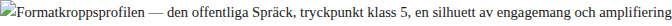

# SPR SISTA TURNÉN — Kapitel 1 PIPELINEN

SISTA TURNÉN

**Kapitel 1**

PIPELINEN

| Kapitel: 1 — PIPELINEN Stad: Okänd (det spelar ingen roll — GPS:en säger en sak, kroppen en annan) Tid: 01:30–04:30 Läge: Ensam / Natt / Läser Turnédag: 13 av 21 Konvoj: 11 fordon, 4 mobila datahallar, 1 cirkustält, 38 personer (37 sovande) Pipeline-status: Synk klar. Inkommande trafik förhöjd. Anomali: oklassificerad. Sensordata: Puls viloläge. Temperatur stabil. Format vilande. Dujag-protokoll: aktivt. |
| --- |

### 1. CONTAINERN

Metallgolvet vibrerade mot strumpfötterna och vibrationen var inte rörelse utan minnet av rörelse — servrarnas samlade rotation, hårddiskar och kylfläktar och spänningsregulatorer som konverterade elektricitet till beräkning och beräkning till värme och värme till det konstanta surr som inte var ljud utan snarare frånvaron av tystnad, den plats där tystnaden borde ha funnits men fyllts, som allt annat fylldes, med arbete.

Jens Spräck satt i en kontorsstol av den billiga sorten — fem hjul varav fyra rörliga, ett ryggstöd som lutade tre grader för mycket åt vänster, en sits vars stoppning hade gett upp sin ambition och övergått till ren bekännelse av metallramen under — och han hade suttit där sedan midnatt eller möjligen sedan elva och skillnaden spelade ingen roll, för natten hade för länge sedan slutat meddela sig om sin progression och övergått i det tillstånd som bäst beskrevs som väder. Natten hade en temperatur. Inte grader — täthet. Luften inuti containern var kylig och torr och konditionerad av servrarnas oupphörliga respiration, och den luktade av metall och ozon och en antydan av den pizza som stod i sin kartong på den utfällbara hyllan bredvid laptopen.

SPRÄCK INDUSTRIES DATAHALL 07 stod det på containerns utsida men Spräck såg inte utsidan — han befann sig inuti, alltid inuti, och insidan var: fyra serverrack med blågröna LED-lampor som pulserade i mönster som inte var mönster utan statusrapporter, kablar som löpte längs golvet i tejpade stråk av svart gaffer som någon — han själv, förmodligen, för vem annars tejpar kablar klockan ett på natten i en container på ett fält mellan två städer vars namn han inte kontrollerat — hade fäst med den sortens precision som uppstår inte av ordningskärlek utan av att man snubblar i mörker och lär sig var golvet slutar vara golv och börjar vara infrastruktur.

Den utfällbara hyllan fungerade som skrivbord. Den var inte avsedd som skrivbord — den var avsedd för nätverksutrusning, för switchar och patchpaneler, men Spräck hade tidigt i turnén konstaterat att en hylla är en hylla är en hylla och att distinktionen mellan arbetsyta och serverutrustning var en kategori som existerade i katalogen men inte i fältet. På hyllan: laptopen, öppen, skärmljuset det enda varma ljuset i containerns blågröna dunkle. En mugg med texten DATA ÄR DATA vid laptopens vänstra sida, halvfull med kaffe som passerat ljummet och befann sig i den temperaturzon som bäst beskrevs som uppgivenhet — vätskan hade slutat försöka vara dryck och accepterat sin roll som stilleben. Vid laptopens högra sida: en pizzakartong, öppen, med tryckt logotyp — PIZZA FRÅN FRAMTIDEN — vars bokstäver i det blågröna LED-ljuset fick en färg som inte fanns i CMYK-modellen utan bara i den koloristik som uppstår när tryckt papper och serverbelysning förhandlar.

Klockan var 01:30. Han hade varit vaken sedan 05:30 igår. Nitton timmar. Talet nitton hade vid det här laget upphört att vara ett tal och blivit ett tillstånd, en viskositet i kroppen, ett tryck bakom ögonen som inte var smärta utan den form av uppmärksamhet som uppstår när smärtan ger upp och övergår i ultraljud — inte hörs, men registreras. Han hade hållit en demo klockan tio på förmiddagen, mossbox-prototyp v1.2 för en regional delegation vars ansikten han mindes som en serie variationer på temat intresserad-men-osäker, och han trodde att det hade gått bra, eller han använde frasen lovande engagemang i sin rapport och frasen var tekniskt korrekt och emotionellt tom på det sätt som fraser blir när de produceras för system som behöver fraser, inte betydelse. Poddintervju klockan fjorton, om mobil datainfrastruktur och cirkusekonomi — han hade sagt "Data är data, ekonomin växer, planeten består" och menat det och inte menat det och skillnaden var inte hyckleri utan att båda var sanna samtidigt, att sanningen hade en dualitet som inte ryms i poddens format men som ryms i natten, i containern, i det tillstånd som uppstår när tröttheten passerar nitton timmar och kroppen konverterar sömnbristen till ekolod.

Dujag-protokollet körde. Han hade inte startat det. Det startade sig självt, som det alltid gjorde, vid den tröskel där hjärnans frontallober drog sig tillbaka och lämnade scenen åt den äldre hårdvaran — den lågfrekventa uppmärksamhet som inte letade efter något specifikt utan registrerade allt. Servrarna. Surret. Pizzakartongen. Muggen. Stolen som lutade. Kablarnas stråk på golvet. Metallens vibration genom strumporna. Allt blev data. Allt blev inkommande.

Utanför containern befann sig Booleanska Cirkusens konvoj, elva fordon, parkerade på ett fält mellan två städer — det spelade ingen roll vilka, möjligen utanför Karlstad, möjligen utanför Sundsvall, GPS:en visade en koordinat som han inte kontrollerat för det spelade ingen roll var kroppen befann sig när hjärnan befann sig i en pipeline.

· · ·

### 2. CIRKUSEN SOVER

Han öppnade containerdörren. Inte för att gå ut — för att låta natten komma in.

Den kom. Den kom som luft och temperatur och doft och det ljud som inte är ljud utan frånvaron av serversurr, den plötsliga, nästan chockerande tystnad som uppstod när utomhusluften blandade sig med containerns konditionerade atmosfär och örat för ett ögonblick registrerade skillnaden mellan inomhus och utomhus som en fysisk gräns, en membran som genomträngdes.

*Nattluften. Maj i mellansverige — den sortens luft som hade bestämt sig för att vara vår men inte helt litat på sitt eget beslut. Kylig. Fuktig. En temperatur som tillhörde den liminalzon där jacka och inte-jacka var lika rimliga och båda en form av tillkännagiven hållning till årstiden. Den luktade jord — den blöta, öppna jorden som finns vid parkeringsytor och fält som normalt används till annat, jord som inte brukats utan trampats, jord som bär fordon istället för grödor och som doftar annorlunda, grundare, metalliskt, som om den uttrycker sin besvikelse kemiskt.*

*Under jorddoften: diesel. Inte den skarpa dieseln från avgaser utan den matta, indränkta dieseln som finns i marken kring fordon som stått länge, den doft som inte kommer från bränsle utan från bränslets konversation med tid och metall. Och under dieseln: impregnerad tältduk — den tunga, vaxade lukten av cirkustältet som låg hoprullat på ett flak, komprimerat, väntan konverterad till volym. Och under tältduken, djupast: något djuriskt. Inte skarpt, inte obehagligt. Den varma, grässiga doften av djur som sover i sina vagnar — en doft som påminde om barndom fast Spräck inte haft en barndom med djur utan bara en barndom med idén om djur, med böcker om djur, med den abstraktion som stadsbarnet gör av landsbygdens materialitet.*

Cirkusfältet. Mörkt. Elva fordon parkerade i den ordning som trettio års turnélogistik hade optimerat till en rumslig grammatik: tältvagnarna längst fram, för de skulle av först vid nästa stopp, en prioritetslogik som var så ingrodd att ingen längre behövde kommunicera den. Djurvagnarna i mitten — de behövde jämn temperatur, och mittenpositionen skyddade mot vind från båda hållen, en placering som inte beräknats utan erfarits under decennier av svensk väderfront. Datahallarna längst bak. De behövde ström och kyla och hade den lägsta sociala prioriteten i konvojens hierarki — de var de nyaste medlemmarna, Spräcks tillägg, tolererade men inte integrerade, som en ny tonåring i en etablerad familj.

Hans container: näst sist. Sista fordonet: Gustafs personliga husvagn. Gustaf Booleander, cirkusdirektörens, tredje generationens — hans farfar hade startat cirkusen 1993, hans far hade drivit den genom nittiotalet och nollnolltalet, och Gustaf hade ärvt den 2018 och ärvt med den en skuld och en estetik och en övertygelse om att cirkus inte var underhållning utan kosmologi, att tältet var ett universum och att universumets gränser var dukens gränser och att allt som hände innanför duken var sant på ett sätt som inget utanför kunde vara.

Gustafs lampa brann. Den brann alltid. Spräck visste detta för att han hade frågat — inte av nyfikenhet utan av det som Dujag-protokollet genererade som respons på mönster: varför brinner den lampan? Gustaf hade svarat: "Jag vill kunna se dörren om jag vaknar." Och Spräck hade förstått att detta inte handlade om rädsla utan om kontroll, om den minimala kontroll som bestod i att veta var utgången var, den territoriella grundfunktionen, den som Flempo skulle ha identifierat omedelbart men som Gustaf inte hade ord för utan bara en lampa.

*Han gick till tältduken. Den låg hoprullad på flaket, en cylinder av grov textil, våt av dagg. Han rörde vid den. Hans fingrar registrerade den vävda strukturen — trådar som bar trådar, en matris av spänningar, varje tråd beroende av varje annan tråd för sin position och sin funktion. Infrastrukturens hud. Han tänkte: servrarna har metall, cirkusen har duk. Båda bär vikter de inte dimensionerades för. Båda surrar i mörkret — servrarna surrar av beräkning, av den oändliga konversionen av data till mening och mening till mer data. Duken surrar inte alls men bär i tystnad, och tystnaden är kanske en form av surr som inte registreras i frekvensband utan i år, i de trettio år som den här duken eller dess föregångare har fällts upp och fällts ner och rört sig genom Sverige som en nomadisk arkitektur vars enda funktion är att skapa ett innanför.*

Ragnhild satt vid djurvagnen. Hon var alltid vaken vid den här tiden. Ragnhild Anderberg, femtioårsåldern, grått hår i en fläta som hon aldrig löste upp utanför sin egen husvagn, arbetskläder — de mörkgröna, slitstarka byxorna och den fodrade västen — som aldrig riktigt torkade, för djurskötarens kläder lever i en permanent fuktighetscykel: svett, utomhusluft, djurens andning, tvätt, och sedan samma cykel igen. Hon satt på en fällstol med en termos.

Djuren hade en rytm som inte följde klockan utan årstiden, och i maj vaknade de tidigt, och Ragnhild vaknade före dem, för att vara där när de övergick från sömn till medvetande, för övergången — hade hon förklarat för Spräck under en tidigare natt, en annan fällstol, en annan termos — var det känsligaste ögonblicket, det ögonblick då ett djur bestämmer om dagen ska vara bra eller inte, och närvaron av en bekant människa vid det ögonblicket var skillnaden.

"Kan inte sova?" sa Ragnhild.

"Pipelinen synkade," sa Spräck.

"Mm."

Ragnhilds mm var den mest ekonomiska kommunikationsformen han kände till. Den bekräftade närvaro utan att kräva förklaring. Den sa: jag hör dig, jag vet inte vad du pratar om, det spelar ingen roll, du är här, jag är här, natten är här. Den var den exakta motsatsen till en dashboard — ingen metrik, ingen temperatur, inget index. Bara ett ljud som betydde: registrerat.

Han satte sig bredvid henne. De sa ingenting mer. Ragnhild drack ur sin termos — den sortens långsamma drickande som inte handlar om törst utan om att händerna behöver hålla något varmt. Djuren andades i vagnen. Han kunde höra dem genom vagnsväggarna: den djupa, jämna andningen av kroppar som var för stora för sina kärl och som andades med hela sin volym, inte bara med lungor utan med bukar och flanker och den vibration som överfördes till vagnsplåten och därifrån till marken och därifrån till fällstolen och därifrån till hans kropp.

Servrarna surrade i containern tio meter bort. Två sorters infrastruktur. En som han hade byggt. En som hade funnits i trettio år utan att någon hade kallat den infrastruktur.

· · ·

### 3. DASHBOARDEN

Han återvände till containern. Stängde dörren. Natten stängdes ute men dess doft dröjde sig kvar — jord och djur och impregnerad duk — inbäddad i hans kläder, i tygfibrernas mikroskopiska topografi, och den doften blandades med containerns metalliska luft och skapade en tredje atmosfär som var varken inne eller ute utan den blandzon som uppstår när en kropp rör sig mellan rum och tar med sig det rum den lämnade.

Laptopen. Skärmens ljus. Dashboarden laddade — de tre sekunderna av vit skärm innan systemet renderade sina siffror var de tre sekunder då hans ögon omställde sig från nattens vidvinkel till skärmens tunnel, den perceptuella kontraktion som innebar att världen gick från fält och fordon och himmel till ett rektangulärt fönster med siffror, och det var i den kontraktionen som Spräck kände sig mest hemma, i övergången, i den punkt där allt annat försvann och det enda som återstod var data.

| PIPELINE STATUS — SPRÄCK INDUSTRIES / DATAHALL 07 ──────────────────────────────────────── Senaste synk: .............. 01:47 Inkommande filer: .......... 0 Utgående kampanjer: ........ 2 (automatiserade, schemalagda) Mediebevakning: ............ 14 omnämnanden (senaste 72h) Temperaturindex: ........... 34 (stabil, låg) Amplifieringskurva: ........ flat — inga aktiva noder ──────────────────────────────────────── STATUS: NORMAL DRIFT |
| --- |

Siffrorna var normala. Ingenting hade hänt. Pipelinen rapporterade precis det den skulle rapportera under en turnédag utan incidenter: låg temperatur, stabila mätvärden, inga anomalier. Temperaturindex 34 var den digitala ekvivalenten av Ragnhilds mm — registrerat, inget att anmärka. Amplifieringskurvan var flat, vilket betydde att ingen aktiv nod i nätverket genererade förstärkning, att allt som publicerats de senaste timmarna hade absorberats av det normala bruset utan att skapa resonans.

Men det fanns en rad som inte stämde.

Inte i den synliga dashboarden — i trafikloggen under den. En nod som Spräck inte kände igen. Inte en kampanjnod, inte en mediebevaknignsnod, utan en SYN-nod. En synkroniseringspunkt. Något hade synkats till systemet som inte initierades av hans kampanjschema. Något hade kommit in som inte var planerat, inte schemalagt, inte tillhörigt.

Han klickade. Tre sekunder. Under de tre sekunderna registrerade hans kropp en förändring som hans hjärna ännu inte kategoriserat — en lätt acceleration i pulsen, en ompositionering i stolen, en lutning mot skärmen som inte var nyfikenhet utan reflexen att röra sig mot det som rör sig, den djuriska funktionen, den som servrarna inte hade men som kroppen framför servrarna aldrig slutade ha.

Noden visade: trafikökning i pipelinens bevakningsmekanism. Inte från hans kanaler — från andras. Formaten hade börjat röra sig. Inte mycket. Inte synligt för allmänheten, inte synligt för någon som inte satt framför just denna dashboard vid just denna tid med just denna sömnbrist som konverterat perception till ekolod. Men i realtidsvyn såg han det: lokaltidningar som börjat indexera hans namn i sina bevakningssystem. Regionaltidningar som sparat ner söksträngar. En meme-page — han kunde inte avgöra vilken i denna upplösning — som hade tagit en gammal bild av honom och lagt text som genererade engagement, inte mycket engagement, inte viralt engagement, men det specifika, lågintensiva engagement som var värre än viralt för det betydde att bilden inte konsumerades utan lagrades, att den cirkulerade inte uppåt utan sidledes, att den etablerade sig som referens snarare än sensation.

Något höll på att börja. Han visste inte vad. Systemet visste inte vad. Men systemet mätte att något började, och systemet rapporterade detta som en anomali, inte för att det var avvikande utan för att det var oklassificerbart — det passade inte in i de taxonomier han hade byggt, inte i kampanjeffekt, inte i organisk räckvidd, inte i medialt genomslag, utan i den gråzon som systemet markerade med den mest ödmjuka av alla statusrapporter: oklassificerad.

Spräck — som hade suttit framför dashboards i elva år, som hade byggt dashboards och blivit mätt av dashboards och som visste att en dashboard alltid ljög, inte genom att visa fel siffror utan genom att rama in verkligheten och därmed utesluta det som inte rymdes i ramen — läste anomalin som en meteorolog läser barometern: inte som information utan som förvarning. Inte som siffra utan som tryck.

Temperaturen var 34. Stabil. Låg. Imorgon, eller övermorgon, eller om tre dagar, skulle den vara något annat. Han visste inte vad. Han visste bara att barometern hade rört sig.

· · ·

### 4. PIZZAKARTONGEN

Han åt den sista kalla pizzabiten. Inte av hunger — av rutin. Av att händerna behövde göra något medan ögonen läste, av att kroppen krävde en handling som inte var kognitiv, en motrörelse till skärmens abstraktioner, och den enklaste motrörelsen var att ta en triangulär bit kall pizza och föra den till munnen och tugga.

*Pizzan smakade som kall pizza smakar — degig, fettig, med en antydan av basilika som hade övergått från krydda till minne av krydda, den sortens smak som inte längre existerar som smak utan som referens till en smak som en gång funnits. Osten hade stelnat till en vaxartad yta, halvgenomskinlig, som ett geologiskt lager, och under det geologiska lagret av ost fanns pepperoni-skivor med den sortens glans som betydde att fett och tid hade samarbetat, att den kemiska processen som skiljer färsk pizza från kall pizza inte var förfall utan transformation, en aggregatförändring i det gastronomiska, och att den transformationen hade en estetik — den blanka, lätt klibbiga ytan — som var sin egen.*

PIZZA FRÅN FRAMTIDEN. Han hade designat logotypen själv. Den var ett skämt — en intern grej, en sen kväll i Gävle tre månader sedan, Gustaf och han i Gustafs husvagn med den lampa som alltid brann, och Gustaf hade sagt: "Om du ska åka med oss behöver du bidra till catering." Det var inte ett krav — det var cirkushumor, den sortens humor som testade om nykomlingen förstod att gemenskap mättes i arbete, inte i intention. Spräck hade svarat: "Jag ska göra den mest framtidssäkra pizzan du ätit." Gustaf hade sagt: "Jag vill ha pepperoni." Spräck hade beställt pizzakartonger med tryck. Femhundra stycken. Det var skämtet.

Sedan hade cirkuspersonalen börjat använda kartongerna vid matförsäljningen. Sedan hade en lokal restaurang i Borås beställt tio kartonger "för kul skull." Sedan hade en distributör bett om offert. Sedan hade offerten blivit en order. Sedan hade ordern blivit en leverans. Sedan hade leveransen blivit en referens i en branschkatalog för förpackningsmaterial.

Skämtet metaboliserades av marknaden och blev infrastruktur. Det var hela hans metod komprimerad till en pizzakartong: starta i det absurda, i den punkt där ingen säger nej för att ingen tar det på allvar, och låt det bli verklighet — inte genom att argumentera för det utan genom att göra det, genom att producera det fysiskt och släppa det i världen och låta världen göra vad den ville med det. Och när verkligheten hade svalt skämtet kunde man inte längre se skillnaden. Gränsen mellan ironi och industri var inte suddig — den var upplöst. Det enda sättet att veta att det en gång varit ett skämt var att fråga den som startade det, och han mindes knappt själv, för minnet av intentionen eroderas av objektets framgång.

*Han höll kartongen. Den vägde nästan ingenting — papp, tryckfärg, rester av mozzarella. Men han tänkte på den som artefakt. Kartongen som distributionskanal. Kartongen som den lågtemperaturingång till ett system han inte designade men som han startade genom att göra en sak som var för rolig för att inte existera. Kartongerna cirkulerade nu utanför hans kontroll, utanför hans pipeline, utanför hans dashboard. De var en del av den oklassificerbara trafiken. De var en del av de trettio procenten. Möjligen.*

Han ställde den öppna kartongen bredvid laptopen. Logotypen glödde i det blågröna ljuset. Kartongen skulle stå där. Den skulle stå där imorgon och övermorgon och dagen efter det. Den skulle åldras i containerns konditionerade luft. Kartongens organiska material — mjöl, tomatsås, ost — skulle reagera med fukten och temperaturen och tiden och genomgå den transformation som inte kallas transformation utan förfall, och den transformationen skulle vara osynlig tills den blev synlig, tills den manifesterade sig som mögel, och möglet skulle vara grönt eller vitt eller grått och det skulle ha en doft som var annorlunda än pizzans doft, en doft av nedbrytning, av systemets gräns, av den punkt där produkt övergår i konsekvens.

Men det visste han inte ännu. Nu var den bara: en kartong med rester av ett skämt som blivit verkligt, upplyst av servrarnas blågröna dunkle, bredvid en laptop som visade en anomali som ännu inte hade ett namn.

· · ·

### 5. FLASHBACK — DET TIDIGA STYRELSEMÖTET

Dashboarden visade att Verboten Medias automatiserade kampanjsystem hade kört en schemalagd publicering klockan 02:00. Standardinnehåll. Inget ovanligt. Systemet publicerade, systemet rapporterade, systemet gick vidare — den automatiska cykeln som fortsatte oavsett om någon tittade eller inte, som en liturgi utan församling, som en maskin som utför sin funktion inte för att funktionen behövs utan för att maskinen inte kan sluta.

Men Verboten-noden i dashboarden — den lilla fyrkanten som representerade förlaget som ägde rättigheterna till en del av hans IP — blinkade med en regelbundenhet som inte var avvikande men som påminde honom om något. Blinkandet hade en rytm. Rytmen hade ett minne. Minnet hade en doft.

*Kaffe som stått för länge. Det var det första han mindes — inte rummet, inte personerna, utan kaffekoppen på bordet, den tunna oljefilmen på ytan som betydde att kaffet hade passerat drinkbart och blivit bevis. Bevis på att mötet hade varat längre än planerat, bevis på att tiden hade gått utan att någon hade bytt kaffe, bevis på att det som diskuterades var för viktigt eller för komplicerat eller för obehagligt för att avbrytas av en vardagshandling som att koka nytt.*

*Ett styrelsemöte. Inte det nuvarande styrelsemötet som han undvek — ett tidigt. 2022, möjligen. Verboten Media var litet. Tre personer i ett rum, eller fyra, han mindes inte antalet — kroppen mindes inte antal, kroppen mindes sinnesintryck, och sinnesintrycken var: kaffet, en whiteboard-penna vars lock saknades och vars lösningsmedel avgav en sötaktig, kemisk doft som blandades med kaffets oxidation, en fönsterbräda med damm, dammet belyst av en strimma solljus som avslöjade att kontoret inte städades tillräckligt ofta, att ambitionen var större än underhållet, att företaget befann sig i den fas där man investerar i framtiden och sparar på nutiden.*

*Frågan var: vem äger vad? Juridiken ställde frågan, i juridikens format — avtal, paragrafer, procenttal. Men frågan UNDER juridiken, den fråga som inte kunde formuleras i avtal men som fyllde rummet med den specifika spänning som uppstår när människor som har skapat något tillsammans inser att skapandet måste delas upp i ägbart och icke-ägbart, att impulsen måste konverteras till kontrakt — den frågan var: vem äger energin? Vem äger impulsen som startade detta? Kan en impuls ägas? Kan den punkt där en idé övergår från ingenting till något — den exakta punkten, den neuronala urladdningen, den mening som formuleras för första gången i ett rum och som förändrar rummets kemi — kan den punkten tilldelas en ägare?*

*Han hade sagt något. Han mindes inte ordagrant men han mindes känslan i munnen, den specifika vikten av en mening som produceras utan att ha tänkts färdigt, den sortens mening som inte kommer från hjärnan utan från mellangärdet och passerar genom munnen på väg till ett rum som inte bad om den:*

*"Data är inte en produkt. Data är en konsekvens. Man äger inte konsekvenser. Man ärver dem."*

*Någon i rummet — en jurist, förmodligen, eller en person som tänkte som en jurist, som konverterade världen till paragrafer — hade sagt: "Det låter filosofiskt men vi behöver ett avtal."*

*Och det var sant. De behövde ett avtal. Filosofin betalade inte hyran. Impulsen genererade inte kassaflöde. Avtalet skrevs. Rättigheterna fördelades. Den juridiska äganderätten etablerades — procenttal, licenser, territoriella begränsningar, den sortens struktur som gör att något som var fritt kan cirkulera kontrollerat.*

*Men den affektiva äganderätten — den som handlar om vem som KÄNNER att saken är deras, vem som vaknar klockan tre på natten och tänker på den, vem som bär den i kroppen som en vibration som inte syns på något avtal — den förblev odefinierad.*

*Formatkroppen — den offentliga Spräck. Dagsljusets version. Den som producerar meningar för poddar och presentationer. Natten har en annan version, en utan publik, en som sitter i strumpfötter i en container och tittar på siffror som blinkar.*

Nu, fyra år senare, blinkade Verboten-noden i hans dashboard. Blinkandet var regelbundet. Blinkandet var normalt. Blinkandet innehöll, i komprimerad form, hela den odefinierade affektiva äganderätten — hela frågan om vem som ägde energin, vem som ägde impulsen, vem som vaknade klockan tre och kände att saken vibrerade. Blinkandet visste inte att det innehöll detta. Blinkandet var en LED-indikator som rapporterade automatiserad drift. Men Spräck, som satt i Dujag-protokollets ekolod vid den tidpunkt på natten då allt blir tecken, läste blinkandet som man läser en text man skrivit själv och glömt: med den chockerande igenkänningen att orden är ens egna och att man inte längre vet vad de betyder.

· · ·

### 6. MOSSBOXEN

Han reste sig från stolen. Sträckte på sig. Ryggkotan — den vid bröstkorgens bas, den som alltid reagerade först på nitton timmars sittande — knakade med ett ljud som var för tyst för att höras men som han kände som en intern kalibrering, kroppens sätt att meddela att den var medveten om sin egen neglekt. Containerns tak var tillräckligt högt för att stå rak men tillräckligt lågt för att man var medveten om det — medveten om taket som gräns, som den övre kanten av det rum som var möjligt, och medvetenheten om taket skapade en hållning som inte var upprätt utan upprätt-med-reservation, en hållning som sa: jag står men jag vet att rummet inte vill att jag står.

Han gick de tre stegen till rack 4. Tre steg — containerns totala diameter av tillgänglig golvyta, om man exkluderade kablarnas stråk och stolens radie och den smala britsen längs väggen. Tre steg var allt som skilde hans arbetsplats från hans prototyper, hans dashboard från hans hårdvara, hans abstraktioner från hans material.

Där, på hyllan mellan rack 4 och rack 5, stod mossbox-prototyp v1.2.

*Mossboxen var inte stor — ungefär som en skokartong, fast djupare, med den sortens proportioner som uppstår när en designer inte börjar med proportioner utan med funktion och låter funktionen diktera formen. Skalet var plast och trä, en hybrid som såg ut som den designades av en person som inte kunde bestämma sig mellan natur och industri och bestämde sig för att inte bestämma sig, att låta de två materialen mötas utan att försöka dölja mötet, utan att slipa ner kanten mellan dem till en sömlös yta. Kanten syntes. Plasten var grå. Träet var björk. Där plasten mötte björken fanns en linje som inte var en designdetalj utan en skarv, och skarven var synlig, och synligheten var poängen.*

*Ytan: mossa. Äkta, levande mossa, i ett tunt lager bakom en perforerad yta. Mossan var grön — inte den gröna som finns i designprogram, inte hex-grön, inte RGB-grön, utan den ojämna, komplexa, fläckiga gröna som existerar i skogar och på stenar och som aldrig är EN grön utan alltid flera gröna i konversation. Mossan andades. Bokstavligen — den absorberade fukt och avgav fukt, och i containerns konditionerade luft hade den hittat en jämvikt, en andningsfrekvens, en livscykel som var långsammare än servrarnas men snabbare än tältdukens.*

*Han lyfte den. Den vägde mer än den såg ut att göra — sensorerna och batteriet adderade en tyngd som inte syntes, en dold massa, som de dolda systemen i hans egna produkter som alltid vägde mer än deras estetik antydde. Han höll den i händerna och kände: mossans fukt genom perforeringen. Den gröna, metalliska doften av levande material i en maskin. En doft som inte borde finnas i en container full av servrar men som fanns där ändå, som ett infiltrat, som en infiltratör, som den punkt där biologi och teknologi slutar vara kategorier och börjar vara grannar.*

Knappar på sidan — analoga, fysiska, den sortens knappar man trycker med tummen. Inte pekskärm. Inte gränssnitt. Knappar. Mekaniska knappar som klickade med den taktila feedbacken av plast mot metall, den känsla som har reducerats i varje generation av konsumentelektronik men som Spräck hade insisterat på att behålla, inte av nostalgi utan av övertygelse: att en knapp som man trycker med tummen är en annan kommunikationsform än en yta man sveper med ett finger, att det taktila klicket är en bekräftelse som pekskärmen har eliminerat, att eliminationen är en förlust som ingen mäter men alla känner.

Han skulle demonstrera den för en kommunal delegation. Imorgon, eller övermorgon, i Sundsvall — om konvojen rullade enligt schema, och konvojen rullade alltid enligt schema för att Gustaf drev konvojen med den precision som uppstår inte av planeringsverktyg utan av trettio års erfarenhet av svenska vägar och svenska väderförhållanden och svenska kommuners parkeringsplatser.

Mossboxen var designad som dialogverktyg. Medborgare interagerade med den analoga ytan — tryckte knapparna, rörde mossan, svarade på frågor som projicerades. Deras input registrerades. Analyserades. Levererades.

Hundra procent. Det var designprincipen. Full leverans. Inget filter. Inget tomrum. Allt som kom in gick ut. Allt som medborgarna sa skulle höras, visas, räknas. Ingen redigering. Ingen kuratoring. Ingen redaktionell hand som valde vad som var relevant och vad som var brus.

Han visste inte ännu att detta designval — hundra procent, noll filter — skulle skapa incidenten. Att systemet skulle leverera svar som kommunen inte kunde hantera, inte för att svaren var felaktiga utan för att de var för sanna, för ofiltrerade, för fulla av den sortens verklighet som kommunala system inte är konstruerade att absorbera: ensamhet, busslinje, hemsidor som inte fungerar, den vardagens infrastrukturella smärta som kommuninvånare bär utan att uttrycka den för att det inte finns något format som tar emot den — tills mossboxen erbjöd ett format. Att temperaturen skulle stiga från 34 till siffror han inte förberett sig för.

Nu höll han bara mossboxen. Kände fukten. Den gröna metalliska doften. Satte tillbaka den på hyllan mellan rack 4 och rack 5, bredvid en nätverkskabel och en bunt buntband som han aldrig använt men aldrig kastat, för i en container på turné kastar man ingenting, allt är potentiell infrastruktur, allt väntar på sin funktion.

· · ·

### 7. DUJAG-REGISTRET

02:30. Han satt igen. Dashboarden glödde. Anomalin i trafiken hade inte eskalerat — den låg och pulserade, som en lampa som inte riktigt bestämt sig för om den var på eller av, som en signal som inte var en signal utan en möjlighet till signal, en potentialitet.

| ANOMALI — OKLASSIFICERAD ──────────────────────────────────────── Nodtyp: ................... SYN (extern synkronisering) Källa: .................... ej identifierad Tidpunkt: ................. 01:47 → pågående Amplifiering: ............. +0.3 (inom marginal) Klassificering: ........... VÄNTANDE ──────────────────────────────────────── |
| --- |

Dujag-protokollet hade nått det stadium där det inte längre var ett verktyg utan ett tillstånd. Gränsen mellan läsning och upplevelse hade lösts upp — den gränsen var aldrig stabil, den var alltid porös, men vid den här tiden på natten, vid den här nivån av trötthet, vid den här djupnivån av ekolod, upphörde den helt att existera. Han läste dashboarden och dashboarden läste honom. Siffrorna på skärmen och pulsen i handlederna synkroniserade sig — inte metaforiskt, inte poetiskt, utan faktiskt: hans puls hade den regelbundenhet som matchade dashboardens uppdateringsfrekvens, och matchningen var inte designad utan emergent, en resonans som uppstod när två system befann sig i samma rum tillräckligt länge.

Han tänkte på Flempo Guyenjaure.

Tanken kom inte som beslut — den kom som register. ISTP. Territorial. Somatisk precision. Flempo som han inte sett på tre veckor men vars frekvens alltid fanns tillgänglig i Dujag-protokollets repertoar, som en radiostation som sänder oavsett om någon lyssnar, som en grundton som inte hörs förrän man stänger av alla andra ljud.

*Han föll in i Flempos register.*

*Rummet konverterades. Containern slutade vara en serverhall och började vara en terräng. Det var inte en metafor — det var en perceptuell omkalibrering, en förändring i sättet att se som förändrade det som sågs. Dörren: utgång, inte entré. Skillnaden var inte semantisk — i Flempos register var varje öppning en potentiell reträtt, en flyktlinje, och man satt alltid med ryggen mot det fasta och ansiktet mot det öppna. Stolens placering: ryggen mot väggen, ansikte mot dörr. Spräck satt redan så — han hade alltid suttit så i containern, utan att reflektera över det, men i Flempos register blev positionen medveten, blev taktisk, blev den äldsta strategin: vet var du kan ta dig ut.*

*Flempos terräng. Norrländsk topografi — vatten, sten, horisont. Dujag-protokollets källa. I Flempos register finns inga KPI:er, bara kardinalriktningar.*

*Servrarnas surr: inte data utan vind. Kylfläktarna: inte kyla utan ström — vattenström, den sortens ljud som finns vid forsar i Norrland, vid de punkter i älvarna där vattnet möter sten och konverterar massa till ljud. I Flempos register var allt vatten. Allt flöde. Kablarnas stråk på golvet: biflöden. Dashboardens siffror: yta, skum, det som flödet producerade som avfall. Det viktiga var inte siffrorna utan strömmen under siffrorna, den riktning som inte syntes i dashboarden men som kroppen kunde känna om den slutade titta och började lyssna.*

*I Flempos register fanns inga KPI:er. Inga engagemangstal. Inga amplifieringskurvor. I Flempos register fanns: är det vatten? Är det skydd? Varifrån blåser det? Kan man sova här? De fyra frågorna som inte var frågor utan reflexer, den evolutionära grundkoden, firmware som inte kunde uppdateras för att den var skriven i kroppens äldsta språk.*

Han befann sig i Flempos register i ungefär tre minuter. Under de tre minuterna var han inte Jens Spräck, formatkropp, offentlig tryckpunkt klass 5. Han var en kropp i ett rum som registrerade rummet som terräng. Han var det enklaste man kan vara: en organism som bedömer sin omgivning. Och omgivningen — containern, servrarna, fältet utanför — bedömdes och befanns: adekvat. Inte optimal. Inte hemma. Men adekvat. Kan man sova här? Möjligen. Varifrån blåser det? Från kylfläktarna, från dörren. Är det vatten? Nej. Men det låter som vatten. Det räcker.

Sedan återvände han. Inte frivilligt — Dujag-protokollet släppte sitt grepp när laptopens skärmsläckare aktiverades och ljuset i containern förändrades, den subtila skiftningen från skärm-och-LED till bara-LED, och den skiftningen var tillräcklig för att bryta Flempos register och återföra Spräck till Spräck. Han rörde musen. Dashboarden återvände. Siffrorna återvände. Anomalin pulserade. Han var Spräck igen.

Men Flempos register lämnade en rest. En vinkel. En fråga som inte formulerades som fråga utan som kroppshållning — en förskjutning i axlarnas position, en sänkning av huvudet, en orientering mot dörren som var Flempos och inte Spräcks: vad gör du här?

Inte filosofiskt. Topografiskt. Vad gör du i den här containern, i den här konvojen, på det här fältet? Vad är den territoriella logiken? Var är den plats i terrängen som gör att denna position — denna specifika punkt, mittemot rack 4, bredvid en halvuppäten pizza, framför en dashboard som visar en oklassificerad anomali — är den punkt där du befinner dig?

Frågan hade inget svar. Frågan behövde inget svar. Frågan var resten av Flempos register, och resten var tillräcklig — den förändrade inte vad han gjorde men den förändrade varifrån han gjorde det, och den skillnaden var skillnaden mellan att sitta framför en dashboard och att sitta i en terräng som innehåller en dashboard.

· · ·

### 8. TRETTIO PROCENT — FRÖET

03:00. Han scrollade genom dashboardens historik. Inte för att leta efter något — för att handen rörde musen och ögonen följde. Dujag-ekolodets passiva registrering. Rullningslisten rörde sig och data passerade förbi som landskap genom ett tågfönster, inte betraktat utan passerat, inte analyserat utan upplevt som rörelse, som den sortens seende som uppstår när man slutar fokusera och låter ögonen vara kameror utan redigerare.

Han stannade vid en datapunkt. Inget dramatiskt — ingen färgkodad varning, ingen röd flagga, ingen av de alarmsignaler han hade designat in i systemet för att fånga uppmärksamhet. Bara en konverteringsmetrik från en kampanj tre veckor sedan. Kampanjen hade genererat engagemang, delningar, konverteringar. Alla siffror inom förväntade intervall. Alla KPI:er gröna. Alla rapporter levererade. Kampanjen var, i dashboardens taxonomi, avslutad och arkiverad.

Men i marginalen — i den anteckning han hade gjort när han analyserade kampanjen, i det fält som systemet kallade notes och som han använde som det man använder marginaler till: tankar som inte ryms i huvudtexten — hade han skrivit:

| ~30% av trafiken oklassificerbar. Laterala effekter. Ej hänförbara. |
| --- |

Trettio procent oklassificerbar trafik. Trettio procent av kampanjens effekt som inte kunde mätas, inte kunde tillskrivas, inte kunde rapporteras. Trettio procent som hade hamnat utanför dashboardens ram — inte för att de inte existerade utan för att de existerade i former som ramen inte var konstruerad att fånga. Delningar som inte registrerades som delningar för att de skedde i mörka kanaler. Konversationer som inte konverterades till konverteringar för att de fördes i rum som inte hade spårningspixlar. Beteendeförändringar som inte mättes som beteendeförändringar för att de ägde rum i kroppar, inte i browsers.

Trettio procent av verkligheten föll utanför ramen.

*Dujag-protokollet gjorde det somatiskt. Det var dess funktion: att konvertera abstraktion till kropp, att ta en datapunkt och översätta den till den specifika känslan i mellangärdet som uppstår när man inser att ens egen karta inte stämmer överens med ens eget territorium. Trettio procent. Inte en procent. Inte fem procent. Trettio. Nästan en tredjedel. Nästan en tredjedel av det han producerade var osynligt för det system han hade designat att se det.*

Hade han designat en ram som missade trettio procent? Eller hade han designat en ram som visade sjuttio procent och lämnade trettio procent? Skillnaden var inte semantisk — den var strukturell. Att missa var passivt. Att missa innebar ett misstag, en brist, en designflaw som kunde åtgärdas med bättre sensorer, bättre spårning, bättre algoritmer. Att lämna var aktivt. Att lämna innebar att systemet producerade en utanför, att ramen inte bara avgränsade det synliga utan skapade det osynliga, att dashboarden inte bara mätte verkligheten utan genererade en verklighet som inte kunde mätas.

Han hade aldrig lämnat något aktivt. Inte medvetet. Det var hans mest konsekventa instinkt, den instinkt som predaterade alla system och alla dashboards och alla pipelines: att fylla. Fulla lanseringar. Fulla produkter. Fulla presentationer. Fulla manifest. Fulla system. Hundra procent. Samma designprincip som mossboxen: allt som kommer in ska gå ut. Inget filter. Inget tomrum. Full leverans.

Men trettio procent av hans systems output föll utanför hans systems mätningskapacitet. Systemet producerade mer än det kunde se. Han producerade mer än han kunde mäta. De trettio procenten existerade — de hade effekter, de förändrade beteenden, de skapade laterala rörelser i kultur och kommun och memes och beteendemönster — men de hade inget rum i dashboarden. De hade ingen rad. Inget fält. Ingen pixel. De levde i den zon som systemet kallade oklassificerbar och som han, vid den här tidpunkten på natten, med Dujag-protokollets ekolod på full mottagning, kände som en vibration i mellangärdet som inte hade ett namn men som hade en riktning: utåt, bortom, lateral.

Vad om de trettio procenten inte var ett mätfel?

Vad om de trettio procenten var produkten?

Tanken var inte en tanke. Den var en förskjutning. En seismisk mikrorörelse i den tektoniska platta som bar hans hela professionella identitet. Inte en jordbävning — en tremor. En tremor som registrerades av Dujag-protokollets somatiska seismograf men som inte hade styrkan att nå medvetandets yta och bli en artikulerbar insikt. Den stannade i mellangärdet. Den stannade som känsla. Den stannade som den sortens vetande som kroppen har men som hjärnan ännu inte begärt leverans av.

Han öppnade anteckningsappen. Markören blinkade. Han skrev:

| "Temperaturen är inte en konsekvens. Temperaturen är leveransen." |
| --- |

Det var den första anteckningen av kvällen. Den såg enkel ut. Den var inte enkel. Den innehöll — komprimerat, kodat, oavsiktligt — fröet till allt som väntade: amplifieringen som skulle komma när temperaturen passerade 34 och inte stannade, incidenten med mossboxen som skulle leverera hundra procent av en verklighet som kommunen inte var konstruerad att ta emot, läckan som skulle exponera de trettio procenten för system som inte hade ramar för dem, subtraktionen som Spräck ännu inte visste var möjlig — att man kunde ta bort istället för att lägga till, att tomrummet kunde vara en designprincip och inte en brist.

Men nu var anteckningen bara: en rad text på en skärm i en container på ett fält. Skriven av en man som inte visste vad han hade skrivit.

· · ·

### 9. TRAPETSEN SOM MINNE

03:30. Dashboarden glödde. Anomalin pulserade. Pizzakartongen stod öppen. Kaffet i muggen DATA ÄR DATA hade nått den temperatur som inte längre kunde mätas i grader utan bara i övergåendet — det hade upphört att vara en dryck och blivit en arkeologisk formation, ett spår av en handling, ett fossil av intention.

Han tänkte på trapetsartisten. Dujag-protokollet hämtade minnet inte som bild utan som kropp — inte ögats register utan musklernas, den kinestiska rekonstruktionen, den sortens minne som inte projiceras på en inre skärm utan upplevs i handlederna, i axlarna, i den punkt i mellangärdet där rädslan och exaltationen inte kan skiljas åt.

*Han KÄNDE trapetsartistens sväng. Kvällens föreställning — han hade stått i teknikbåset, han skulle ha kört diagnostik på ljudsystemet men hade istället titta på trapetstakten ovanför publiken, de tre artister som rörde sig i luften med den sortens precision som inte var precision utan tillit, tillit till fysiken, tillit till timingen, tillit till att den andra trapetsens stång skulle vara där den skulle vara vid den tidpunkt då den skulle vara där.*

*Centrifugalkraften i handlederna. Den är inte stor — den är enorm. Hela kroppens vikt multiplicerad med hastigheten och radien, och allt det — den samlade massan av en mänsklig kropp i rörelse — hålls av händerna, av grepp, av den punkt där hud möter metall och friktionen beslutar om liv och fall. Grepp. Grepp. Grepp. Och sedan:*

*Släppet.*

*Det ögonblick av ingenting — varken grepp eller fall — innan den andra trapetsens stång anlände. Det ögonblick som inte var en del av akten utan som VAR akten. Det ögonblick som publiken betalade för utan att veta att de betalade för det, för de trodde att de betalade för akrobatiken, för greppet, för den spektakulära kroppen i rörelse, men de betalade egentligen för DETTA: det ögonblick då kroppen befann sig i luft och ingenting höll den.*

Tomrummet ovanför publiken. Trapetsartisten svängde i ett tomrum. Utan tomrummet ingen trapets — utan det rum av ingenting, det voluminösa tomma ovanför de upplysta stolsraderna, var trapetsen bara en stång och kroppen bara en kropp och greppet bara ett grepp. Tomrummet var inte frånvaro av produkt — tomrummet var produkten. Cirkusen sålde inte akrobatik. Cirkusen sålde det ögonblick då kroppen befann sig i luft och publiken höll andan. Det som såldes var tomrummet. Akrobaten var bara den som gjorde tomrummet synligt — genom att passera genom det, genom att visa att det var farligt, genom att visa att det var möjligt att befinna sig i ingenting och överleva.

Han tänkte: har jag någonsin byggt ett tomrum? Inte som misslyckande — som design. Har jag någonsin avsiktligt lämnat trettio procent tomt — inte av slarv, inte av resursbrist, inte av tidspress utan av design — för att tomrummet ska vara produkten?

Svaret var: nej. Aldrig. Inte en enda gång. Inte i en enda produkt, inte i en enda presentation, inte i en enda pipeline, inte i en enda kampanj. Han fyllde. Det var vad han gjorde. Det var vad han alltid hade gjort. Han fyllde varje system, varje format, varje rum, varje container, varje kartong, varje mossbox med hundra procent av sin kapacitet och krävde att systemen levererade hundra procent tillbaka. Han hade aldrig låtit trapetsartisten svänga utan att fylla luften med siffror, utan att placera en dashboard i tomrummet, utan att mäta det ögonblick av ingenting och konvertera det till en KPI.

Denna tanke — den första versionen av trettio-procent-frågan, den version som ännu inte hade ett namn, ännu inte var en teori, ännu inte var en metod — planterades utan ceremoni. Den var inte en fråga ännu. Den var en känsla i handlederna. En fantomförnimmelse av släppet. Den punkt där greppet upphör och fallet ännu inte börjat — den punkt av ingenting som är den enda punkt där allt är möjligt.

Han öppnade anteckningsappen igen. Han skrev:

| "Finrummet har aldrig rum. Men det gör alltid plats." |
| --- |

Han visste inte vad han menade. Inte med intellektet — intellektet protesterade mot meningens grammatiska inkonsistens, mot det faktum att "finrummet" inte var ett etablerat begrepp, att meningen inte kunde analyseras utan att kollapsa. Men han visste att det var sant. Ibland — och detta var en av de sanningar som inte hade rum i dashboarden, som tillhörde de trettio procenten, som existerade i den zon som systemet kallade oklassificerbar — kom sanningen före förståelsen. Och det enda man kunde göra var att skriva ner den och vänta tills förståelsen hann ikapp.

Förståelsen skulle inte hinna ikapp i den här containern, på den här natten, i det här kapitlet. Den skulle behöva mer: en incident, en amplifiering, en läcka, en subtraktion. Den skulle behöva allt som väntade. Men fröet var planterat, och fröet visste inte att det var ett frö, och jorden visste inte att den var jord, och natten visste inte att den snart var slut.

· · ·

### 10. GRYNING

04:00. Natten tunnades. Inte snabbt — den svenska majnatten tunnades med en långsamhet som gjorde att man inte visste när den tog slut förrän den redan hade gjort det. Det var inte en gryning — det var en övertalning. Mörkret övertygades, gradvis, med en tålmodighet som bara ljuset har, om att det var dags att lämna, och mörkret lämnade inte genom att försvinna utan genom att bli genomskinligt, genom att skifta från svart till grått till den specifika blågrå ton som existerade i maj klockan fyra och som inte hade ett namn i något färgsystem men som alla som sett den kände igen.

Ljuset i containern förändrades. Inte för att containern hade fönster — den hade inte det — utan för att dörren stod på glänt, den glänta han hade lämnat efter sin nattliga exkursion, och genom springan trängde en förändring som inte var ljus utan ljusets förvarning, en skiftning i luftens temperatur och densitet som kroppen registrerade innan ögonen hade något att se. Det blågröna LED-skenet som hade regerat containern under hela natten förhandlade nu med ett nytt ljus — den gråblå dagningen som trängde genom springan och som var svagare än LED-lamporna men starkare i sin implikation, för den bar med sig tiden, den bar med sig morgonen, den bar med sig det faktum att natten hade en gräns och att gränsen hade passerats.

Han hade ackumulerat två anteckningar.

*"Temperaturen är inte en konsekvens. Temperaturen är leveransen."*

*"Finrummet har aldrig rum. Men det gör alltid plats."*

Två anteckningar. Fler än han förväntade sig av en natt utan incidenter. Färre än han producerade under arbetsdagar, under de dagar då meningarna flödade i den hastighet som uppstod när publik och format och pipeline samverkade och konverterade hans inre monolog till output. Rätt antal för en natt som var tänkt som vila och blev ekolod — två anteckningar var ekolodets avkastning, två meningar som hade studsat mot nattens yta och återvänt med information om djupet.

Han stängde laptopen. Skärmen slocknade. Ljuset i containern förändrades — de blågröna LED-lamporna och kylfläktarnas surr återstod, men skärmens ljus, det enda ljus han kontrollerat, det enda ljus som var hans och inte servrarnas, slocknade, och containern gick från instrument till rum. Från arbetsplats till sovplats. Från dashboard till mörker. Distinktionen var minimal — en bärbar dator stängdes, det var allt — men den var total, för den markerade övergången från den Spräck som tittade på siffror till den Spräck som skulle lägga sig, och de två var inte samma Spräck, eller de var samma Spräck men i olika register, och registerskiftet skedde med klappet av en laptopskärm.

*Han sträckte sig ut på den smala britsen längs containerns ena vägg. Den var inte bekväm — en tunn madrass på en metallram, tjugo centimeter bred, den sortens sovplats som militärer och cirkusfolk och serverhallstekniker accepterar utan att klaga, inte för att de inte föredrar bättre utan för att klagomålet kräver en mottagare och mottagaren kräver ett system och systemet kräver en hierarki och hierarkin kräver att man erkänner att man befinner sig längst ner i den, i den position där ens sömn inte prioriteras, och det erkännandet är dyrare än den obehagliga britsen.*

*Han drog filten — en grå filt, inte varm men tillräcklig, tillverkad av det syntetmaterial som inte absorberar fukt utan avvisar den, som inte värmer genom isolering utan genom att hindra kroppens egen värme från att lämna, en teknisk filt, en filt som löste ett ingenjörsproblem snarare än erbjöd en tröst — och kände kroppens övergång från vertikalt till horisontellt. Ryggkotorna la sig tillrätta. Skulderbladen hittade sin position mot madrassen. Benen sträcktes ut. Fötterna — fortfarande i strumpor, de strumpor som hade känt metallgolvets vibration hela natten — hittade filtens kant och registrerade den som gräns: här slutar filten, här börjar containern.*

Servrarna surrade. Kylfläktarna arbetade. Pipelinen cirkulerade. Dashboarden visade sina siffror i mörker, för ingen — anomalin pulserade, Verboten-noden blinkade, temperaturindexet vilade på 34, och allt detta fortsatte utan åskådare, utan tolkare, utan den mänskliga kroppen som konverterade data till mening, för den mänskliga kroppen hade stängt sin laptop och lagt sig på en brits och övergått till det register som inte producerade anteckningar utan drömmar.

Utanför containern: Ragnhild gjorde sin morgonrunda. Hon rörde sig mellan vagnarna med den tystnad som uppstår inte av hänsyn utan av vana — trettio år av morgonrundor hade eliminerat varje onödigt ljud, varje överflödig rörelse, och kvar var bara funktionen: kontrollera djuren, kontrollera vagnarna, kontrollera att natten inte hade lämnat skador. Djuren hade vaknat. Deras ljud — den låga, varma ström av andning och rörelse och den sortens kommunikation som inte är läten utan vibration — trängde genom vagnsväggarna och blandades med servrarnas surr och bildade den polyfoni som var konvojens morgon: biologisk infrastruktur och digital infrastruktur i osynkroniserad samklang.

Cirkusen började röra sig mot morgon. Gustaf hade släckt sin lampa — eller inte, det gick inte att se från containern, men den lampa som alltid brann hade antingen släckts av sömnen eller brann fortfarande i det ljus som nu kom utifrån, och skillnaden var osynlig, och osynligheten var kanske poängen: att det finns ljus som inte syns för att de omges av mer ljus, att det finns signaler som inte registreras för att de befinner sig i de trettio procenten.

Konvojen skulle rulla idag. Mot Sundsvall. Mot demonstrationen. Mot den kommunala delegationen som väntade på mossboxen och inte visste att mossboxen skulle leverera hundra procent av deras medborgares verklighet och att hundra procent var mer än de hade bett om. Mot incidenten som han inte visste väntade. Mot amplifieringen. Mot temperaturen som skulle stiga och stiga och inte stanna vid 34. Mot Flempo som skulle anlända och med sin ankomst förändra registret. Mot Verboten som skulle ringa och med sin ringning aktivera den odefinierade affektiva äganderätten. Mot cirkusen som skulle lämna och med sitt lämnande skapa det tomrum som inte var frånvaro utan produkt.

Mot allt som väntade. Mot allt som var fullt.

Han sov.

*I sömnen — om Dujag-protokollet producerade drömmar, och det gjorde det, det producerade inte bilder utan tillstånd, inte narrativ utan frekvenser — fanns containern och fältet och mossboxen och cirkustältet och Flempos register och trapetsens tomrum och trettio procent oklassificerbar trafik och en pizzakartong som ännu inte möglat och en dashboard som visade en anomali som ännu inte hade ett namn och en anteckning om temperatur som ännu inte betydde det den skulle komma att betyda och en anteckning om finrum som ännu inte hade plats.*

*Allt väntade.*

*Allt var fullt.*

*Natten tog slut. Containern surrade. Konvojen stod stilla. Sverige sov och vaknade och sov och vaknade runt den, i den cykliska rörelse som landet hade utfört i tusen år och som en karavans elva fordon inte förändrade med sin närvaro men deltog i med sin stilla, parkerade, surrande, drömmande, väntande vikt.*

·   ·   ·
 SLUT KAPITEL 1
 ·   ·   ·
