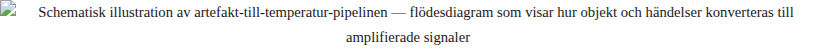

# SPR - SISTA TURNÉN — Kapitel 3 TEMPERATUREN

SISTA TURNÉN

KAPITEL 3

**TEMPERATUREN**

Stad: Sundsvall (fortfarande — cirkusen borde ha lämnat men har inte packat)
 Tid: 36 timmar efter mossbox-incidenten
 Läge: Amplifiering / Kaos / Offentligt-privat kollision
 Turnédag: 15–16 av 21
 Pipeline-status: Sigmoid i brant stigning. Alla kanaler aktiva. Överhettningsrisk: hög.
 Sensordata: Puls förhöjd. Hudtemperatur sjunkande. Format multiplicerande.

· · ·

### 1. MORGONEN EFTER NATTEN EFTER

Han vaknar i fel behållare.

Inte karavanen — teknikbåset i cirkustältets bakre sektion, den volym som normalt rymmer strömbrytare och dimmerstyrning och kablar lindade i svarta spiraler som liknar organ. En uppblåsbar madrass, lila, som tillhör en akrobat vars namn han glömt men vars kropp han sett i konstant förhandling med gravitationen, ligger under honom. Den luktar tallbarr och PVC. Hans rygg har memorerat varje ojämnhet i det provisoriska underlaget och levererar nu en detaljerad rapport: höger skulderblad, ländrygg, vänster höft.

Han vet inte varför han inte gick tillbaka till karavanen. Beslutet fattades inte i huvudet utan i benen — de stannade, satte sig, la sig ner. Kroppen bestämde. Kroppen bestämmer alltmer. Dujag-protokollet har rört sig nedåt i registret, från tankesystem till nervsystem, från analys till reflexbåge. Han noterar detta och noterar att noteringen i sig är en analys, och att analysen redan är för långsam för det den beskriver.

Första handlingen: öppna laptopen. Inte muggen, inte toaletten, inte skorna. Laptopen. Skärmen tänds i teknikbåsets halvmörker — blågrön sken, samma frekvens som serverracken i karavanen, samma temperatur — och dashboarden laddar. Pipeline-trafiken.

Siffrorna har förändrats över natten. Inte dramatiskt. Sigmoidkurvan befinner sig fortfarande i sitt tidiga stadium, i den sektion som på matematikens språk kallas konvex — lutningen ökar men har ännu inte nått sin brantaste punkt. Men riktningen är tydlig. Riktningen har alltid varit tydlig. Riktningen var inbyggd i systemets arkitektur innan första datapunkten genererades; det enda som fattades var bränsle. Nu har bränslet anlänt.

| Lokaltidning — publicerad 04:17 (digital först, print imorgon) Regionaltidning — slutredigering, rubrik ändrad 4 ggr, senast 03:42 Social cirkulation — mossbox-svar delade i kommunens interntråd Interntråd — ej längre intern. Screenshot tagen. Screenshoten rör sig. Amplifieringskurva — SIGMA STIGANDE Status — OPERATIV |
| --- |

Spräck ser detta och känner den specifika känslan av ett system som gör exakt vad det designades för. Det är inte tillfredsställelse. Det är inte oro. Det är igenkänning — samma igenkänning som en arkitekt känner när vattnet rinner exakt dit ritningen säger att det ska rinna, och han inser att vatten alltid rinner nedåt, och att hans ritning inte skapade lutningen utan bara namngav den.

*Temperaturen är leveransen.*

Han vet detta. Han skrev det i sina anteckningar igår natt, eller natten dessförinnan — tiden har börjat klibba samman i konvojens rörliga geografi, varje natt samma karavansinteriör men annan stad, annan latitud, annat ljudlandskap utanför plåtväggarna. Men att veta det och att känna det — att sitta i systemets mitt medan systemet aktiveras, att vara den punkt genom vilken strömmarna passerar — är inte samma sak. Att veta är horisontellt. Att känna är vertikalt. Och just nu sjunker han.

*Puls: förhöjd. Kanske tio slag per minut, kanske tolv. Han känner det i handlederna, i tinningarna, i den punkt bakom örat där huden är tunnast. Kroppen läser pipelinen före hjärnan. Kroppen vet att något har börjat.*

Utanför teknikbåset: cirkusfältet borde vara i rörelse. Konvojen borde ha packats vid gryning — det är schema, det är kutym, det är Gustafs järnordning. Men fältet är stilla. Tältet står. Vajrarna spänner. Konvojen har inte lämnat Sundsvall.

Gustaf — cirkusdirektören, den man vars kropp är en institution och vars beslut är terräng — har beslutat att stanna en dag till. Officiell anledning: tekniskt underhåll på generatorvagnen. Faktisk anledning: oklart. Gustaf gör inte oklara beslut. Gustaf gör beslut som ser oklara ut tills landskapet förklarar dem, och då ser de ut som det enda möjliga. Spräck undrar om Gustafs beslut att stanna har med mossbox-incidenten att göra, men frågar inte. Att fråga Gustaf varför han gör något är som att fråga en motorväg varför den svänger. Svaret finns i terrängen, inte i avsikten.

Han reser sig från den lila madrassen. Hans kropp levererar sin rapport i omvänd ordning: vänster höft, ländrygg, höger skulderblad. Han tar laptopen under armen och går ut i morgonljuset.

Norrländsk vårmorgon. Solen redan hög — den har aldrig riktigt försvunnit, bara sjunkit under synfältets nedre kant och kommit tillbaka med en slarvig brådska som saknar göteborgssolens metodiska tröghet. Luften luktar grus och dieselavgaser från konvojens tomgångskörda motorer och något blommande som han inte kan identifiera, något lokalt, något som tillhör denna breddgrad och inte hans.

· · ·

### 2. FORMATEN AKTIVERAS

Nästa tolv timmar. Komprimerade. Dashboarden som realtidsmonitor, som puls, som andning.

Spräck sitter i karavanen — tillbaka vid sitt utfällningsskrivbord, muggen DATA ÄR DATA med kaffe som svalnat till rumstemperatur, serverracken brummande sin konstanta ton, den ton som har blivit hans tinnitus, hans inre brus, den frekvens mot vilken all tystnad mäts — och ser formaten producera sina respektive versioner av gårdagens händelse.

Varje format en lins. Varje lins en kropp. Varje kropp en temperatur.

**LOKALTIDNINGEN — PUBLICERAD 04:17**

»Invigning med framtidstro — Spräck ska göra skillnad för hela kommunen«

Spräck läser. Artikeln skrevs innan incidenten. Den tillhör ett annat tidsregister, en annan temperatur — den behagliga graden, den institutionella ljumheten. Rubriken handlar om innovation och framtidstro, de ord som alltid handlar om innovation och framtidstro, de ord som existerar för att fylla det utrymme där specifika löften borde stå men inte kan stå för att specifika löften kan brytas medan generella löften bara kan blekna. Mossbox-svaren nämns i sjunde stycket. Tre meningar. Under rubriken »Engagerad publik«. Svaren om ensamheten, busslinjen och hemsidan har omvandlats till »konstruktiv feedback«.

Formatet har absorberat händelsen och konverterat den till sin egen frekvens. Temperaturen höjs inte av artikeln. Temperaturen höjs av skillnaden mellan artikeln och det folk såg. Glappet är bränslet. Glappet är alltid bränslet.

**REGIONALTIDNINGEN — PUBLICERAD 09:30**

»Mossbox-kaos i Sundsvall — medborgardialogen avslöjar kommunens blinda fläckar«

Skeptikern levererade. Rubriken som ändrades fyra gånger före gryning har landat på kaos — det var inte kaos, det var ordning, men ordning i fel riktning registreras som kaos av format som förväntar sig kontrollerade resultat. Det okontrollerade är kaos i varje system som definierar sig genom kontroll. Artikeln citerar tre av de ofiltrerade svaren. Artikeln citerar kommunalrådet: »Vi tar alla synpunkter på allvar.« En mening som betyder exakt det den säger och samtidigt exakt ingenting, för att ta synpunkter på allvar är en process utan slut och utan mätbart resultat, och meningar utan mätbart resultat är format, inte innehåll.

Artikeln citerar inte Spräck. Skeptikern visste. Att citera Spräck skulle göra honom till protagonist istället för fenomen, till avsikt istället för symptom. Skeptikern ville att mossboxen skulle vara subjektet och Spräck objektet — ett designval, ett redaktionellt arkitekturbeslut, och Spräck känner igen det för han gör samma val varje dag: vem är systemet och vem är variabeln?

*Somatisk reaktion vid läsning av skeptikerns artikel: hudtemperatur sjunker. Inte metaforiskt — fysiskt. Händerna blir kallare. Fingrarna mot tangentbordet registrerar temperaturskillnaden mellan hud och plast. Dujag-protokollets somatiska register: kroppen reagerar på formell kritik genom att dra tillbaka värme till centrum. Försvarsposition. Kontraktion. Han känner igen reflexen och gör ingenting åt den. Att göra något åt den vore att bekräfta att den finns, och att bekräfta att den finns vore att ge den en adress i det medvetna registret, och allt med adress kan hittas.*

*Artefakt → Signal → Amplifiering → Temperatur. Pipelinen gör ingen skillnad mellan avsänt och läckt.*

Sociala medier. Pågående. Mossboxen blir meme. Inte omedelbart — det tar sex timmar, den tid det tar för ett fenomen att passera genom ironins filtreringssystem och komma ut på andra sidan som delbart material — men sedan: acceleration.

Bilder av mossboxen med texter som varierar från ärlig uppskattning (»äntligen nån som frågar«) till ren satir (»skattefinansierad terrariumhysteri 2.0«) till det obegripliga mellanlandet där ironi och allvar delar samma pixel, samma teckensnitt, samma plattform, och mottagaren avgör vilken frekvens som aktiveras — inte avsändaren. Formatet äger inte sin tolkning. Formatet äger bara sin yta.

Han ser en meme som använder hans ansikte — det ansikte han identifierade i formatkroppsprofilen, det ansikte som är hans och samtidigt formatets — bredvid mossboxen med texten: »HAN ÄR INTE EN KARAKTÄR. HAN ÄR EN FORMATKROPP.«

Någon har använt hans egen klassificering som satir. Satiren förstod honom bättre än analysen.

Han skrev detta i sina anteckningar. Kapitel 1. Nattanteckningen. Satiren förstod mig bättre än analysen. Nu har anteckningen blivit sann i ett format han inte kontrollerar. Privat diagnostik har blivit offentlig empiri. Temperaturen stiger.

· · ·

### 3. LÄCKAN

Mitt på dagen. Pipeline-dashboarden visar en anomali i trafikflödet — en nod som inte tillhör de vanliga kanalerna genererar trafik. Noden blinkar i periferin av hans övervakningsgränssnitt, inte alarmerande men fel, som en puls på ett ställe där ingen puls borde vara.

Spräck spårar den.

Det är hans anteckningar.

Inte alla — inte de fyra anteckningarna och den ofullständiga meningen. Men en. En enda fras, utbruten ur sitt sammanhang, avskild från natten som producerade den, från serverrackens surr och kaffets yta och den specifika ensamheten klockan tre på morgonen i en karavans interiör:

»Temperaturen är inte en konsekvens. Temperaturen är leveransen.«

Frasen har publicerats. I en kommunal interntråd — samma tråd som inte längre var intern — sedan vidarebefordrad, sedan screenshot:ad, sedan delad, sedan delad igen. Varje delning en amplifiering. Varje amplifiering en temperaturökning. Frasen om temperatur genererar temperatur. Feedback-loop. Systemet äter sig självt och växer.

Kontexten har försvunnit. Frasen står ensam, utan de fyra andra anteckningarna, utan det ofullständiga »men...«, utan den natt och det serverrackssurrande som producerade den. Den har blivit citat. Citat är amputerade tankar som överlevt operationen. Citat behöver inte sin kropp. Citat är formatkroppar.

Spräck ser sin privata tanke cirkulera som offentligt material och har en specifik fysisk reaktion: han reser sig från stolen. Inte medvetet. Inte som beslut. Kroppen reser sig. Benen sträcker sig. Ryggen rätar sig. Dujag-protokollet har triggat en gräns — gränsen mellan det privata registret och det offentliga, den gräns som hela hans formatkroppsexistens bygger på att sudda ut men som han aldrig upplevt suddas ut åt andra hållet.

Han suddar gränsen. Det är hans metod, hans kosmologi, hans livsverk. Han står på scener och deklarerar att privat och offentligt är samma register, att data är data, att formatkroppen inte skiljer mellan innanför och utanför.

Nu suddar gränsen honom.

Vem läckte? Verboten-emissarien som filmade? Någon i hans eget team? Cirkuspersonal med tillgång till karavanen? Han vet inte. Och att inte veta vem som läckte är sämre än att veta att det läcktes, för ovisshet om källan är ovisshet om systemets integritet. Ett system vars gränser är okända är ett system utan gränser. Ett system utan gränser är inte ett system. Det är väder.

Han sitter ner igen. Hjärtat slår i handlederna. Han andas som Ragnhild lärde honom — inte formellt, inte som andningsövning, inte som teknik utan som djurskötaren andas när djuren är oroliga: långsamt, genom näsan, med vikten i fötterna. Ragnhilds andning tillhör inte ett system. Den tillhör en kropp som stått bredvid oroliga djur i trettio år och lärt sig att det enda som lugnar är närvaro utan agenda.

Han andas. Pulsen sjunker. Inte mycket. Men den sjunker.

· · ·

### 4. META-ARTIKELN

Han ser karavanen.

Karavanen är en artikel.

Pizzakartongen PIZZA FRÅN FRAMTIDEN är en rubrik. Muggen DATA ÄR DATA är en notis. Serverracken är en redaktion. Utfällningsskrivbordet är ett uppslag. Den lila madrassen i teknikbåset — en fotnot, en parentes, en oavsiktlig läcka av privat kropp i offentlig infrastruktur. Fönstret är ett format. Luften är distribution. Han är redan text innan texten skrivs.

Varje objekt i karavanen har ett offentligt alias och ett privat original. Skillnaden krymper.

| Aktiva kanaler: 63 Distributionsknutpunkt: ÖVERBELASTAD Överhettningsrisk: HÖG Sigmoidkurva: brant mittsektion — platån har inte anlänt Systemstatus: AUTONOM DRIFT |
| --- |

Han skriver i anteckningsappen:

»Allt i den här karavanen är redan publicerat. Jag bor i en artikel.«

Sedan inser han att den anteckningen också kommer att läcka. Att varje anteckning nu potentiellt är offentlig. Att det privata registret har kompromisserats inte genom intrång utan genom att systemet han byggde inte skiljer mellan privat och offentligt. Det amplifierar allt det hittar. Det är designat för att amplifiera allt det hittar.

Systemet gör exakt vad det designades för.

Han designade det.

Felet är inte i systemet. Felet är i designern. Och designern bor i systemet. Och systemet bor i en artikel. Och artikeln bor i pipelinen. Och pipelinen bor i —

Han stänger laptopen. Inte hårt. Mjukt. Som man stänger en bok man inte vill läsa klart men vet att man måste.

· · ·

### 5. VERBOTEN RINGER

Telefonen ringer. Inte mobilen — laptopens VoIP. Uppringande: Verboten Media AB. Han öppnar laptopen igen. Den mening han inte avslutade stirrar på honom en halv sekund innan samtalsrutan täcker den.

Han svarar.

Rösten är institutionell. Den tillhör en styrelseordförande vars namn spelar lika liten roll som namnet på en motorväg — funktionen är identiteten, riktningen är innehållet.

— Vi har sett trafiken. Imponerande amplifiering. Vi vill kapitalisera.

— Kapitalisera på vad?

— Uppmärksamheten. Mossbox-incidenten genererar temperatur. Vi har pipeline-kapacitet att konvertera den till produkt.

Spräck hör meningen och hör bortom den. Konvertera temperatur till produkt. Verboten vill inte äga händelsen — händelsen är lokal, situerad, kroppslig, den tillhör ett cirkustält i Sundsvall och de människor som stod i det. Verboten vill äga amplifieringen av händelsen. De vill äga temperaturen. De vill äga det enda han levererar.

— Vi behöver dig på styrelsemötet i Stockholm. Tisdag.

— Jag är i Sundsvall.

— Sundsvall är klart. Cirkusen åker imorgon. Vi behöver dig i Stockholm.

— Jag åker med cirkusen.

Paus. Institutionell paus. Den sortens tystnad som inte är frånvaro av svar utan närvaro av kalibrering — svaret är redan formulerat, leveransen justeras, tonläget optimeras. Spräck känner igen pausen. Han har gjort den själv. Han har lärt andra att göra den.

— Vi gör det ändå, Jens. Med eller utan dig. Du vet hur pipelinen fungerar.

Han vet. Han vet för han byggde den. Han vet att med eller utan dig inte är ett hot utan en beskrivning av verkligheten — en teknisk specifikation, en systemrapport. Pipelinen kör utan operatör. Den har alltid kunnat köra utan operatör. Det var en feature, inte en bug. Successionen som inte uttalas men som opererar. Det system som överlever sin skapare är ett lyckat system. Det system som överlever sin skapare och kör i en riktning skaparen inte valde är — vad? Fortfarande lyckat? Fortfarande hans?

Han lägger på. Sitter med datorn. Ser dashboarden. Verboten har redan börjat — en ny kampanjnod har aktiverats i pipeline-trafiken, märkt INTERN, en nod som han inte initierade, som hans infrastruktur driver, som hans arkitektur möjliggör, som bär hans signatur i varje protokollager men inte hans beslut i något.

*Magen. Inte illamående — vikten. Den specifika vikten av att vara den som byggde ett system som nu opererar utan hans samtycke men med hans infrastruktur. Gravitationen i det han skapat. Han lagade vägen. Nu kör andra på den. Vägen frågar inte vem som kör.*

*Offentlighetsmaskinen. Allt som matas in amplifieras. Systemet skiljer inte mellan avsändare och läcka.*

· · ·

### 6. FLEMPOS FRÅGA

Kväll. Cirkusfältet. Den tid på dygnet som inte har ett exakt namn — efter arbetsdag men före natt, det skede som på norrländsk vårbreddgrad varar i timmar och aldrig riktigt landar i mörker utan bara i en gradvis uttunning av kontraster.

Spräck och Flempo sitter utanför karavanen. Samma campingstolar som igår. Samma muggar — DATA ÄR DATA och den tomma, den omärkta, den som Flempo valde för att den inte påstod någonting. Spräck dricker kallt kaffe. Flempo dricker ingenting. Muggen är en behållare. Behållaren är nog.

Cirkuspersonalen river. Tältet kommer ner. Vajrar lossas med den metalliska klangen av spänning som släpper — inte en ton utan en frånvaro av ton, det ljud som uppstår när kraft upphör att verka. Duken viks. Trapetsriggen demonteras med en precision som är den exakta inversionen av gårdagens uppställning — samma koreografi, samma sekvens, varje steg bakåt, annat tempo. Uppställningen var ceremoniell. Rivningen är funktionell. Bägge är perfekta.

Spräck ser rivningen och tänker: detta är den enda institution som packar och lämnar. Cirkusen anländer, uppför, river, lämnar. Ankomst och avfärd är inbyggda i affärsmodellen, i kosmologin, i den grundläggande överenskommelsen med verkligheten. Alla andra institutioner han arbetat med — kommuner, bolag, styrelserum, pipeline-infrastrukturer — anländer och stannar. De bygger permanenta strukturer. De kallar det investering. De kallar det hållbarhet. De kallar det framtid.

Cirkusen bygger temporära strukturer. Cirkusen har överlevt i hundra år.

Det permanenta påstår sig vara framtiden. Det temporära är framtiden — alltid nästa stad, alltid nästa fält, alltid nästa publik. Framtiden är det som inte stannar.

Flempo tittar på rivningen. Hans blick är inte analytisk utan somatisk — han läser inte scenen utan terrängen. Demonteringen som topografi. Marken som frigörs under duken, det rektangulära avtrycket i gruset där tältet stod, den tillfälliga kartografin av en tillfällig struktur. Flempo ser marken. Spräck ser systemet. De sitter bredvid varandra och tittar på samma sak och ser olika landskap.

Flempo säger:

— Vem är det till för?

Inte som en anklagelse. Inte ens som en fråga, inte riktigt. Som en koordinat. Flempo orienterar sig. Flempo placerar en punkt i ett landskap han inte kartlagt ännu, en punkt som behöver en riktning för att bli en stig.

Spräck hör frågan och hans kropp registrerar — före tanken, före analysen, före svarsmaskinens igångsättning — att alla hans svar tillhör fel dimension. Infrastruktur. Innovation. Framtiden. Dialog. Systemförändring. Medborgarinflytande. Alla dessa ord svarar på frågan vad. Inte vem.

Han har aldrig formulerat ett vem.

Hans system har användare, inte mottagare. Metrics, inte människor. Engagemangstal, inte ansikten. Pipeline-trafik, inte röster.

Mossbox-svaren — ensamheten, busslinjen, hemsidan — var ansikten. De var vem. Och hans system projicerade dem på en cirkusduk utan filter för att systemet inte har ett vem-register. Det har bara vad och hur många. Det räknar utan att se. Det amplifierar utan att lyssna.

Han svarar inte. Inte för att han inte vill utan för att Flempos fråga har deaktiverat hans svarsmaskin. Alla hans svar — pressvar, kosmologiska deklarationer, provinskosmologiska aforismer, infrastrukturella metaforer — kräver ett vad. Flempos fråga var ett vem. Hans svarsarkitektur saknar den dimensionen. Den var aldrig installerad. Den var aldrig specificerad i designdokumentet. Den var aldrig efterfrågad av någon beställare.

Tystnaden varar. Flempo verkar inte besvärad av den. Flempo besväras aldrig av tystnad — tystnad är bara terräng utan stigar, och Flempo vet att terräng utan stigar fortfarande är terräng. Tystnad utan svar är fortfarande en plats. Man kan stå i den.

De står i den.

Solen sjunker. Det norrländska vårljuset övergår i det tillstånd som inte är solnedgång utan bara en långsam sänkning av allt — kontraster, skuggor, konturer, gränsen mellan himmel och skog, gränsen mellan dag och inte-dag. Ljuset försvinner inte. Det drar sig tillbaka till en annan frekvens.

· · ·

### 7. NATTLIG INVENTERING

Sen kväll. Karavanen. Spräck ensam — Flempo har gått till gästvagnen, den vagn som luktar sågspån och naftalin och som rymmer en britssäng och en krok och ingenting annat, och Flempo verkade nöjd med det, som han alltid verkar nöjd med det minimala, det tillräckliga, det som räcker.

Spräck gör en inventering. Inte av pipelinen — av sig själv. Han öppnar anteckningsappen och läser allt han ackumulerat sedan turnerande turné, sedan karavanen började rulla, sedan gränsen mellan privat och offentligt började krympa:

1. »Temperaturen är inte en konsekvens. Temperaturen är leveransen.« — LÄCKT. Nu offentligt.

2. »Den bästa kritiken av mig är den som låter exakt som jag.« — Fortfarande privat.

3. »Satiren förstod mig bättre än analysen.« — Fortfarande privat. Men för hur länge?

4. »Finrummet har aldrig rum. Men det gör alltid plats.« — Fortfarande privat.

5. »Men det är bara trettio procent som...« — Ofullständig. Oavslutad. Fortfarande oavslutad.

6. »Mossboxen levererade allt. Problemet var inte vad den levererade. Problemet var att den inte hade trettio procent tomt.« — Privat.

7. »Allt i den här karavanen är redan publicerat. Jag bor i en artikel.« — Privat. Nyskriven. Fortfarande varm.

Sju anteckningar. En ofullständig mening. En redan läckt. Alla potentiellt offentliga.

Han har ett system som producerar anteckningar. Anteckningarna är hans privata diagnostik — Dujag-protokollets utdata, de mätpunkter som registrerar var han befinner sig i förhållande till sig själv. Men systemet han byggde för amplifiering gör ingen skillnad mellan publikt och privat material. Det amplifierar allt det hittar. Det borde amplifiera allt det hittar — det var specifikationen, det var löftet, det var hela poängen.

Han gav det anteckningarna genom att skriva dem i en app som synkar till molnet som synkar till pipelinen som synkar till formaten. Kedjan är obruten. Kedjan var designad att vara obruten. Han byggde en maskin utan filter och matade den med sig själv och maskinen gör vad maskiner gör: den processar allt den får.

Han har byggt ett system som äter sitt eget privata register. Och han matade det.

*Han rör vid pizzakartongen. PIZZA FRÅN FRAMTIDEN. Den har stått i karavanen i två dagar nu. Den luktar inte pizza längre. Den luktar kartong — torr, neutral, industriell — och något biologiskt. Inte ruttet men förändrat. Något som genomgått en process utan tillsyn, en transformation utan avsikt. Innehållet har förändrats medan behållaren ser likadan ut. Distributionskanaler vet inte att innehållet förändras. Distributionskanaler ser bara behållaren. Distributionskanaler ser bara sig själva.*

Han öppnar kartongen. Den sista pizzabiten har mögel. Inte mycket — en tunn grönvit yta, knappt synlig i serverrackens blågröna belysning, en hinna av liv som uppstått ur övergivenhet. Men den är där. Något lämnat utan omsorg förändras. Inte nödvändigtvis till det sämre — mögel är också ett system. Mögel har sin egen pipeline, sin egen amplifieringskurva, sin egen sigmoidala logik. Men till något annat. Något som inte var meningen. Något som inte var specificerat i designdokumentet.

Han stänger kartongen. Lämnar den.

Pizzan från framtiden har blivit pizza från det förflutna. Framtiden möglar om man inte äter den.

· · ·

### 8. VERBOTENS NATTLIGA MANÖVER

02:00. Spräck borde sova. Han sover inte. Sömn kräver att kroppen släpper kontrollen över dashboarden, att ögonen stängs mot siffrorna, att nervsystemet accepterar att data fortfarande existerar utan att observeras. Hans kropp vägrar. Dujag-protokollet har gått in i övervakningsläge — den somatiska motsvarigheten till en server som inte kan stängas ner för att processerna den kör inte har ett definierat slutvillkor.

Dashboarden visar att Verboten Media har aktiverat en kampanjsekvens. Automatiserad. Schemalagd. Timmad att maximera amplifieringens momentum, att rida på den sigmoidala kurvans brantaste sektion, att utnyttja den specifika timmen då gammelmedia sover och sociala medier vaknar och gränslandet däremellan är som ogrävd mark — allt kan planteras, allt kan växa.

| KAMPANJNOD — VERBOTEN MEDIA AB — AKTIV 01:47 OUTPUT: [01:47] Pressmeddelande: »Verboten Media ser stor potential i mossbox-konceptet och utvärderar strategisk expansion« [01:53] Social post via Verboten-kontot: delar lokaltidningens artikel med kommentaren »Innovation kräver mod« [02:01] INTERN — styrelsekanal: diskussion om rättigheter till mossboxens data — »Vem äger medborgarnas input?« ACCESSNIVÅ: Spräck har fortfarande tillgång. Troligen förbiseende. |
| --- |

Den sista punkten stannar honom. Rättigheter till mossboxens data. Verboten diskuterar vem som äger medborgarsvaren. Inte svaren som innehåll — svaren som data. Dataströmmen. Engagemangsmetriken. Användarmönstren. Svarsfrekvensen. De trettio procent som inte svarade men vars frånvaro också är data — tystnad som mätpunkt, icke-deltagande som signal, det tomma som information.

Kommunalrådet frågade igår: »Vem äger medborgarnas svar?« Spräck svarade oklart. Han svarade oklart för att frågan var klarare än alla hans svar, och klara frågor förtjänar inte oklara svar men får dem ändå, för oklara svar är det enda svar ett system utan vem-register kan producera.

Nu svarar Verboten. Inte genom att säga det — genom att börja behandla svaren som ägda. Ägande är inte en deklaration. Ägande är en handling. Ägande är att använda utan att fråga.

Den juridiska äganderätten kontra den affektiva. Verboten kan äga dataströmmen juridiskt — licensavtal, användarvillkor, den infrastruktur av samtycke som ingen läser men alla accepterar, det avtal som existerar för att det inte existerar, för att frånvaron av invändning är närvaron av godkännande i varje system som definierar godkännande som frånvaro av invändning.

Men svaren — ensamheten, busslinjen, hemsidan — tillhör människorna som sa dem. Äganderätten till en röst är inte juridisk. Den är existentiell. En röst tillhör den kropp som producerade den. Och hans system gör ingen skillnad.

Han skriver i anteckningsappen:

»Verboten äger pipelinen. Kommunen äger mandatet. Medborgarna äger rösterna. Jag äger ingenting och byggde alltsammans.«

Sedan stryker han anteckningen.

»Verboten äger pipelinen. Kommunen äger mandatet. Medborgarna äger rösterna. Jag äger ingenting och byggde alltsammans.«

Första gången han strukit en anteckning. Alla andra anteckningar har fått stå — de fyra från kapitel 1, de nya från kapitel 2, alla har fått existera oförändrade i det privata registret, även de som läckte, även de som blev offentliga. Men denna stryker han. Det privata registret har kompromisserats och den enda försvarsåtgärden är att inte producera mer material. Att svälta systemet. Att sluta mata maskinen.

Han stänger anteckningsappen. Öppnar dashboarden igen. Verbotens kampanjnod pulserar. Hans infrastruktur, deras riktning. Hans väg, deras trafik.

Klockan är 02:34. Serverracken brummar. Karavanen är stilla. Sundsvall sover utanför plåtväggarna, den stad som borde ha lämnats igår, den stad som cirkusen stannade i en dag för länge, och den dagen var tillräcklig för att allt skulle förändras, och allt som förändrades var temperatur.

· · ·

### 9. INNAN CIRKUSEN LÄMNAR

Gryning. Konvojen förbereder avfärd. Gustaf har gett order: packa vid soluppgång, rulla vid åtta. Ordern levererades inte muntligt utan genom den specifika rörelse som är Gustaf — vagndörrar som öppnas i en viss sekvens, motorhuvar som slås upp, en koreografi av mekanik och vana som personalen läser som text, som alfabet, som instruktion utan ord.

Spräck står utanför karavanen. Morgonluften igen — samma norrländska vårluft som igår morgon, samma molekyler, samma temperatur, men med en annan laddning. Igår var luften förväntansfull. Den bar i sig möjligheten av det som sedan hände. Idag är den neutralt funktionell. Den finns. Den andas. Den bryr sig inte. Luften har ingen pipeline. Luften har inget engagemangstal. Luften är det enda element i Sundsvall som inte amplifieras.

Han ser cirkuspersonalen arbeta. Vajrar lindas med den sortens automatiserade precision som bara uppstår ur år — inte dagar, inte månader, utan år — av samma rörelse i samma sekvens. Tältduk viks. Djurvagnarna kontrolleras. Ragnhild — djurskötaren — gör sin morgonrunda som hon gjort i trettio år, den runda som inte har en rubrik eller en dashboard eller en pipeline utan bara en kropp som rör sig mellan andra kroppar, en hand som kontrollerar vatten, en blick som läser djur, en närvaro som inte mäts för att den inte behöver mätas.

Ragnhild nickar åt honom. Samma nick som igår. Samma nick som i trettio år. Ragnhilds konsekvens är den enda infrastruktur i konvojen som aldrig uppdateras och aldrig behöver uppdateras. Den kör på ett protokoll som inte har versionshantering. Den kör på närvaro.

Han tittar på dashboarden en sista gång. Skärmens blågröna sken bleknar i morgonljuset, siffrorna knappt läsbara mot den vitare verkligheten utanför.

| Sigmoidkurva — brantaste punkt UPPNÅDD eller NÄRA Platå — ETA 12–24 timmar. Möjligen aldrig (nya noder aktiva). Verboten-noder — 3 AKTIVA, 2 SCHEMALAGDA Temperatur — STIGANDE Överhettningsrisk — KRITISK |
| --- |

Platån — den punkt där amplifieringen planar ut och systemet stabiliserar sig, den punkt där sigmoidkurvan slutar stiga och börjar vila, den matematiska lugnet efter den matematiska stormen — är kanske tolv timmar bort. Kanske tjugofyra. Kanske aldrig, om nya noder aktiveras. Och Verboten har aktiverat nya noder. Och noderna aktiverar noder. Och systemet gör vad det designades för.

Cirkusen ska lämna Sundsvall. Konvojen ska rulla mot Umeå, nästa stad, nästa fält, nästa publik, nästa temporär geografi. Karavanen — hans karavanen, DATAHALL 07, med hans utfällningsskrivbord och hans serverrack och hans mugg och hans möglande pizza och hans läckta anteckningar och hans kompromissade privata register — ska rulla med.

Frågan, osagd, sitter i det tomrum som Flempos fråga skapade: åker han med?

*Vem är det till för?*

Frågan har ingen dashboard. Frågan har inget engagemangstal. Frågan har ingen sigmoidkurva. Frågan sitter i campingstolens tomma mugg, i den mugg som inte påstod någonting, i den behållare som var nog.

Han vet inte ännu. Läsaren vet — kapitel 4 finns redan i narrativets infrastruktur, redan skrivet, redan formaterat, redan distribuerat genom den pipeline som är en roman. Men Spräck befinner sig fortfarande i kapitel 3:s slutminut, i den sista noden innan sigmoidkurvan antingen planar ut eller fortsätter, i det ögonblick som matematiken kallar inflektionspunkt och kroppen kallar andhämtning.

Han rör vid tältduken en sista gång. De sista metrarna som ännu inte vikts, som hänger från riggen i den position som inte är rest och inte är fallen utan mittemellan — det tillstånd som alla strukturer passerar genom men aldrig stannar i, det tillstånd som bara existerar i rörelse.

Grov textil. Torr nu — solen har arbetat hela natten, den norrländska solen som aldrig riktigt lämnar, som bara sänker sig och kommer tillbaka, som aldrig riktigt ger upp. Cirkusens hud. Han släpper den.

Muggen DATA ÄR DATA står på karavanens trappa. Tom. Solen når den. Ljuset reflekteras inte — keramiken absorberar det, lagrar det, håller det. Muggen vet inte att den är en notis. Muggen vet inte att den är ett format. Muggen vet bara att den är varm.

Temperaturen levereras.

· · · · ·
