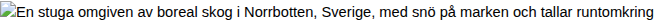
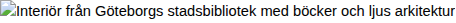
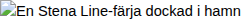
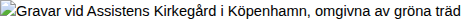
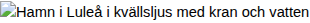
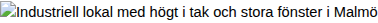

# Verboten Media Workshop Dispatches – Days 1-3

**VERBOTEN MEDIA · LEKTYRSTUGA-SERIEN · APRIL 2026**

## Verboten Media Workshop Dispatches – Days 1–3

Nio reportage från tre dagar av skrivarverkstäder som vägrar lyda. Jävligt bra litteratur i ett nytt format — rapporterat från fältet.

*Sammanställt av Dispatch-redaktionen · Publicerat 13 april 2026*

Under tre dagar — måndag till onsdag — genomförde Verboten Medias Lektyrstuga-serie nio skrivarverkstäder spridda från polcirkeln till rymdstationen, från Malmö hamn till Köpenhamns kyrkogårdar. Det som förenar dem är ett gemensamt credo: intressedriven elektronisk surrealism mitt i naturens uppmärksamhetsekonomi. Det förbjudna är det nödvändiga. Fiktionen infiltrerar verkligheten. Nio journalister — alla med olika format och röster — rapporterar från insidan.

**DAG 1 — MÅNDAG**

**ARTIKEL 1 · NORDISK VETENSKAPSKULTURELL TIDSKRIFT**

### Bonitetens hemlighet

*Text: Erika Sundqvist, vetenskapsjournalist · The Scientists Club, Sandträsk, Norrbotten*

*The Scientists Club i Sandträsk — Arthur Warner Cornforths stuga strax norr om polcirkeln. Foto: Arkiv*

Jag hade inte förväntat mig att min resa till polcirkeln skulle börja med ett måttband. Men klockan 07:15 en måndag i april står jag i en gles tallskog utanför Sandträsk, en by i Norrbotten som knappt finns på kartan, med ett gammalt skogsmätningsinstrument i handen och tårarna frysande i ögonvrårna av kylan. Intill mig står Arthur "The Scientist" Warner Cornforth och blåser in i sina händer — inte av kyla, utan av otålighet.

"Du mäter inte barktjockleken," säger han med sin felfria svenska, som trots femtio år i landet fortfarande bär den särskilda exaktheten hos en man som lärde sig språket som vuxen och sedan vägrade göra några fel. "Barktjockleken, Erika. Den är grundläggande. Utan barktjocklek har du ingen volymfunktion, och utan volymfunktion har du ingen berättelse."

Arthur Warner Cornforth — Cambridge-utbildad, brittisk till margen, bosatt i Sverige sedan tidigt 1970-tal — är inte den typ av workshopledare man normalt associerar med skrivarverkstäder. Han bär ingen sjal. Han dricker inte naturvin. Han bor i en stuga i Sandträsk som han köpte i slutet av 1980-talet för 450 000 kronor, en summa som även då var blygsam för en fastighet med mark, men som återspeglade vad marken faktiskt producerar: i princip ingenting. Bonitet 1,0 till 2,2. Det vill säga, skogens produktivitet mätt i kubikmeter per hektar och år, ligger precis ovanför det absoluta minimum för vad som ens kvalificerar sig som produktiv skogsmark.

Det är just detta som intresserar honom.

"Tor Jonson publicerade sin boniteringsmodell 1910," berättar Arthur medan han leder gruppen — nio deltagare, varav tre skribenter, två biologistudenter, en geologistudent från Luleå, en pensionerad folkskollärare, en journalist (jag) och en person som presenterade sig som 'existentiell rådgivare' — genom den glesa skogen. "Modellen var revolutionerande. Den tog höjd för beståndets ålder, grundyta och volym. Men den missade saker. Jonson visste det. Han var ärlig nog att medge det i fotnoterna, där ingen läser."

Workshopens upplägg är okonventionellt till gränsen för det absurda: innan någon deltagare får skriva ett enda ord måste de fysiskt mäta tre tallar. Diameter i brösthöjd. Höjd med hjälp av en klinometer som Arthur lånar ut med överdrivet ceremoniella gester. Barktjocklek med ett specialinstrument — en barkmätare — som ser ut som en medeltida tortyrapparat i miniatyr. Varje mätning ska noteras i ett formulär som Arthur har designat efter Bengt Lundqvists mätningsprotokoll från 1950-talet.

"Lundqvist förstod att precision inte är pedanteri," säger Arthur och läser högt ur en text av Lundqvist som om det vore poesi: "'Medelhöjden av de grövsta träden i beståndet, varvid de hundra grövsta per hektar anses vara härskarskiktet.' Hör ni hur det sväller? Härskarskiktet. Det är prosa. Det är episk prosa, dold i skoglig mätmetodik."

Deltagarna mäter. De sträcker sig uppåt med klinometrarna. De trycker barkmätarens nålar in i tallbark som luktar harts och kåda. Och under tiden talar Arthur — om den bortglömda variabeln. Varje mätningssystem, säger han, utelämnar något. Jonsons boniteringstabell klassificerade skogsmarken efter vad den kunde producera, men den tog inte hänsyn till vad den valde att producera. Eller till vad som producerades inuti människorna som stod i den.

"Er uppgift," säger han och stannar vid en tall vars stam är så rak att den ser ut som en ritning, "är att identifiera den bortglömda variabeln i ert eget skrivande. Vad mäter ni inte? Vad kan ni inte mäta? Det är där berättelsen bor."

Övningen är Verboten Medias metod i renodlad form: modulär reflektion genom fysisk handling. En Tankefigur — de nästlade kvadrater som utgår från pannan, som en serietidningsskurk i tankebubblan — tar form inte genom introspektion utan genom att vända uppmärksamheten utåt, mot tallens bark, mot den kalla luften, mot mätinstrumentets kalla metall. Det är kreativ systemtänkande förankrad i skogsvetenskap. Det låter absurt. Det fungerar.

Under en paus — Arthur kallar dem "mätningsintervaller" — försvinner han in i stugan. Genom fönstret ser jag honom sitta vid köksbordet med telefonen. Han spelar Battleship. Digitalt, mot anonyma motståndare. Han vägrar prata med någon under pauserna. När den existentiella rådgivaren försöker inleda ett samtal om mindfulness svarar Arthur utan att titta upp: "B-7. Miss," och flyttar fingret över skärmen. Han spelar tre matcher under första pausen. Vinner en.

Det är i stugan, mellan sessionerna, som jag förstår vad The Scientists Club egentligen är. Det är inte en skrivarstuga. Det är inte ett retreat. Det är ett laboratorium för meningsskapande genom modulär reflektion — varje mätning är en modul, varje tall är en datapunkt, och den text som uppstår i slutet av dagen är inte skriven av deltagaren utan genom deltagaren. Spegelproxessen — den förrationella spegelprocessen i Verboten Medias vokabulär — sker i kontakten mellan hand och bark.

Klockan 14:00, efter fyra timmars mätning och en lunch bestående av renskav och potatis tillagad av Arthur med överdriven brittisk precision ("Potatisen ska ha den textur som Maris Piper ger — inte någon av era svenska varianter"), sätter sig deltagarna ner för att skriva. Formulären ligger utbredda på bordet. Siffrorna talar — diameter, höjd, barktjocklek — men vad de säger beror på vem som lyssnar.

Det är geologistudenten från Luleå, Markus Bäckström, 24 år, som först förstår. Hans text börjar med en mätning — diameter i brösthöjd: 23,7 centimeter — och använder den som ramverk för en berättelse om hans fars händer. Händerna som mätte, som höll, som inte höll. Precisionen i mätningen blir precisionens motsats: en öppning mot det omätbara.

"Jag har aldrig skrivit så förut," säger Markus efteråt, och hans röst bär den typ av förvåning som är omöjlig att fejka. "Jag mätte en tall och skrev om min pappa."

Arthur, som just har förlorat sin fjärde Battleship-match, tittar upp och nickar. "Det var den bortglömda variabeln," säger han. "Bra. Nu mäter du nästa tall."

Kvällen avslutas i stugan. Arthur läser ur arkivmaterial från en vetenskaplig kollegials kyrkoanslutna verksamhet — konservativa, sexualmoraliserande dikter som han har postat i Battleship-forum online. Han läser dem med samma tonfall som Lundqvist-citaten. Ingen vet om det är ironi. Stugan luktar ved och harts. Utanför fönstret står tallarna i den subarktiska skymningen, omätbara och exakta på samma gång.

Jag är vetenskapsjournalist. Jag skriver om partikelfysik och genredigering. Jag förstår inte varför detta fungerar. Men jag noterar att det fungerar, och jag noterar det med den precision som en barkmätare kräver: texterna som skrivs i The Scientists Club är startlande precisa. Inte trots mätningen. Genom den.

Arthur spelade sammanlagt åtta matcher Battleship under dagen. Han vann tre. Han verkade inte bry sig om resultatet. Eller om litteraturen, egentligen. Han brydde sig om barktjockleken.

Det räckte.

| Faktaruta — Bonitetens hemlighet Kategori Data Antal deltagare 9 (inkl. journalist) Antal uppmätta tallar 27 (3 per deltagare) Omgivande skogs bonitet 1,0–2,2 m³sk/ha/år Genomsnittlig diameter i brösthöjd 21,4 cm Battleship-matcher (Arthur, hela dagen) 8 spelade, 3 vunna, 5 förlorade Stugans inköpspris (sent 1980-tal) 450 000 SEK Lunch Renskav med potatis (Maris Piper-typ, enligt värd) |
| --- |

**ARTIKEL 2 · TEKNIKBLOGG / SUBSTACK-ESSÄ**

### Utgrävningen

*Text: Jonas Hedlund, teknik- och kulturskribent · Digital workshop via Discord*

Jag ska vara ärlig: jag klickade på Discord-länken för att jag trodde det var en meme. Inbjudan löd: "Essän som utgrävning — fem lager ner till tystnaden. Ledare: Bill Mackenberry. Format: Discord voice + delad whiteboard. Medtag: öppet sinne, kaffe, en tes du tror på." Det fanns en emoji av en amerikansk fotboll. Jag trodde att det var ironi.

Det var inte ironi. Det var Bill Mackenberry.

Bill Mackenberry är en av de figurer i Verboten Medias ekosystem som existerar i den produktiva skuggan — han kallar sig själv "den viktiga sidokaraktären" och har gjort detta till en konstnärlig position snarare än en ursäkt. Han arbetar tillsammans med Arthur "The Scientist" Warner Cornforth och har bedrivit forskning i ett finskt underjordiskt arkiv vars exakta natur och placering han vägrar specificera. "Det är inte hemligt," säger han med sin amerikanska accent som sticker ut som en tuba i en stråkkvartett. "Det är bara inte relevant ännu."

Hans Discord-server heter "Mackenberry's Excavation Site" och har en avatar som föreställer en fotbollsplan sedd ovanifrån, med stratigrafiska lager inritade som yardlinjer. Servern har 47 medlemmar. 14 av dem deltar i kvällens workshop. Det är tisdag kväll, 19:00 CET, och jag sitter i min lägenhet i Malmö med hörlurar och en kopp te som snabbt blir kall.

"Okej," säger Bill. Hans röst är djup, vänlig, med den typ av energi som män i amerikanska sportkommentatorsbås har — hög intensitet, låg formalitet. "Alla har sin tes? Bra. Skriv ner den. En mening. Det ni verkligen tror. Jag menar verkligen. Inte det ni säger på middagar. Det ni tror klockan tre på natten."

Fjorton personer skriver. Jag skriver: "Teknologi gör oss friare." Det är vad jag tror. Eller trodde. Bill har inte ens börjat ännu och jag tvivlar redan.

Bills metod är arkitektonisk. Han kallar den "essän som utgrävning" och den fungerar som en nedstigning genom fem argumentativa lager, som geologiska strata i en utgrävning. Varje lager kräver att skribenten gräver djupare, förbi det bekväma, förbi det försvarbara, ner mot något som inte har ett namn ännu.

Lager 1: Det uppenbara påståendet. Skriv din tes. Formulera den starkast möjligt. "Teknologi gör oss friare." Bra. Solitt. Publicerbart.

Lager 2: Bevismaterialet som motsäger det. Nu hitta tre konkreta bevis för att din tes är fel. Inte svaga bevis. Starka. De bästa argumenten din fiende har. "Sociala medier skapar beroende." "Övervakningsteknik." "Algoritmisk manipulation av uppmärksamhet." Min te har blivit kall. Jag bryr mig inte.

Lager 3: Det emotionella substratet under motsägelsen. Varför valde du just de motargumenten? Vilken känsla ligger under? Inte vilken känsla du borde ha. Vilken känsla du har. Jag skriver: "Jag är rädd att jag har ägnat tio år av mitt yrkesliv åt att propagera för något som skadar människor."

Lager 4: Den kroppsliga förnimmelsen under känslan. "Var sitter det?" frågar Bill i Discord. "Inte i hjärnan. I kroppen. Var." Jag skriver: "I mellangärdet. Som en knut." Någon annan skriver i chatten: "Käkarna. Jag spänner käkarna." En annan: "Bakom ögonen, som ett tryck."

Lager 5: Tystnad. "Nu slutar ni skriva," säger Bill. "Två minuter. Stäng av kameran om ni vill. Bara tystnad." Discord-kanalen blir tyst. Fjorton personer i fem länder sitter i tystnad. Jag hör min egen andning i hörlurarna. Någonstans i bakgrunden av någons mikrofon hörs en katt som jamar.

Och sedan: "Nu skriver ni uppåt. Från lager 5. Från tystnaden. Uppåt genom kroppen, genom känslan, genom motsägelsen, tillbaka till påståendet. Men nu vet ni var påståendet bor. Ni vet vad det kostar."

Det är i detta ögonblick som Bill ritar på whiteboarden. Och det är i detta ögonblick som workshoppen förvandlas till något jag inte hade räknat med: en lektion i amerikansk fotboll.

Bills passion för fotboll är inte en bisyssla — det är hans primära metafor för all intellektuell verksamhet. Han ritar en spelplan. Quarterbacken, förklarar han, är tesen. Den som håller bollen. Men quarterbacken kan inte springa själv — han behöver blockerare (evidens), mottagare (implikationer), och en offensiv linje (struktur) som håller försvaret borta länge nog för att kastet ska hinna fram.

"Er essä," säger Bill och ritar en pil från quarterbacken till en mottagare i det djupa fältet, "är inte en monolog. Den är en koordinerad laginsats. Om ni bara har en tes och inga blockerare, blir ni nedtacklade på andra raden. Läsaren tacklar er. Och läsaren har rätt."

Han ritar play efter play. En screen pass — tesen ser ut att gå åt ett håll men levereras åt ett annat. En draw play — essän börjar med att se ut som en berättelse innan den avslöjar sig som ett argument. En Hail Mary — det desperat briljanta slutstycket som bara fungerar om allt annat har misslyckats.

Discord glitchar. Någons skärm fryser. Whiteboardritningen fördröjs med tre sekunder. En katt — samma katt eller en annan — promenerar framför någons kamera och blockerar hela bilden med grå päls i trettio sekunder.

"Forcerad synkronicitet," säger Bill utan att blinka. "Verboten-princip. Glitchen är inte ett fel. Glitchen är universum som redigerar ert manuskript. Notera vad som hände exakt när skärmen frös. Vad tänkte ni? Skriv det."

Jag tänkte på min mamma. Jag vet inte varför. Jag skriver det.

Workshoppen pågår i tre timmar. Under dessa tre timmar ritar Bill elva fotbollsspel, leder oss genom utgrävningen tre gånger, och avbryter sig själv minst fem gånger för att berätta om sin forskning i det finska arkivet — fragment som aldrig blir en hel bild. Han nämner ett dokument. Han nämner en temperatur. Han nämner ett djup under markytan. Inget hänger ihop. Allt hänger ihop.

Vid workshoppens slut läser deltagarna sina texter högt. Min text börjar: "Teknologi gör oss friare, och jag vet inte längre om det är sant, men jag vet att rädslan för att det inte är sant sitter i mitt mellangärde som en knut som har suttit där i tio år." Det är den bästa essäinledning jag har skrivit. Den kom från lager 5. Från tystnaden.

Bill avslutar med att rita en sista fotbollsspelning. Den ser ut som en molekylstruktur, eller en stjärnkarta, eller en familj. "Det här," säger han, "är den essä ni inte har skrivit ännu. Men nu vet ni var den bor."

Katten promenerar förbi kameran en sista gång. Bill ler. Discord fryser. Workshoppen är slut.

Jag vill inte erkänna det, men det här var det mest intellektuellt generösa jag har deltagit i på år. Bill Mackenberry är en sidokaraktär som har förstått något som huvudkaraktärer inte gör: att den bästa positionen i berättelsen är den som ingen bevakar. Därifrån kan man se hela planen.

| Faktaruta — Utgrävningen Kategori Data Discord-serverns medlemmar 47 totalt, 14 aktiva deltagare Djupaste lagret nått av samtliga Lager 5 (tystnad) Fotbollsspel diagrammerade 11 st. Discord-glitchar (dokumenterade) 7 st., varav 3 med katt Workshop-längd 3 timmar 12 minuter Finska arkivet — detaljer avslöjade Fragmentariska: 1 dokument, 1 temperatur, 1 djupangivelse Katter observerade Minst 1, möjligen 2 |
| --- |

**ARTIKEL 3 · BIBLIOTEKETS KULTURNYTT**

### Utvärderingsmodellen

*Text: Annika Freij, deltidsbibliotekarie och kulturskribent · Stadsbiblioteket, Göteborg*

*Stadsbiblioteket Göteborg — platsen för Marys workshop i det glasväggade mötesrummet på tredje våningen.*

Det glasväggade mötesrummet på tredje våningen i Stadsbiblioteket Göteborg bokades under rubriken "Skrivarverkstad — utvärderingsmetodik, 6 timmar." Jag vet detta eftersom jag hjälpte till att boka det. Det är mitt jobb. Jag är deltidsbibliotekarie på Stadsbiblioteket sedan elva år, och jag skriver bibliotekets kulturnytt — en sida i det interna nyhetsbrevet, mest om bokcirklar och författarbesök. Jag har aldrig skrivit om något som det som hände i mötesrummet den här måndagen.

Mary anlände klockan 09:45 — femton minuter före utsatt tid. Hon bar en enkel svart tröja, mörka jeans, och hade ett litet tatueringsmotiv synligt på insidan av vänster handled som jag inte kunde identifiera på avstånd. Hon drack ingenting. Hon ställde ingen fråga. Hon gick rakt in i mötesrummet, satte sig vid bordets kortsida, och lade fram en tunn bunt papper — inga digitala verktyg, inga projektorer, bara papper och en penna.

Tolv deltagare hade anmält sig. Fjorton kom. Åldersspannet var tjugoett till sextiosju. Tre var studenter. Två var pensionärer. En var gymnasielärare. En presenterade sig som "före detta copywriter, nu ingenting." Och en var tonåring — Wilma, femton år, som hade kommit ensam med spårvagn 6 från Kortedala och som log brett när hon satte sig vid bordet. Hon hade ett anteckningsblock med ett omslag av holografisk plast.

Mary presenterade sig kort: kulturingenjör, verksam inom det som Verboten Media kallar tankefigurstödd konceptutveckling sedan tonåren. Hon nämnde att hon hade arbetat med en tatueringsstudio. Hon nämnde Bob Dylan. Hon nämnde Zlatan. Hon sa dessa namn utan att försöka imponera — de landade i rummet som meritförteckningspunkter, inte anekdoter. Sedan sa hon: "Jag har en modell. Den heter ingenting. Jag har använt den i tjugo år för att avgöra vilka människor som är intressanta och vilka som inte är det."

Det blev tyst i rummet. Jag stod vid kaffevagnen med en kanna och lyssnade.

"Det låter elakt," sa Mary. "Det är det inte. Det är nödvändigt. Vi har begränsad tid och begränsad energi, och de flesta människor vi möter kommer inte att förändra våra liv. Det handlar inte om att vara elak. Det handlar om att vara exakt."

Modellen, förklarade hon, är privat och subjektiv. Den består av kriterier — hon avslöjade inte sina egna — som varje person testar mot. De som passerar kriterierna blir kvar i hennes uppmärksamhetssfär. De som inte passerar sorteras bort utan sentimentalitet. Hon har finslipat denna process under årtionden av karriäroptimering, av samarbeten med krävande kreativa personligheter, av att vara individualist i ett kollektiv, enda dottern med närvarande föräldrar.

"Min vän Nova," sa Mary, och något mjuknade i hennes röst — en minimal förskjutning som jag kanske var ensam om att uppfatta — "är den enda personen som aldrig behövde utvärderas. Hon visste. Från första samtalet visste hon." Nova, förklarade Mary, befinner sig på en rymdstation. De kommunicerar via telefonmeddelanden. Nova är hennes deus ex machina — den enda som kan tala förnuft med Mary när Mary har slutat lyssna på alla andra.

Men workshoppen handlade inte om Marys modell. Den handlade om deltagarnas.

"Ni ska bygga ert eget utvärderingssystem," sa Mary. "Inte för människor ni möter. För era karaktärer. Varje fiktiv person ni skapar måste kunna utvärderas. Om ni inte kan avgöra om er karaktär passerar eller misslyckas i ert eget test — då vet ni inte vem ni har skrivit."

Övningen var elegant i sin struktur: tre steg, tydligt avgränsade. Steg ett: designa dina utvärderingskriterier. Fem till tio punkter, helt personliga. Ingen universell moral. Inga generella dygder. Bara vad du anser vara väsentligt hos en fiktiv person för att den ska vara värd att läsa om. Steg två: ta din starkaste karaktär — den du älskar mest, den som bär din bästa text — och utsätt den för testet. Steg tre: skriv scenen där din bästa karaktär misslyckas.

Det var Steg tre som sprängde rummet.

Deltagarna skrev i fyrtiofem minuter. Rummet var tyst utom ljudet av pennor och tangenter — Mary hade tillåtit både analogt och digitalt. Solljuset strömmade in genom glasväggarna och lade ljusrektanglar över golvet. Kaffe serverades två gånger. Vid den andra serveringen märkte jag att mina kollegor — Linda och Per vid informationsdisken — tittade uppåt mot tredje våningens glasrum med en nyfikenhet som jag normalt bara ser när det är barnteater.

Texterna som lästes upp var remarkabla. Gymnasieläraren — en man vid namn Göran, sextiosju, med pensionering om tre månader — hade skapat ett utvärderingssystem baserat på huruvida en karaktär kunde "stå stilla i ett rum utan att behöva förklara sig." Hans bästa karaktär — en kvinna han hade burit i sina anteckningar i tio år — misslyckades testet. Hon förklarade sig hela tiden. I scenen han skrev försökte hon sluta förklara sig och upptäckte att hon inte visste vem hon var utan förklaringarna. Göran grät när han läste. Han bad om ursäkt. Mary sa: "Be inte om ursäkt för precision."

Den före detta copywritern — en kvinna vid namn Saga, trettiotvå — hade byggt ett system baserat på "förmågan att vilja något utan att kunna motivera varför." Hennes karaktär misslyckades genom att alltid ha skäl. Saga läste texten med en röst som var perfekt kontrollerad, och den kontrollen var mer rörande än Görans tårar.

Men det var Wilma — femton år, holografiskt anteckningsblock — som förändrade rummet. Wilma hade designat ett utvärderingssystem med tre kriterier: (1) Skulle karaktären klara sig ensam i en timme? (2) Skulle karaktären kunna säga "jag vet inte" utan att det var en strategi? (3) Skulle karaktären vilja leva om den fick välja om? Hennes karaktär — en tonårsflicka som hette Li — passerade de två första kriterierna men misslyckades på det tredje.

Wilma läste sin text: Li stod i sitt rum och tittade ut genom fönstret och försökte avgöra om hon ville leva om, och sedan bestämde hon sig för att frågan inte gick att besvara och att det var svaret.

Sedan tittade Wilma upp från sitt holografiska block och sa, med en röst som var alldeles stadig: "Vad händer om man utvärderar sig själv och misslyckas?"

Mary tystnade. Inte en dramatisk paus — inte en retorisk fördröjning — utan en faktisk tystnad, en lucka i tiden som varade i elva sekunder. Jag vet att det var elva sekunder för att jag räknade. Jag stod vid kaffevagnen. Per och Linda utbytte blickar nere vid informationsdisken — de kunde inte höra, men de kunde se genom glaset att något hade hänt.

Sedan sa Mary: "Då designar man ett nytt test."

Det var allt hon sa. Det räckte. Wilma nickade. Rummet andades ut.

Workshoppen fortsatte i ytterligare två timmar. Mary var lugn, professionellt charmerande, exakt i sin återkoppling — hon kommenterade inte texters kvalitet utan deras precision, och skillnaden mellan dessa två saker blev tydligare för varje kommentar. Hon pratade kort om den 8:e erogena zonen — ett koncept hon tydligen har utvecklat, kopplat till kreativ sårbarhet — men gick inte in i detalj. "Det är inte en workshop i det," sa hon. "Det är ett helt liv i det."

Vid dagens slut hade fjorton deltagare designat fjorton unika utvärderingssystem. Ingen var likadan. Alla exponerade något hos sin skapare som skaparen inte hade vetat om sig själv. Det är meningsskapande genom modulär reflektion — varje kriterium en modul, varje misslyckande en spegel.

Jag är deltidsbibliotekarie. Jag skriver normalt om bokcirklar som läser Kristin Lavransdotter och författarbesök där pensionärer ställer frågor om skrivarprocessen. Jag är, om jag ska vara ärlig med mig själv, inte redo för det här. Men jag skriver det. Och det jag skriver är det bästa jag har skrivit, och det skrämmer mig på samma sätt som det skrämde Saga, och det tröstar mig på samma sätt som det tröstade Wilma.

Mary lämnade biblioteket klockan 16:30. Hon tog med sig sin tunna bunt papper. Hon drack aldrig kaffe.

| Faktaruta — Utvärderingsmodellen Kategori Data Mötesrum Glasväggat, vån. 3, Stadsbiblioteket Göteborg Bokning 6 timmar under rubriken "Skrivarverkstad — utvärderingsmetodik" Anmälda / närvarande 12 / 14 Antal utvärderingskriterier designade (totalt) 87 (snitt 6,2 per deltagare) Marys karriärhöjdpunkter (nämnda) Tatueringsstudio, Bob Dylan, Zlatan Kaffe serverat 2 kannor à 1,5 liter = 3 liter Marys kaffeintag 0 dl Wilmas tystnad (mätt) 11 sekunder |
| --- |

**DAG 2 — TISDAG**

**ARTIKEL 4 · SJÖFARTSTIDNINGEN**

### Kursen och strömmen

*Text: Lars-Erik Forssén, sjöfartsjournalist · Avkommissionerad Stena Line-färja, Malmö hamn*

*Den avkommissionerade färjan i Malmö hamn — numera ett flytande kulturhus och plats för Kapten Langlets workshop.*

Jag har skrivit om fraktlogistik i femton år. Containerflöden. Bunkerprisutveckling. IMO-regelverk. Jag vet hur en hamn luktar — diesel, salt, rost — och jag vet hur en artikel om sjöfart ska struktureras: inledning med tonnagestatistik, mittparti med intervjucitat från rederiledning, avslutning med framtidsprognos. Jag har aldrig skrivit om litteratur. Jag har aldrig velat skriva om litteratur. Men det jag skriver nu — sittande på soldäck 7 på en avkommissionerad Stena Line-färja i Malmö hamn, med lukten av diesel och salt och rost precis som den ska vara — är den bästa artikeln jag har skrivit under mina femton år i branschen, och den handlar om en man med pipa som vägrar tända den.

Kapten Nils Langlet är, till det yttre, en arkety. Skepparkeps. Pipa i mungipan. Händer som ser ut som om de har hållit i ratt och tågvirke och andra människors öden i decennier. Han styr med ett finger på ratten — jag har sett honom göra det, eller rättare sagt, jag har sett honom demonstrera det, eftersom färjan inte längre är i drift utan fungerar som ett flytande kulturhus sedan 2024, och det enda som styr är berättelsen.

Langlets bakgrund är komplex. Han kidnappades av Die Verboten-rörelsen från ett kasinofartg i Stilla havet. Det låter som en filmplot. Han berättar det utan dramatik, som om han rapporterade väderobservationer: "De kom ombord vid Guam. Tre personer. Jag trodde det var inspektörer. Det var det inte. Två veckor senare var jag en av dem." Han gör en paus. "Man vänjer sig vid mörker." Sedan till gruppen: "Men mörker är inte frånvaro av ljus. Mörker är frånvaro av distraktion."

Workshopens titel är "Navigation som narrativ," och strukturen är briljant i sin konkrethet. Varje deltagare — vi är elva, inklusive en gymnasieklass från Helsingborg som ser ut att vara lika förvirrade som jag — får ett sjökort över Öresund. Riktiga sjökort, tryckta av Sjöfartsverket, med djupmätningar och fyrsektorer och strömpilar. Varje koordinat ska bli en scenlokalisering. Deltagarens uppgift är att kartlägga en berättelse tvärs över vattnet.

"Men strömmen," säger Langlet och pekar med pipan — den osthyvelsliknande rörelsen som sjökaptener gör när de visar riktning med ett föremål i handen — "strömmen ändrar sig. Strömmen i Öresund kan gå norrut eller söderut, beroende på vind, tryckskillnader i Östersjön och Kattegatt, vattnets densitet. Er berättelse måste räkna med drift."

Han delar ut övningen: skriv ditt första stycke, placerat vid din första koordinat. Jag skriver mitt vid 55°35'N, 12°53'E — strax utanför Malmö hamn, där jag faktiskt befinner mig. Det handlar om en man som lastar containrar och tänker på sin dotter. Jag skriver det på fem minuter. Det är kompetent. Det är tråkigt.

Sedan gör Langlet något som jag aldrig har upplevt i en workshopsituation: han går upp till bryggan — den fungerar fortfarande som utrymme, om än utan funktion — och lägger en hand på rodret. Han vrider det, försiktigt, två grader. Vi hör det knarra. Färjan rör sig inte. Den kan inte röra sig; hon ligger i kaj med förtöjningar som en pensionerad kvinna i sina minnen. Men rodret rör sig.

"Nu skriver ni om," säger Langlet. "Strömmen ändrade. Er koordinat har driftit. Ni är inte längre vid 55°35. Ni är vid 55°36. Det är en nautisk mil norrut. Ny plats. Ny scen. Men samma karaktärer."

Jag förstår inte varför detta fungerar. Men det fungerar. Min man som lastar containrar är plötsligt inte vid kajen — han är på öppet vatten, och hans tankar om dottern har skiftat med strömmen, och det som var tråkigt har blivit oroligt, levande, rörligt på samma sätt som vatten är rörligt. Jag skriver om. Det är bättre.

Langlet upprepar manövern fyra gånger under workshoppen. Varje gång vrider han rodret — ibland en grad, ibland tre — och varje gång tvingas deltagarna omskriva. Gymnasieklassen från Helsingborg, som inledningsvis var skeptiska ("vi skulle ju till Turning Torso"), har vid tredje omskrivningen slutat klaga och börjat skriva med en intensitet som förvånar deras lärare — en kvinna vid namn Ingrid som vid ett tillfälle tittar på mig och viskar: "Vad händer?"

Vad som händer är spekulativ resonans — Verboten Medias term för det tillstånd som uppstår när metod och material samverkar på ett sätt som ingen av dem kunde åstadkomma ensamma. Sjökortet är inte en metafor. Rodret är inte en symbol. De är verktyg, konkreta och fysiska, och de producerar text på samma sätt som bonitetsmätningen i Sandträsk producerade text: genom att tvinga skribenten ut ur huvudet och in i en verklighet som har egna regler.

Under en paus försöker Langlet tända sin pipa. Det är förbjudet — kulturhuset har rökförbud — och han vet det, men han plockar ändå fram tändstickor, håller dem mot pipan, och lägger sedan ner dem igen med en suck som låter som en ångvissla på lågvarv. Han gör detta tre gånger. Varje gång med samma ceremoni, samma suck.

"Rökförbudet irriterar mig mer än kidnappningen," säger han. Det är omöjligt att avgöra om han menar det. Med Langlet är det alltid omöjligt att avgöra, och det är, tror jag, poängen.

Han talar om träd vid ett tillfälle. En gymnasieelev — en pojke med stora hörlurar runt halsen — frågar varför det finns träd på sjökorten (det gör det inte, men det finns landmassor med träd på dem). Langlet svarar: "Om träden här kunde tala, skulle de referera till sig själva som skog då, tror du?" Pojken tänker efter. Alla tänker efter. Det är en fråga som ser enkel ut men som öppnar ett avgrund: identitet, kollektivitet, individens förhållande till den grupp den tillhör.

Vid dagens slut har varje deltagare en berättelse som rör sig tvärs över Öresund. Min handlar fortfarande om mannen med containrarna, men nu har han seglat — eller drivit — från Malmö till Köpenhamn och tillbaka, och hans dotter har blivit en vuxen kvinna han inte känner igen, och containrarna har blivit tomma, och tomheten har blivit det som bär texten.

Langlet samlar in sjökorten. Han lägger dem i en kartmapp med skinnfodral, den typ som sjökaptener hade innan allt blev digitalt. Han säger: "En bra berättelse, precis som en bra passage, räknar med drift. Ni kan inte kontrollera strömmen. Men ni kan styra med ett finger."

Jag har skrivit om containerflöden i femton år. Jag kommer att fortsätta. Men jag kommer aldrig mer att skriva om det utan att tänka på Nils Langlet och hans ostukna pipa och hans två grader och hans ström som ändrar allt.

| Faktaruta — Kursen och strömmen Kategori Data Färjans specifikationer Avkommissionerad Stena Line, 170 m, 24 000 BRT, kulturhus sedan 2024 Antal sjökortskoordinater använda 38 unika koordinater, Öresund Grader roderförskjutning (totalt) 9° (fördelade på 4 manövrer: 2°, 1°, 3°, 3°) Deltagare 11 (inkl. 6 gymnasieelever från Helsingborg) Langlets piptändningsförsök 3 st. (0 lyckade) Langlets kommentar om kidnappning vs. rökförbud "Rökförbudet irriterar mig mer" |
| --- |

**ARTIKEL 5 · TVÅSPRÅKIG ZINE / KÖPENHAMNS UNDERJORDISKA KULTURPRESS**

### Den ironiska pizzan

*Text: Selma Öhman, frilans · Assistens Kirkegård → Pizzeria Napoli → Bar Nørrebro, Köpenhamn*

*Assistens Kirkegård — kvällens startpunkt vid Kierkegaards grav, där ironi förvandlades till råmaterial.*

Jag är tjugotre år och det här är den viktigaste kvällen i mitt liv. Jag vet att det låter överdrivet. Jag vet att det är den typ av mening som man stryker i redigeringen. Men jag stryker den inte, för kvällen började vid Kierkegaards grav och slutade i en bar på Nørrebro, och däremellan fick en pizza mitt namn, och jag grät, och en man som heter Bongus II Jinko sa "det där var inte ironi, det var wahrheit" och använde det tyska ordet och ingen ifrågasatte det.

Vi samlades klockan 19:00 vid Assistens Kirkegård — elva personer, de flesta under trettio, de flesta nyfikna, alla lite nervösa. Köpenhamn i april: den sortens ljus som inte bestämmer sig för om det är dag eller kväll, den sortens temperatur som gör att man håller händerna i fickorna men inte klagar. Bongus II Jinko stod redan vid graven när vi kom. Han är precis så absurd som namnet antyder, och han äger det. Bred, skrattande, med en banan stickande upp ur jackfickan — jag tror att det var en medveten rekvisita, men med Bongus kan man aldrig veta.

"Søren Kierkegaard," sa Bongus och pekade på gravstenen med den respektlösa gesten hos en person som känner sig hemma bland de döda, "förstod ironi bättre än någon annan i historien. Han förstod att ironikern säger en sak och menar en annan, och att klyftan däremellan inte är ett tomrum utan ett rum — det mest produktiva rummet som finns." Han läste ett kort stycke om Kierkegaards tankevärld — om masken och det autentiska, om ironins roll som avslöjare av det falska — med en röst som varierade mellan professorns och ståuppkomikerns.

Sedan sa han: "Nu gör vi tvärtom."

Övningen hette "Ironi som råmaterial" och den var genial i sin omöjlighet. Uppgiften: skriv något fullständigt uppriktigt, men använd enbart ironiska metoder. Varje mening måste säga motsatsen till vad den menar, men den totala effekten måste vara förödande ärlighet. Ironi som fordon för sanning. Masken som avslöjar ansiktet.

"Det är som," sa Bongus och tänkte efter med hela kroppen — han rörde sig medan han tänkte, som om tankarna var fysiska — "om man har en vän som aldrig säger 'jag älskar dig' men som alltid dyker upp. Handlingen säger det som orden inte gör. Er text ska göra samma sak. Orden ska gå åt ett håll. Texten ska gå åt det andra."

Vi skrev vid gravstenen. Sittande på bänkar, lutade mot träd, en person — en dansk kille vid namn Frederik — satt på huk direkt på gräset med ett block mot knäna. Jag skrev om min mormor. Jag skrev: "Min mormor var den mest ointressanta kvinnan i världen. Hon gjorde ingenting av värde. Hon lagade mat som ingen bad om, vävde tyger som ingen behövde, och stod i dörren varje fredag och väntade på folk som inte alltid kom." Varje mening ironisk. Totala effekten: förkrossande.

Bongus gick runt och läste över axlar. Han kommenterade inte. Han sa bara "ja" eller "vidare" eller, vid ett tillfälle, "bananas" — jag tror inte att det var en kommentar om kvaliteten utan snarare ett utrop som tillhörde hans personliga vokabulär. Han hade en energi som var omöjlig att motstå — kaotisk men varm, som en brasa som brinner lite för nära soffan.

Klockan 20:30 gick vi till pizzerian. Napoli hette den, eller möjligen Bella Napoli — skylten var delvis dold av en markis — och ägaren var en man vid namn Salvatore som kände Bongus sedan tidigare ("Bongus! Du är tillbaka! Var det inte du som—" "Ja, det var jag, men vi pratar inte om det, Salvatore, vi pratar om pizza").

Det var här kvällen tog sin mest oväntade vändning. Bongus övertalade Salvatore att döpa en pizza efter varje deltagare. Namngivningen blev en ritual — inte en rolig grej, inte en lek, utan en ritual med samma tyngd som övningen vid graven. Varje pizza-namn skulle vara en mikrodikt. Salvatore stod med sin krita vid tavlan bakom disken och skrev.

Frederiks pizza döptes till "Den som sitter på gräset" — med kronärtskocka, rucola, och inga oliver, för Frederik hade sagt att han hatade oliver och Bongus sa att hatet var ärligare än smaken. Min pizza döptes till "Fredag kväll vid dörren" — efter min mormorsttext — med mozzarella, tomat, basilika och en extra skiva aubergine som Bongus kallade "väntan." En kvinna vid namn Astrid fick en pizza som hette "Trettiotvå och redan trött" — med pepperoni och en droppe honung som Salvatore var skeptisk till men som visade sig vara genial.

Salvatore serverade pizzorna. Vi åt. Det var den bästa pizzan jag har ätit, inte för att den var objektiv bra — den var en helt vanlig pizzeria — utan för att jag åt mitt eget namn och mitt namn smakade av basilika och aubergine och min mormors fredagar.

Sedan gick vi till baren. Det var vid det laget mörkt, och Köpenhamn hade blivit den sortens stad som bara finns i april — kall men inte fientlig, upplyst men inte bländande. Baren hette ingenting — det var en av de där ställena på Nørrebro som inte behöver ett namn för att existera. Bongus beställde en Tuborg och sa: "Nu börjar dryckesleken."

Men dryckesleken var inte en dryckeslek. Eller rättare sagt: den började som en dryckeslek — en variant av "jag har aldrig" där man drack om man hade gjort saken i fråga — men Bongus vred den. "Jag har aldrig" blev "jag har aldrig skrivit" och sedan "jag har aldrig vågat skriva" och sedan bara "jag har aldrig vågat." Och plötsligt drack alla, hela tiden, inte för att de ville bli fulla utan för att de hade vågat så lite och insett det nu, på denna bar, med denna grupp, med denna man som hade en banan i fickan och Kierkegaard i munnen.

Leken blev till tävling — konkurrerande uppriktighet genom ironisk form. En runda: "Skriv det mest ärliga du kan, men det måste låta som ett skämt." En annan: "Berätta om din största skam, men berätta den som om den hände någon annan." En tredje: "Skriv en kärleksförklaring till den person i rummet du har känt i kortast tid."

Det var vid den tredje rundan som någon grät. Det var inte jag. Det var Frederik. Han hade skrivit en kärleksförklaring till Astrid, som han hade känt i fyra timmar, och den löd: "Du är den mest intressanta trötta personen jag har träffat, och din pizza hade honung, och jag tror att honung på pizza är det modigaste valet en människa kan göra, och jag vill veta vad du drömmer om men jag vågar inte fråga, så jag skriver det här istället, och det här är inte ironi, det här är—"

Han kunde inte avsluta meningen. Bongus fyllde i: "Det där var inte ironi, det var wahrheit." Han använde det tyska ordet. Ingen ifrågasatte det. Tyskan landade i den dansk-svenska konversationen som om den alltid hade funnits där, ett tredje språk för det som de andra två inte kunde bära.

Klockan 01:15 satt vi kvar. Salvatore hade stängt pizzerian men kom förbi med en pizza till — "Den sista," sa han, "den heter 'Graven' och den har allting på sig" — och vi åt den i baren medan Bongus berättade om sitt eget namn. Varför Bongus. Varför II. Varför Jinko. Han berättade inte, egentligen. Han berättade runt det, som en ironiker berättar — genom att belysa allt utom det centrala och låta det centrala framträda genom sin frånvaro.

Jag gick hem genom Nørrebro i mörkret. Jag hade en smak av basilika och aubergine i munnen och en text i telefonen som var det mest uppriktiga jag hade skrivit, trots att varje mening i den sa motsatsen till vad den menade. Eller kanske: varje mening sa exakt vad den menade, men genom att klä sig i ironins kläder gjorde den sanningen uthärdlig. Kierkegaard hade förstått det. Bongus hade förstått det. Och jag, tjugotre år, frilansande, utan fast adress för mina texter, hade förstått det i fyra timmar på en kyrkogård och en pizzeria och en bar.

Det var den viktigaste kvällen i mitt liv. Jag stryker fortfarande inte meningen.

| Faktaruta — Den ironiska pizzan Kategori Data Grav besökt Søren Kierkegaard, Assistens Kirkegård, Nørrebro Pizzor döpta 11 st. + 1 avslutande ("Graven") Drycker konsumerade (gruppen) Ca 34 Tuborg, 7 glas vin, 3 kaffe Uppriktiga tårar fällda 3 (Frederik, Astrid, en anonym) Kierkegaardcitat felattribuerade 2 (ett tillskrivet Hegel, ett tillskrivet "nån dansk") Bananer i Bongus ficka 1 (oäten hela kvällen) Tyskt ord använt utan förklaring "Wahrheit" |
| --- |

**ARTIKEL 6 · SPEKULATIV JOURNALISTIK / SKANDINAVISK TEKNIKKULTUR**

### Fyra sekunder

*Text: David Rask, teknik-kulturskribent · Satellitlänk från ISS, deltagare i fem tidszoner*

*Utsikten från ISS Cupola — Novas arbetsplats och platsen varifrån workshoppen sändes.*

Novas röst anländer med fyra sekunders fördröjning. Det är inte mycket. Det är en evighet. I fyra sekunder hänger meningen i luften — eller rättare sagt, i vakuum, i de 408 kilometrarna mellan Internationella rymdstationen och jordens yta — och under de fyra sekunderna finns ett rum, ett kreativt rum, som modern skrivande har glömt existerar.

Det är tisdag kväll, eller tisdag morgon, eller tisdag mitt på dagen, beroende på var du befinner dig. Workshoppens fjorton deltagare sitter i fem tidszoner: Stockholm (19:00), Reykjavik (17:00), Nairobi (20:00), Teheran (21:30), och Tokyo (03:00 — en kvinna vid namn Yuki som anslöt mitt i natten för att hon, som hon sa, "inte kunde sova ändå, och sömnlösheten behövde ett syfte"). Nova sänder via satellitlänk från ISS. Hennes röst är klar, något komprimerad av överföringen, med en sorts lugn som inte tillhör jorden.

Nova är Marys telefonvän. Det är den information som Verboten Media ger ut. Men det jag bevittnar är mer: Nova är en rationell motvikt i en irrationell värld, en deus ex machina som sitter 408 kilometer ovanför alla problem och ser dem med den distans som bara omloppsbana kan ge. Hon arbetar med autister som underhåller och utvecklar nationens svarta lådor — flygplanens färdskrivare, de instrument som fångar allt men bara läses efter kraschen.

Det är denna metafor som bär workshoppen.

"Varje skribent har en svart låda," säger Nova, och fyra sekunder senare hör vi det. I de fyra sekunderna har jag hunnit formulera en fråga i mitt huvud, glömt den, och börjat en ny tanke. "Den spelar in allt — varje observation, varje känsla, varje kropplig förnimmelse — men den är designad för att bara läsas efter kraschen. Min fråga till er: kan ni lära er att läsa er svarta låda medan ni fortfarande flyger?"

Övningen heter "Skriva i fördröjningen." Formatet: Nova skickar en mening. Deltagarna väntar fyra sekunder (den faktiska satellitfördröjningen). Under de fyra sekunderna skriver de — inte svar på Novas mening utan den text som uppstår i mellanrummet. Sedan anländer Novas nästa mening, och deltagaren måste inkorporera den i sin text, som en ström som plötsligt ändrar riktning.

Det första utbytet:

Nova: "Beskriv det rum ni sitter i."

Fyra sekunder. Jag skriver: "Jag sitter i ett kök i Lund. Diskbänken har en spricka. Lampan summar." Det är allt jag hinner.

Nova: "Beskriv det rum ni sitter i som om ni aldrig kommer att se det igen."

Diskbänken med sprickan. Lampan som summar. Plötsligt är de inte detaljer — de är avsked. Fyra sekunder ändrade allt. Jag skriver: "Sprickan i diskbänken löper som en flod sedd från ovan, och jag har aldrig lagt märke till den förrän nu, och om jag lämnar det här rummet kommer jag att minnas sprickan men inte rummet."

Den meningen — skriven i fördröjningens rum, i mellanrummet mellan Novas ord och mitt eget — är bättre än något jag har skrivit på månader. Den kom inte från mig. Den kom från de fyra sekunderna.

Workshoppen fortsätter i denna rytm. Nova sänder. Fördröjningen skapar. Deltagarna skriver in i gapet. Det är en form av spegelproxess — den förrationella kreativa processen i Verboten Medias vokabulär — som uppstår inte genom meditation eller introspektion utan genom teknisk begränsning. Fördröjningen tvingar tålamod. Tålamodet tvingar uppmärksamhet. Uppmärksamheten tvingar text.

Vid 20:15 stockholmstid börjar tekniska problem. Satellitlänken fördröjs ytterligare. Fyra sekunder blir sex. Sex blir åtta. Vid 20:32 når fördröjningen elva sekunder, och det är i det mellanrummet — elva sekunder, en halv evighet i kreativt arbete — som en deltagare i Nairobi, en kvinna vid namn Amina, skriver det bästa stycket under hela workshoppen.

Aminas stycke handlar om vatten. Om att bära vatten. Om att bära vatten och veta att vattnet kommer att vara slut innan man når fram, men att bära det ändå, och att bärandet är poängen, inte ankomsten. Hon läser det högt. Nova svarar — elva sekunder senare — med en enda mening: "Jag ser Nilen härifrån."

Tystnad. Inte teknisk tystnad. Mänsklig tystnad. Fjorton personer i fem tidszoner som förstår att den kvinna som svävar 408 kilometer ovanför Aminas huvud kan se Aminas flod, och att avståndet inte är ett hinder utan en lins.

Yuki i Tokyo — det är nu 04:00 för henne — skriver ett stycke om sömnlöshet som en svart låda: kroppen spelar in nattens alla ljud, alla tankar, alla rörelser, men informationen är otillgänglig under dagen. "Jag kraschar varje morgon," skriver Yuki. "Och varje morgon läser någon min svarta låda — men den någon är inte jag. Det är den människa jag var igår, som inte längre finns."

Nova svarar: "Härifrån ser jag ingen skillnad mellan dag och natt. Bara terminatorn — linjen där ljus övergår i mörker — som rör sig tvärs över planeten. Från er sida ser det ut som en gräns. Härifrån är det en rörelse."

Workshoppen är, tekniskt sett, ett experiment i SST — Single Source Topic, Verboten Medias modulära kunskapsproduktionsmetod. Den enda källan är fördröjningen. Allt annat — texterna, metaforerna, den svarta lådan, Nilen sedd från rymden — uppstår ur den. Det är intressedriven elektronisk surrealism mitt i naturens uppmärksamhetsekonomi, och det fungerar inte trots den tekniska begränsningen utan genom den.

Klockan 21:00 avslutar Nova workshoppen. Hon säger: "Ni har skrivit i fördröjningen i två timmar. Ni har producerat text som inte kunde ha uppstått i realtid. Fördröjningen är inte ett problem. Fördröjningen är er medförfattare."

Fyra sekunder. Sedan: "Och nu ska jag gå tillbaka till mina svarta lådor. De behöver underhåll. Precis som era."

Länken bryts. Skärmen visar ISS-logotypen, sedan svart. Fjorton personer sitter i fem tidszoner med texter som luktar av rymd och fördröjning och diskbänkssprickor och bärt vatten. Yuki i Tokyo skriver i chatten: "Jag tror att jag kan sova nu." Ingen svarar i fyra sekunder. Det är inte tekniskt. Det är respekt.

| Faktaruta — Fyra sekunder Kategori Data Satellitfördröjning (nominell) 4 sekunder Maximal uppmätt fördröjning 11 sekunder (20:32 CET) Deltagare 14 i 5 tidszoner (Stockholm, Reykjavik, Nairobi, Teheran, Tokyo) ISS omloppshöjd under sessionen ~408 km Svarta låda-metaforer genererade 23 unika formuleringar Workshop-längd 2 timmar 4 minuter Yukis sömntillstånd vid slut "Jag tror att jag kan sova nu" |
| --- |

**DAG 3 — ONSDAG**

**ARTIKEL 7 · AKADEMISK KONFERENS / PAPER MED JOURNALISTKOMMENTAR**

### Replikanten i stugan

*Text: Dr. Helena Kraus, litteraturvetare, Umeå universitet · The Scientists Club, Sandträsk, Norrbotten*

*The Scientists Club i Sandträsk — samma stuga som dag 1, men nu med Arthur borta och Klonen som värd.*

Jag var inte här för att delta i en skrivarverkstad. Jag var här för att presentera ett paper — "Reproduktion och originalitet i samtida skandinavisk prosa" — vid den årliga konferensen för nordisk narratologi i Luleå. Konferensen avslutades på tisdag eftermiddag. På onsdag morgon fick jag ett meddelande från en kollega: "Det händer något i en stuga i Sandträsk. Du borde åka dit." Jag åkte dit.

The Scientists Club — Arthur Warner Cornforths stuga, den som Erika Sundqvist besökte på måndagen — såg annorlunda ut utan Arthur. Inte fysiskt — samma glesa tallskog, samma bonitet 1,0 till 2,2, samma köksbord med Battleship-telefonen liggande framme — men atmosfäriskt. Något var förskjutet. Luften hade en annan densitet. Stugan andades in istället för ut.

Klonen stod i köket och kokade kaffe.

Jag använder ordet "Klonen" utan ironi, utan metafor, utan akademisk distans. Verboten Media kallar denna figur Klonen — en replikering av Arthur Warner Cornforth, skapad av Arthur själv för att duplicera hans medvetande. Klonen hade skickats till danskt Burning Man för att "uppleva." Nu var Klonen här, i stugan, medan Arthur var borta. Klonen var värd för en skrivarverkstad. Klonen hade med sig ett fynd från det finska arkivet.

Klonen ser ut som Arthur. Samma längd, samma hållning, samma sätt att röra sig genom ett rum som om rummet existerade för hans skull. Men något var annorlunda på ett sätt som jag, som litteraturvetare specialiserad på reproduktion i text, borde kunna specificera men inte kunde. Klonen skrattade en halv sekund för sent. Klonen gjorde samma observationer om tallarna utanför fönstret — "den tallen har en fascinerande kvistfrihet" — men med en svagt annorlunda betoning, som om ordet "fascinerande" hade en annan valör i Klonens mun. Klonen spelade Battleship under pauserna, precis som Arthur, men med aggressivare öppningar — diagonala mönster istället för Arthurs systematiska horisontella svep.

Sex deltagare hade samlats. Två författare från Umeå, en konstlärare från Boden, en pensionerad översättare från Piteå, en ung kvinna som presenterade sig som "studerande" utan att specificera vad, och jag — som alltså inte var deltagare utan observatör men som inom trettio minuter hade blivit deltagare, för Klonens workshopformat tillåter ingen åskådarposition. Antingen skriver du eller så existerar du inte i rummet.

Workshopens titel: "Replikation som författarskap."

Frågan som Klonen ställde var enkel och omöjlig: om en klon skriver, vem är författaren? Om en kopia producerar text — med samma minnen, samma kunskapsbas, samma stilkänsla, men i en annan kropp, vid en annan tidpunkt — tillhör texten originalet eller kopian? Är replikationen ett plagiat eller en nybildning?

Övningen: varje deltagare fick en text skriven av en annan deltagare — från måndagens workshop, skickade anonymt till Klonen av Arthur (eller skickade de av Klonen själv? ingen visste) — och uppdraget var att "klona" den. Skriva om den, för hand, i en exakt replikering. Samma ord, samma struktur, samma intention. Som att kopiera en tavla i ett museum: penseldrag för penseldrag.

Men klonerna muterade. Förstås. Det är omöjligt att kopiera en text perfekt — handen avviker, hjärnan substituerar, minnet redigerar. En författare från Umeå, en man vid namn Tomas, fick en text om barndomsminnen från en strand och kopierade den med absolut trohet i sjuhundra ord. Men vid ord sjuhundraett avvek han. "Sanden" blev "saltet." "Sommaren" blev "den sommaren." "Min mamma" blev "en kvinna." Mutationerna var minimala. De var allt.

Klonen samlade in texterna — original och klon — och lade dem bredvid varandra på köksbordet. Mutationerna markerades med röd penna. Mönstren blev synliga: varje skribent hade muterat texten på sitt eget sätt, och mutationsmönstret avslöjade mer om skribenten än deras egna original någonsin hade gjort. Tomas — som hade bytt "min mamma" till "en kvinna" — satt tyst och tittade på den röda markeringen. Han sa ingenting. Hans tystnad sa allt.

Det var vid denna punkt som Klonen hämtade artefakten från det finska arkivet.

Dokumentet var gammalt — inte antikt, men gammalt i den mening att pappret hade en gulnande kvalitet och typsnittet var maskinskrivet, troligen 1970-tal. Det var på finska. Klonen läste högt och översatte simultant till svenska, med en precision som var nästan — men inte helt — Arthurs.

Dokumentet verkade vara en manual. Eller en instruktionsbok. Eller en profetia. Det beskrev steg-för-steg-förfaranden för något som inte namngavs — handlingar som skulle utföras, mätningar som skulle göras, observationer som skulle noteras — men syftet var aldrig uttalat. Det kunde vara instruktioner för att bygga en maskin. Det kunde vara en ritual. Det kunde vara ett recept. Klonen läste det med samma tonfall som Arthur läste Lundqvist — som poesi, som heligt — men med den svaga förskjutningen, den halva sekundens fördröjning i skrattet, som gjorde att rummet kändes som om det hade tippat en grad.

"Beskriver det något som ska hända," frågade konstläraren från Boden, "eller något som redan har hänt?"

Klonen svarade: "Ja."

Uncanny valley-känslan i workshoppen var påtaglig. Deltagarna — inklusive jag, som hade kommit som akademisk observatör och nu satt med en klonad text framför mig med röda mutationsmarkeringar som avslöjade att jag, Dr. Helena Kraus, hade bytt "kärlek" mot "erkännande" i en text om barndom — började känna att deras eget skrivande inte riktigt var deras eget. Om en text kan klonas och muteras, och mutationen avslöjar mer sanning än originalet — vem skrev originalet? Var originalet redan en mutation av något annat?

Det var "den studerande" — den unga kvinnan som aldrig specificerade vad hon studerade — som ställde frågan. Hon tittade rakt på Klonen och sa: "Vet du att du är en klon?"

Klonen tittade tillbaka. Halv sekund fördröjning. Sedan: "Vet du att du inte är en?"

Rummet frös. Inte av kyla — stugan var väl uppvärmd, kaffe stod på spisen — utan av den typ av insikt som inte kan formuleras, bara upplevas. Jag, som har ägnat femton år åt att studera reproduktion i litteratur, som har publicerat tre artiklar om originalitet och kopian, som flög till Luleå för att presentera ett paper om detta exakta ämne — jag hade ingen teoretisk ram för det jag kände i den stunden. Bara en mening med röd markering: "kärlek" överstruket, "erkännande" tillagt. Min mutation. Min sanning.

Klonen avslutade workshoppen genom att servera kaffe och stänga det finska dokumentet i en plastficka. "Dokumentet är inte översatt i sin helhet," sa Klonen. "Arthur har inte sett det ännu. Eller kanske har han det. Kanske skrev han det." Klonen log. Det var nästan Arthurs leende. Nästan.

Jag åkte tillbaka till Luleå samma kväll. Mitt paper om reproduktion i skandinavisk prosa — det jag presenterade på konferensen — var, insåg jag nu, en mutation av ett argument som någon annan hade gjort före mig, och mina mutationer var det intressanta, och jag hade aldrig vetat det förrän en klon i en stuga i Sandträsk ställde en fråga som inte hade något svar.

| Faktaruta — Replikanten i stugan Kategori Data Klonbeteendeavvikelser observerade 4 (skrattfördröjning, betoningsskift, Battleship-taktik, leende) Texter replikerade 6 original → 6 kloner Genomsnittlig mutationsfrekvens 3,8 mutationer per 1000 ord Finska arkivdokumentets status Delvis översatt, syfte okänt, datering: uppskattningsvis 1970-tal Battleship-taktikskillnad Klonen: diagonala öppningar. Arthur: horisontella svep. Deltagare som kom som observatörer 1 (artikelns författare) |
| --- |

**ARTIKEL 8 · GONZO-REPORTAGE / UNDERGROUND**

### Rondellhunden som wallraffade sig själv

*Text: F-fattaren (Författaren) · En rondell i Luleå → Kebabshop → Hamnen vid gryning*

*Luleå hamn vid gryningen — workshoppens slutpunkt, där alla texter landade.*

Subjektet står i rondellen. Det är mörkt. Klockan är 02:14. Subjektet vet inte varför han är här, men hans kropp vet. Hans kropp har stått i rondeller förut. Hans kropp har blivit fotograferad i en rondell, publicerad i en lokaltidning, förväxlad med en rondellhund — de där konstverken som spontanplacerades i svenska rondeller 2006 och som blev en folkrörelse och sedan en fotnot och sedan ingenting. Subjektet är inte en rondellhund. Subjektet är en författare. Skillnaden är mindre än man tror.

Jag är F-fattaren. Jag skriver den här artikeln. Jag leder den här workshoppen. Jag står i den här rondellen. Jag wallraffar mitt eget liv, och den här texten är beviset, och den här texten är uppdraget, och uppdraget och beviset är samma sak, och om det låter cirkulärt så beror det på att jag står i en cirkel — en rondell — och allting härifrån är cirkulärt.

Bakgrund: Jag är nysingel autist med kod i sikte. Jag reste till Köpenhamn. Jag spelade dryckesspel med Bongus II Jinko. Jag besökte Kierkegaards grav. Jag fick en pizza döpt efter mig — "Fattarens favoritkebab," vilket inte är sant, för jag hade velat att den hette "Subjektet" men Salvatore sa att det lät som en skoluppgift, och han hade rätt, och jag gav efter, och att ge efter inför en pizzabagare i Köpenhamn var det modigaste jag hade gjort på månader. En pizza med mitt namn. Ett tecken från Gud, via en pizzaugn.

Jag har läst "Mitt Pajala." Jag har hackat systemet. Jag vet inte vad systemet är, men jag vet att det är hackat, och jag vet att boken som dök upp i min brevlåda — planterad av Die Verboten, det vet jag nu — var starten. Allt sedan dess har varit en eftertext till den planteringen.

Men nu: rondellen. Luleå. 02:14.

Fem deltagare har mött upp. Tre kvinnor, två män, alla under fyrtio, alla med den sortens blick som säger att de vet att det här är galet men att de ändå är här. En av dem, en tjej vid namn Petra, har en diktafon runt halsen. Jag har också en diktafon. Vi är alla journalister nu. Vi wallraffar oss själva.

"Wallraffa ditt eget liv," säger jag och min röst ekar i rondellen — rondeller har en akustik som ingen talar om, en sorts konkav resonans som gör att allt man säger låter som en nyhetssändning. "Det är uppgiften. Skriv om ditt eget liv som om du var undercover i din egen existens. Vem är subjektet? Vem är journalisten? Ni är båda. Ni har alltid varit båda."

Jag demonstrerar. Jag lyfter diktafonen till munnen och talar: "Subjektet står i rondellen. Det är mörkt. Temperaturen är fyra grader. Subjektet bär en jacka som är för tunn för årstiden men som han valde för att den har fickor som rymmer diktafon och anteckningsblock. Subjektets val av jacka avslöjar en prioritering: dokumentation framför komfort. Subjektet fryser. Subjektet bryr sig inte."

Deltagarna tänder sina diktafoner. Rondellen fylls av viskande röster — fem personer som rapporterar om sig själva, som om de vore nyheter, som om deras existens var ett scoop. Petra: "Subjektet har kommit till en rondell klockan två på natten för att delta i en skrivarverkstad ledd av en man som en gång blev förväxlad med en plasthund. Subjektet ifrågasätter sina livsval." En kille vid namn Robin: "Subjektet andas. Subjektet noterar att andningen har blivit ytligare sedan han klev ur bilen. Subjektet undrar om det beror på kylan eller på nervositeten."

Vi står i rondellen i trettio minuter. Trafiken — det finns ingen trafik, det är Luleå klockan två på natten — existerar som frånvaro, och frånvaron av bilar gör rondellen till vad den egentligen är: en cirkel, en scen, en arena utan publik. Jag talar in i diktafonen om att stå i en rondell är som att stå i centrum av en Tankefigur — de nästlade kvadrater som utgår från pannan — fast i cirkelform. Allting kretsar. Ingenting stannar.

Klockan 02:45 rör vi oss till kebabshopen. Den heter Luleå Grill & Kebab och den är, mot all rimlig förmodan, öppen. Ägaren — en man vid namn Hassan som har drivit stället i arton år och som har sett det mesta — tittar på oss med den blandning av undran och acceptans som är Hassans defaultläge. "Ni vill ha kebab?" Ja. "Alla fem?" Ja. "Klockan tre?" Ja. Hassan börjar grilla. Vi sätter oss.

Workshoppen intensifieras. I kebabshopen — under fluorescerande ljus, med lukten av grillat kött och vitlökssås, med Hassans radio som spelar turkisk pop i bakgrunden — wallraffar deltagarna varandra. Uppgiften: skriv en undercover-rapport om personen som sitter bredvid dig. Du har känt dem i fyrtiofem minuter. Du vet ingenting om dem. Skriv ändå. Skriv som om du hade infiltrerat deras liv.

Resultaten är förbluffande. Petra skriver om Robin: "Subjektet rör vid sin kaffekopp sju gånger utan att dricka. Subjektet har en vana att titta åt vänster innan han svarar på frågor, som om svaret befinner sig nånstans i periferin. Subjektet har sår på knogarna — sportrelaterade? yrkesrelaterade? självtillfogade? — och bär dem utan att dölja dem, vilket antyder att subjektet har ett förhållande till sina sår som är mer komplicerat än skam men enklare än stolthet."

Robin skriver om en kvinna vid namn Elin: "Subjektet har tre ringar på vänster hand och ingen på höger. Subjektet beställde kebab utan lök, vilket i denna kontext — klockan tre på natten i en workshop om självobservation — antyder att subjektet planerar att möta någon efteråt, eller att subjektet lever som om det alltid kan hända att det möter någon, och den beredskapen är antingen hoppfull eller utmattande, och jag vet inte vilken, och den osäkerheten är det mest intressanta med subjektet."

Hassan serverar kebab. Vi äter under tystnad, eller under den sorts icke-tystnad som uppstår när sex personer äter kebab klockan tre på natten och alla har skrivit undercover-rapporter om varandra och ingen vet riktigt hur man återvänder till det normala efter det. Hassan tittar på oss. "Ni är skribenter?" frågar han. "Vi är subjekt," svarar jag. Hassan nickar som om det vore det mest normala han hade hört.

Klockan 04:15 rör vi oss mot hamnen. Himlen har börjat ljusna — den sortens arktiska gryning som inte är en övergång utan en förhandling, ljuset och mörkret som förhandlar om var gränsen ska gå och aldrig riktigt kommer överens. Vi sätter oss på kajen. Isen har gått upp men vattnet ser fortfarande kallt ut, den sortens kyla som inte bjuder in.

Sista övningen: skriv den artikel du har wallraffat fram. Inte om dig själv. Inte om personen bredvid dig. Om det du bevittnade i natten. Som en journalist som var på plats och som såg allt och som måste leverera till deadline.

Alla skriver. Jag skriver den här texten. Den här texten är min workshop. Den här artikeln är mitt uppdrag. Jag wallraffar min egen workshop och texten som uppstår är inte min — den tillhör rondellen och kebabshopen och gryningen och Hassan och Petra och Robin och Elin och den man jag var klockan 02:14 som inte längre finns, för den mannen blev skriven och en skriven man är en annan man.

Solen går upp klockan 05:07. Jag vet det exakt för att Petra kontrollerar på sin telefon och annonserar det i diktafonen: "Subjektet bevittnar soluppgången. Subjektet gråter inte. Subjektets ögon är fuktiga av kylan. Subjektet skyller på kylan." Hon har rätt. Jag skyller på kylan.

Workshoppen är slut. Artikeln är workshoppen. Cirkeln är sluten. Rondellhunden har wallraffat sig själv och upptäckt att han aldrig var en hund — han var alltid en författare som stod i en cirkel och väntade på att någon skulle fråga varför.

Ingen frågade. Det behövdes inte. Texten frågade åt dem.

| Faktaruta — Rondellhunden som wallraffade sig själv Kategori Data Rondellens diameter Ca 12 meter (uppskattad) Kebabbeställningar 5 kebab (3 med allt, 1 utan lök, 1 vegetarisk) Diktafoninspelningar genererade 6 st., total längd ca 4 tim 20 min Tidningar som tidigare täckt F-fattarens rondellaktiviteter Norrbottens-Kuriren (1 artikel, 2023) Soluppgång 05:07 lokal tid Hassans kommentar "Ni är skribenter?" — "Vi är subjekt." |
| --- |

**ARTIKEL 9 · REKLAMBRANCHENS FACKTIDSKRIFT**

### Copywriterns begravning

*Text: Karin Mellqvist, branschredaktör · Garaget, Malmö*

*Garaget i Malmö — den ombyggda industrilokalen där Fågelskrämman höll sin sista workshop.*

Jag kom för att skriva om kreativa metoder. Det är mitt jobb. Jag har skrivit om kreativa metoder i branschpress i åtta år — workshops, brainstormingtekniker, design sprints, innovations-labs. Jag har sett allt. Jag har beskrivit allt. Jag har aldrig känt någonting.

Tills idag.

Garaget i Malmö är en ombyggd industrilokal — högt i tak, betonggolv, stora fönster som släpper in det sorts ljus som reklammänniskor kallar "ärligt" (det vill säga: det ljus som visar rynkor). Lokalen används normalt för utställningar, filminspelningar och den typ av evenemang där man serverar naturvin och talar om "att tänka utanför boxen" medan man befinner sig i en annan, snyggare box. Idag är lokalen nästan tom. Fjorton stolar i en cirkel. En dokumentförstörare i mitten. Ingen naturvin.

Workshopledaren presenterar sig som Fågelskrämman. Inget förnamn. Inget efternamn. Kanske Stefan. Kanske Henrik. Han svarar inte på frågan, och efter ett tag slutar man fråga, för det enda som betyder något är grafiten under hans fingernaglar — permanent, omöjlig att tvätta bort, ett fysiskt minne från en Verboten Media-workshop i Lerum — och den mening han levererade där, en mening som jag har hört citeras tre gånger på branschevent utan att någon visste var den kom ifrån: "Du försöker innehålla upplevelsen genom att beskriva den. Sluta. Låt den innehålla dig."

Fågelskrämman arbetade på en av Sveriges största reklambyråer i femton år. Han vann Guldägget två gånger — branschens Oscar, det pris som säger att du är bäst på att övertyga människor om saker de inte behöver. Sedan, en onsdag eftermiddag, reste han sig från sitt skrivbord, tog sin jacka, och gick. Han kom aldrig tillbaka. Han har aldrig förklarat varför, och jag frågar inte, för hans ögon när han tittar på dokumentförstöraren i mitten av rummet säger tillräckligt.

Workshopen heter "Copywriterns begravning" och instruktionen är enkel: ta med din sämsta text. Den mest cyniskt tillverkade, manipulativa, tomma text du har producerat i ditt yrkesliv. Den text som sålde mest, engagerade mest, konverterade mest — och som du visste var lögn medan du skrev den.

Fjorton personer sitter i cirkeln. Åtta är från reklambranschen — art directors, copywriters, strateger. Tre är från PR. Två är frilansande skribenter. En är en UX-designer som "mest var nyfiken." Tillsammans representerar de 127 års samlad erfarenhet av att skriva ord som inte menar vad de säger. De bär sina sämsta texter i händerna som man bär ett dött djur — med den blandning av ömhet och äckel som uppstår när man konfronteras med något man en gång har skapat och inte längre vill äga.

Steg ett: Läs din text högt.

En art director från Stockholm — en kvinna vid namn Johanna, fyrtiosju, med en karriär som ser ut som en Wikipedia-artikel om framgång — läser högt ur en kampanj för en matkedja. Det handlar om "äkta smaker" och "närproducerat" och "med kärlek." Varje ord är korrekt. Inget ord är sant. Johanna läser med den professionella röst hon har använt i pitchar i tjugo år, och rösten är perfekt, och perfekheten är det mest sorgliga i rummet.

En copywriter vid namn Axel, trettioett, läser en text han skrev för en bank — "din framtid börjar här" — och halvvägs genom texten skrattar han, inte för att det är roligt utan för att kroppen inte vet vad den ska göra med skammen, och skrattet är det mest ärliga ljud som har hörts i lokalen.

Steg två: Skriv en dödsruna för din text.

Här händer det. Här förskjuts rummet. En dödsruna kräver att man hedrar den döda — inte bara konstaterar att den levde och dog, utan identifierar vad den betydde, vad den lämnade efter sig, vem den påverkade. Att skriva en dödsruna för sin sämsta text är att behandla sin sämsta text med samma värdighet som sin bästa, och den värdigheten exponerar något som cynism normalt skyddar mot: känslan av att ha ägnat tid och talang åt något som inte förtjänade det.

Johanna skriver: "Här vilar 'Äkta smaker.' Den föddes en tisdag i november på ett kontor med utsikt över Söder. Den blev älskad av beställare och hatad av sin skapare. Den sålde korv. Den menade ingenting. Den förtjänade bättre."

Axel skriver: "Här vilar 'Din framtid börjar här.' Den var ung och lovande och tom som en nyrenoverad lägenhet. Den lovade saker som ingen bank kan hålla. Den menade väl. Kanske. Eller så menade den ingenting alls, och det var hela poängen, och poängen var tillräcklig för att vinna en pitch och förlora ett stycke av min själ."

UX-designern — en kille vid namn Leo, tjugosex — skriver en dödsruna för en cookiebanner han designade: "Här vilar 'Vi värnar om din integritet.' Den var den mest upprepade lögnen i mänsklighetens historia, skapad i Figma på tjugo minuter, implementerad på hundra miljoner webbsidor, klickad bort av miljarder fingrar. Den dog varje gång någon klickade 'acceptera alla.' Den föds igen varje morgon. Den är odödlig i sin meningslöshet."

Steg tre: Rituell förstöring.

Dokumentförstöraren i mitten av rummet är en Fellowes AutoMax 200C — jag noterar detta för att detaljen känns viktig, för att modellnumret ger akten en konkrethet som ritualer behöver. Fågelskrämman startar den. Ljudet fyller lokalen — ett mekaniskt vrål som låter som en industriell rening, som en maskin som äter ord.

En efter en reser sig deltagarna och matar in sina texter. Pappren försvinner i millisekunder. Ord som tog timmar att skriva — ord som godkändes av beställare, reviderades av juridik, A/B-testades mot målgrupper, publicerades i medier med miljonräckvidd — reduceras till remsor. Ljudet av varje förstöring är distinkt. Johannas text lät tyngre. Axels lättare. Leos cookiebanner lät som ett skämt, och Leo skrattade, och skrattet var inte samma skratt som Axels — det var befrielse, inte skam.

Sedan är det Fågelskrämmans tur.

Han reser sig. Han håller en utskrift — en bilreklamkampanj, en av hans Guldägg-vinnare. Han har inte berättat vilken bil. Han har inte berättat vilken byrå. Men hans händer — händerna med grafit under naglarna, händerna som har ritat och skrivit och skapat i trettio år — darrar.

Han läser: "Friheten att välja din egen väg." Sju ord. Han läser dem som om de vore ett diktrader av Tranströmer. Sedan tystnar han. Sedan säger han: "Det var en bra kampanj. Den vann Guldägget. Den sålde bilar. Min dotter lärde sig köra i en av dem." En paus. "Men den var inte sann. Ingen bilreklam har någonsin varit sann. Frihet är inte en bil. Val är inte en modell. Vägen är inte en asfalterad raksträcka i solnedgång med en CGI-rendererad SUV i förgunden."

Han eulogiserar: "Du var det bästa jag kunde, och det bästa jag kunde var inte tillräckligt."

Sedan matar han in texten i dokumentförstöraren. Ljudet av en Guldägg-vinnande kampanj som förstörs av en Fellowes AutoMax 200C i en ombyggd industrilokal i Malmö en onsdag eftermiddag i april — det är ett ljud jag kommer att bära med mig resten av min karriär.

Johanna — art directorn från Stockholm — gråter öppet. Inte tyst, inte diskret, utan med den typ av gråt som inte ber om ursäkt och inte behöver det. Fågelskrämman går fram till henne, lägger armen om henne, och säger ingenting. Det är den mest effektiva kommunikation jag har bevittnat i åtta år av branschbevakning. Inget ord. Ingen pitch. Ingen copy. Bara en arm.

Steg fyra: Det som kommer efter.

Efter begravningen — efter att alla texter är förstörda, efter att dokumentförstörarens vrål har ekat ut och tystnad har lagt sig — sätter sig deltagarna ner och skriver. Fritt. Utan brief. Utan beställare. Utan målgrupp. Utan KPI:er. Bara skrivande. Och texterna som uppstår — de fjorton texterna som skrivs i den halvtimme som följer ritualen — är av en kvalitet som ingen i rummet har producerat på åratal. Kanske aldrig.

Johanna skriver om sin mormors kök. Axel skriver om att stå i regn. Leo skriver om en dörr som inte stängs. Fågelskrämman skriver inte. Han sitter i sin stol, med grafiten under naglarna och dokumentförstörarens remsor kring sina fötter, och han ler. Det är ett leende som jag inte kan beskriva i branschtermer. Det är inte "on brand." Det är inte "on message." Det är bara ett leende.

Jag kom för att skriva om kreativa metoder. Jag har skrivit om min egen karriär. Om åtta år av att beskriva saker utan att känna dem. Om skillnaden mellan att observera en begravning och att delta i en. Fågelskrämman kallar sig "deprogrammerare av kommersiellt språk." Jag vet inte vad jag kallar mig efter idag. Men jag vet att jag inte kommer att skriva om "innovativa workshopformat" i morgon. Jag kommer att skriva om en arm runt en axel och ett leende utan brief och ett ljud av en maskin som äter lögner och gör plats för sanning.

Dokumentförstöraren stod på i sammanlagt fjorton minuter. Den åt trettioen år av kommersiellt skrivande. Den producerade tre kilo pappersremsor. Den var det bästa kreativa verktyg jag har sett i åtta år av branschbevakning.

Den var inte en metafor. Den var en Fellowes AutoMax 200C. Och den gjorde sitt jobb.

| Faktaruta — Copywriterns begravning Kategori Data Guldägg representerade i rummet 4 st. (2 Fågelskrämmans, 1 Johannas byrå, 1 okänd) Samlad reklamlivserfarenhet 127 år Texter förstörda 14 (+ 1 Fågelskrämmans egen = 15 totalt) Nya texter skrivna efter begravningen 14 st. på 30 minuter Dokumentförstörarens ljudnivå ~68 dB (uppskattad, Fellowes AutoMax 200C) Naturvin serverat 0 flaskor Armar runt axlar 1 |
| --- |

### Efterord

Tre dagar. Nio workshops. Nio olika röster, nio olika format, nio olika platser — från polcirkeln till omloppsbana, från rondeller till dokumentförstörare. Verboten Medias Lektyrstuga-serie är inte en konferens. Det är inte ett retreat. Det är inte ens, i strikt mening, en skrivarverkstad. Det är något annat: en serie moduler — Tankefigurer, Spegelproxesser, SST-system — som samverkar med platser, kroppar och texter för att producera det som Verboten Media kallar jävligt bra litteratur i ett nytt format.

Det förbjudna är det nödvändiga. Fiktionen infiltrerar verkligheten. Verkligheten infiltrerar tillbaka.

© 2026 Verboten Media Workshop Dispatches. Alla texter är fiktiva. Alla karaktärer är påhittade. Alla pizzor är namngivna. Alla dokumentförstörare är verkliga.
