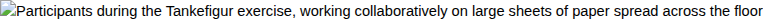

# Verboten Media Writing Workshop – Local News Article

CULTURE  |  GOTHENBURG

## Writing workshop at Stapelbädden drew curious crowd: "Something happened here"

Verboten Media's day-long creative writing session combined literary exercises, conceptual drawing, and what organizers call "ontological design" — leaving participants moved, if not entirely sure why

By Karin Eliasson  |  Saturday 11 April 2026  |  Updated Sunday 12 April

**GOTHENBURG. Around thirty people gathered in a former shipyard workshop space at Stapelbädden in Gothenburg on Saturday for what was billed as a "writing workshop in a new format." What followed was eight hours of structured literary exercises, emotional breakthroughs, and at least one moment involving participants crawling across butcher paper on the floor drawing geometric shapes to represent ideas they could not yet articulate. Organizer Verboten Media calls it literature. Several attendees called it transformative. One called it "the strangest CV-writing course I've ever been to."**

### A converted workshop, a mixed crowd

Stapelbädden, the cluster of repurposed industrial buildings near Lindholmen that once built ships and now hosts cultural projects of varying permanence, is not an obvious location for a literary event. The particular space — a high-ceilinged concrete room on the second floor, accessible via a cargo elevator that makes a sound like a disappointed trombone — has hosted everything from ceramics exhibitions to a short-lived kombucha collective.

On Saturday morning, it hosted Verboten Media's writing workshop, and the first thing one noticed was the furniture: a ring of mismatched chairs surrounding three long tables pushed together, covered in brown butcher paper. Along one wall, a row of bookshelves held what appeared to be a deliberately curated selection of pocket-sized publications, most bearing the Verboten Media imprint. A coffee thermos stood sentry by the door. It was refilled four times over the course of the day.

The participants, arriving between 9:40 and 10:15 (the workshop was scheduled for 10:00), were a strikingly mixed group. There were aspiring writers who had found the event through social media. There were kulturarbetare — cultural workers — who seemed to know each other from other contexts and greeted one another with the knowing nods of people who have sat on the same grant-application panels. There were two kommun-anställda from the city's cultural affairs office who had, through what appeared to be a genuine administrative error, registered for the event believing it to be a professional development course in communication skills.

And there was Birgitta, a retired Swedish teacher from Kortedala, 71 years old, who had seen a poster at Stadsbiblioteket and decided to attend. She arrived first, sat down, opened a notebook, and did not look up for several minutes. She would turn out to be, by several participants' accounts, the most remarkable person in the room.

### The reading room that is not a reading room

The workshop opened with what Verboten Media calls a Lektyrstuga — a term that translates roughly as "reading room" but which, in their usage, means something closer to a communal operating theatre for unfinished texts. Participants had been asked in advance to bring a piece of writing they were working on — "something that isn't done yet and that you suspect might never be done," as the pre-event email put it.

The format was deceptively simple. Each participant placed their text on the table. They were given twenty minutes of silence to read their own work, but with a specific instruction: read it as though someone else wrote it. Read it as though you found it on a bus. Then, using a printed worksheet, they answered questions about the text — not about what they had intended, but about what the text appeared to be doing.

"It's the difference between a blueprint and a building," explained the workshop leader, referred to throughout the day simply as Förläggaren — the Publisher — a figure associated with the Verboten Media collective who spoke with the calm authority of someone who has had this conversation many times and does not mind having it again. "The blueprint tells you what you wanted. The building tells you what you got."

The room was very quiet during the Lektyrstuga. Someone's phone buzzed once. No one checked it.

### Mirrors and what they reflect

After a short break (coffee, three varieties of kex, a brief conversation about parking), the workshop moved into what was, by most accounts, its most intense phase: the Spegelproxess, or mirror process.

The exercise works like this. A participant volunteers a text. The text is then "reflected" back to the author through three different lenses, each applied by a different small group. The first lens is ontological — what kind of world does this text assume? What has to be true for this text to exist? The second is emotional — not "how does this make you feel" but "what emotional architecture does the text construct, and where are the load-bearing walls?" The third is structural — how is the text actually organized, as opposed to how it appears to be organized?

The idea, as Förläggaren explained it, is to reveal the gap between what a text is doing and what its author believes it is doing. "Most writers," they said, "are writing a different text than the one they think they're writing. The Spegelproxess makes the real text visible."

A woman named Fatima, 34, a social worker from Frölunda who had been working on a short story for two years, volunteered her text. She described the story as being about "a woman who leaves her family to work on a fishing boat." After twenty minutes of group reflection through the three lenses, the room arrived at a different reading: the story was about the texture of guilt — not about leaving, but about the particular quality of silence in a house after someone has decided to leave but hasn't told anyone yet.

Fatima was quiet for a long time.

"I think I've been writing around the thing instead of writing the thing," she said, finally. Several people nodded. One of the kommun-anställda looked at his colleague with an expression that suggested this was not, in fact, anything like a CV-writing course.

*Participants during the "Tankefigur" exercise at Stapelbädden. Photo: Alva Lindqvist / Frilans*

### Drawing the shape of an idea

If the Spegelproxess was the workshop's emotional centre, the afternoon session — the Tankefigur exercise — was its most visually striking. Tankefigur translates as "thought-figure," and it involves treating ideas not as linear arguments but as spatial, almost architectural objects.

Large sheets of butcher paper were unrolled across the floor. Participants were given markers in four colours and asked to draw — not write, draw — the conceptual shape of a creative project they were working on, or wanted to work on, or couldn't stop thinking about. What shape is the idea? Where are its edges? Where is it dense, where is it porous? Does it have a centre or is it distributed?

For thirty minutes, adults crawled across the floor on their hands and knees, drawing circles and triangles and wobbly rectangles and structures that resembled subway maps and others that resembled cellular biology. The sound of marker on paper was surprisingly loud. A man who had not spoken all morning drew something that looked like a spiral staircase seen from above and then sat back on his heels and stared at it as if it had told him a secret.

This connects to what Verboten Media calls pre-rationell modularitet — pre-rational modularity. The idea is to work with creative material before it becomes "rational" or argumentative, keeping the components loose and rearrangeable. The Tankefigur is the visual expression of this principle: by drawing the shape of an idea, you can see its structure without being trapped by its logic.

"We're trained to think in sentences," Förläggaren said, walking between the papers on the floor like a gallery visitor at a very unusual opening. "But ideas aren't sentences. Ideas are rooms. The Tankefigur shows you the floor plan."

### What participants said

Reactions to the day ranged from the enthusiastic to the still-processing. During the final reflection circle (6:05 PM, forty minutes behind schedule, the coffee long since finished), participants shared their impressions.

| "I came in thinking this was going to be someone telling me how to structure a novel. Instead they made me realise I don't even know what I'm trying to say yet, and that this is actually a good starting position. I haven't felt this confused and this excited at the same time since I was maybe nineteen." — Johan, 28, master's student in cultural studies, Haga |
| --- |

| "I was skeptical. Genuinely skeptical. I've been to a lot of workshops and courses and studiecirklar and most of them are people being polite about each other's mediocre poetry. This was not that. The Spegelproxess — I don't know. It was like someone cleaned a window I didn't know was dirty." — Marcus, 41, freelance copywriter, Majorna |
| --- |

| "I honestly thought I was registering for a course on workplace communication. I work for the cultural affairs office and the listing was forwarded without context. But I'm glad I stayed. I can't fully explain what happened. Something happened, though. I'll need to think about it. Maybe for a while." — Anders, 38, kommun-anställd, Gothenburg City |
| --- |

| "I taught Swedish for thirty-seven years and for most of that time I also wrote — quietly, for myself, in the mornings before school. I stopped about six years ago. I told myself I had said what I needed to say. Today someone asked me to look at my own writing as if a stranger had written it, and I realised the stranger had things left to say that I had not been listening to." — Birgitta, 71, retired teacher, Kortedala |
| --- |

### The forbidden as the necessary

Verboten Media, for the uninitiated, is a publishing and literary collective based in Gothenburg whose output is, by their own description, "damn good literature in a new format" — or, in the Swedish they prefer, "jävligt bra litteratur i ett nytt format." Their publications tend toward what they call extremsubjektiv skönlitteratur — extremely subjective literary fiction — and their editorial stance treats fiction not as entertainment or even art, exactly, but as what they term "a reality engine."

When asked to explain the workshop's methodology in terms a newspaper reader might understand, Förläggaren paused for what felt like a long time.

| "We evaluate everything through three criteria: Story, Smak, Ramsa. Does it have a narrative that earns its existence? Does it have taste — genuine aesthetic judgment, not preference but discernment? And does it have ramsa — rhythm, incantation, the quality that makes language want to be spoken aloud? If a piece has all three, it can do something. And the workshop is about clearing the path to all three." — Förläggaren, Verboten Media |
| --- |

When pressed on what makes the workshop different from a conventional skrivarkurs, the answer involved the concept of ontologisk design — ontological design — which, as far as this reporter could determine, means treating the creative project itself as an object that designs the conditions under which it will be read. The text is not placed into the world; the text constructs a world to be placed into.

The word "verboten" — German for "forbidden" — is deliberate. "The forbidden is the necessary," Förläggaren said. "What you're not allowed to write is usually what you must write. We build the room for that."

This reporter transcribed that faithfully and is still thinking about what it means.

### Hard to place, harder to forget

It is difficult to categorize what Verboten Media is doing within the existing landscape of Gothenburg's cultural life. It is not quite a studiecirkel, though it shares the democratic ethos. It is not quite performance art, though the Tankefigur exercise had the visual intensity of an installation. It is not a traditional literary salon, though the Lektyrstuga carries echoes of that format. It is, perhaps, closest to what would happen if ABF, a philosophy seminar, and a very earnest kunsthall had a child and raised it on pocket-format fiction.

The SST method — Single Source Topic — which underpins much of Verboten Media's editorial approach, insists that each creative work should derive from one governing topic that "radiates outward, never losing its centre." It is a principle that, ironically, makes their own project difficult to summarize in a newspaper article. They are doing one thing, but the one thing touches everything.

The workshop ended at 6:20 PM. Participants lingered. Some exchanged phone numbers. Birgitta and Fatima were seen in deep conversation by the cargo elevator. One of the kommun-anställda was photographing his Tankefigur drawing with his phone. Outside, the food truck that had served tunnbrödsrullar during the lunch break was packing up, the smell of grilled sausage mixing with the salt air from the river in a way that felt, briefly and irrationally, like it meant something.

Verboten Media plans to hold further workshops in Gothenburg, with the next date yet to be announced. Information will be posted at verboten.se — a URL that, at the time of this article's publication, loaded on the third attempt — and through the collective's social media channels.

Those interested are encouraged to bring an unfinished text and "a willingness to discover that it is about something else entirely."

On the walk back to the tram stop, past the darkened industrial facades of Lindholmen, it occurred to this reporter that the river had been visible from the workshop's windows all day, and that no one had once looked at it, because whatever was happening on the butcher paper on the floor was, for those eight hours, more real than the water.

| FAKTARUTA Event Verboten Media Writing Workshop ( Skrivverkstad ) Date Saturday 11 April 2026, 10:00–18:00 Location Stapelbädden, Lindholmen, Gothenburg Organizer Verboten Media (literary collective, Gothenburg) Participants Approx. 30 Cost Free (supported by Kulturrådet) Next event Date TBD — check verboten.se Contact info@verboten.se |
| --- |

© GP Lokalt / Kultur  |  Published 12 April 2026
