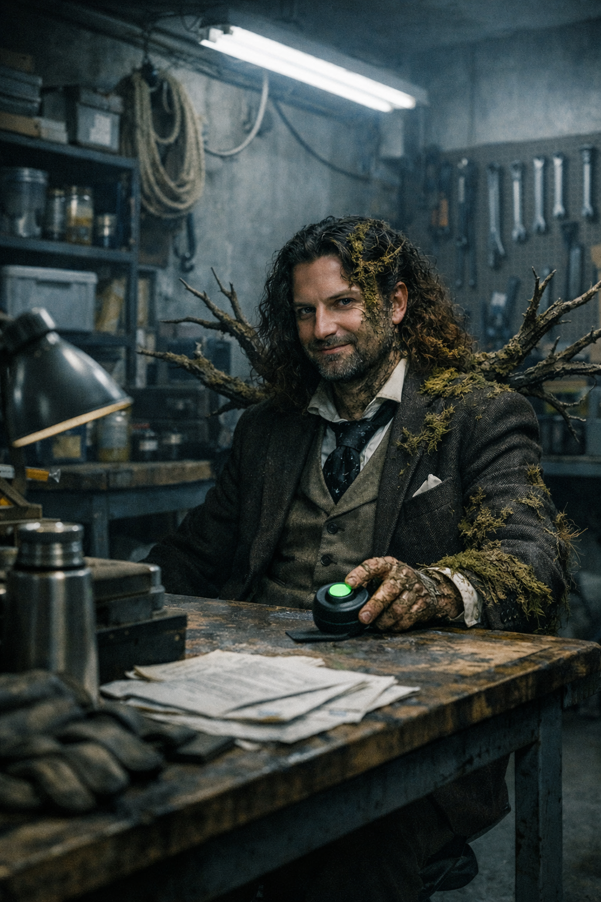
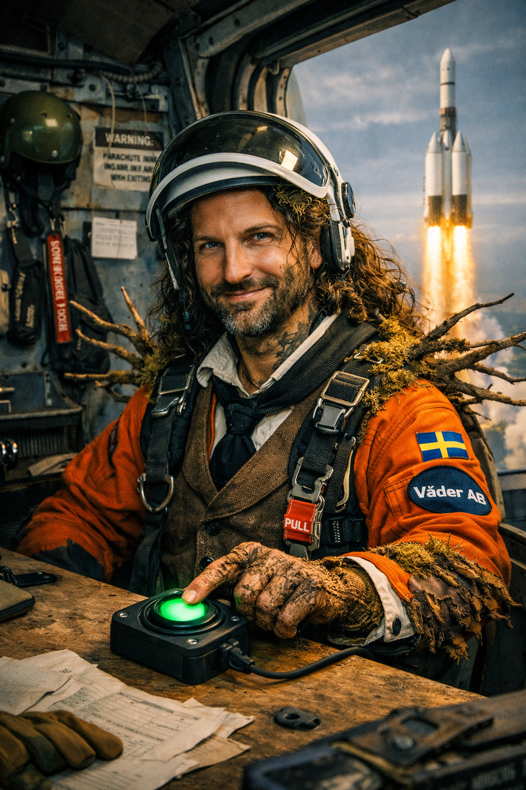

---

---

---

---

## Atmosphere line

> Med pannan i djupa veck över hur allt kommer att framstå för kommande generationer...

## Pressure field
Några nätter senare ska han drömma att ön där de byggt sin ekoby fått bud om att en militant gruppering ska inta landet

## Primary fragment
Förläggaren drömde att närområdet var oklart uppdelat i olika militanta grupperingar, där fanns en miniskvadron av marscherande militärklädda som han i en tidigare dröm gjorde misstaget att interagera med, nackskottet kom i plytet och efter en kort stund av identifikation där drömgruppens drömledare alltså vred huvudet och fokuserade blicken på honom innan han lyfte personvapnet och fyrade av; en mindre organiserad men likväl linjeströmmad samling andragenerationister som är artiga och rätt roliga tills de underhåller sig med helt andra sysselsättningar, någon gång stormade de hans hem, någon gång höll de flera grupperingar gisslan på en och samma tågperrong, och denna gång rörde de sig likt militantgruppen i klunga men längs grusvägar och tvingade honom på flykt flera gånger, viftade med pistoler och sköt alldelens vid sidan om hans hukande gestalt; dessa grupperingar var flera, det kunde förläggare förstå på ett intuitivt plan och hålla med om efter att ha vaknat och fått tillgång till "logikens fakulteter"; de fyllde olika syften i den stora samhällskroppen som ryms inom hans undermedvetna, arketypiskt kompartmentaliserade på ett sätt som är så unikt att man måste leva ett helt liv för att kanske få ihop allt, enligt jungiansk psykoanalytisk praxis; veckor senare ska han för första gången drömma om att han för fram ett fordon i kollektivtrafiksflottan, och detta utgör ett klart trendbrott; en gång tog han tåget till en park och där visade Väder AB en ny teknologisk mojäng som kunde förvandla privatpersoner till träskmossa, till träd; en annan gång hoppade förläggaren fallskärm från en rymdraketsuppskjutning och landade på en megaparabol för att diskutera livets begivenheter med Jokern från en animerad tv-version av DC-comics ärkeskurk. Det slår den som walk the walk and talk the talk att dessa drömbundna syften alltjämt vidarefinns även i vaket tillstånd, lika mycket som den individfrånskilda samhällskroppen, och exempelvis dess olika fraktioner och syftesenliga anslutningar. Tänk hur skådespelarna införlivar gudomliga rollspel, gudar som då i sin tur har fått villkoren dikterade av suprahumanoida arketyper, så har du en ledtråd.

## Side fragment
Förläggaren hade nyst så det dånade i hela lokalen, vridit VR-glasögonen runt nackbenen och svurit åt barnen som lekte där; han hade stekt en ryggbiff, slängt en saint augur i kokkärlet och låtit sänka en handfull pommes fritt i en *ack så efterlängtad* air fryer; slängt den i diskhon, straffknullat lillfrugan, ejakulerat i hennes öra; han hade kammat håret i sidbena, lagt på en peruk och tiktokdansat i en god halvtimme, tills höfterna var trötta, då hade han löst tre korsord innan klockan blev 20 och nyhetssändningen tutade in genom televisionsapparaten. Sömnen hade gjort honom till en ny man, igen. Han hade som vanligt tagit den färska besvikelsen som en ursäkt att undvika djupare utredning av de gamla, och skridit till ett nytt verk. *Äggning* handlade helt enkelt om att kartlägga sin egen situation istället för att involvera andra i smeten:

*En stigande tidvåg lyfter alla båtar, heter det. Det fanns en handfull sattelittelefoner ombord på några synnerligen välutrustade svarta lådor som skumpar runt i den vilda nordhavsbassängen; borta är de fagra kvinnonamnen med storartade flasksmällar mot sidan av karossen under offentlig invigning framför folksamlingens mjugga unnsamhet, ombord varje liten skuta sitter en IT-konsult i flytväst, vissa orangea, någon rosa, någon blå.*

## Edition facts
- Förlagsdeckaren: En stigande tidvåg lyfter alla båtar
- Martin Nygren
- Novellserie: Del I av Plural.
- 2022
- Publicerad som PDF den 20 juni 2022.

