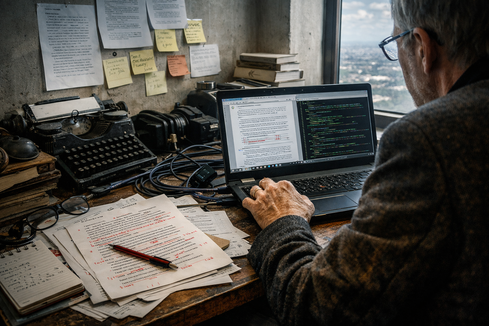

## Template orientation

Template 6 is a bridge between essay page and novel page. It keeps prose continuity but inserts meaningful images at regular points.

## Structural rhythm

1. Opening fragment and publication context
2. Image-supported middle section
3. Secondary movement with process trace
4. Closing metadata or editorial note

## Inline support images

## Use case

Best for essays, special articles, and novel chapter previews.
